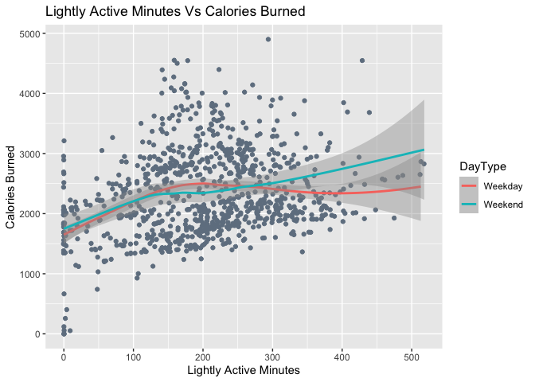
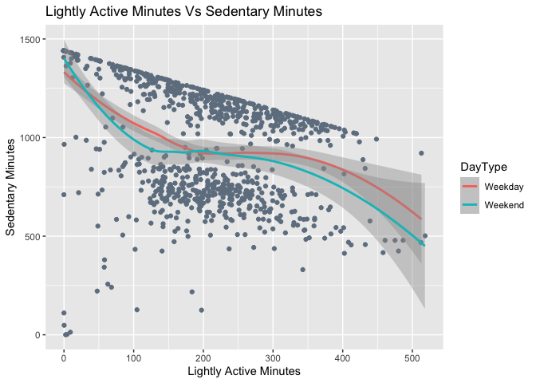
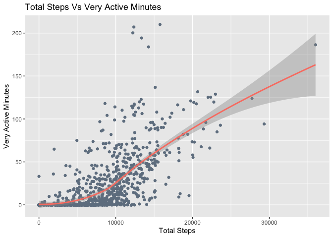
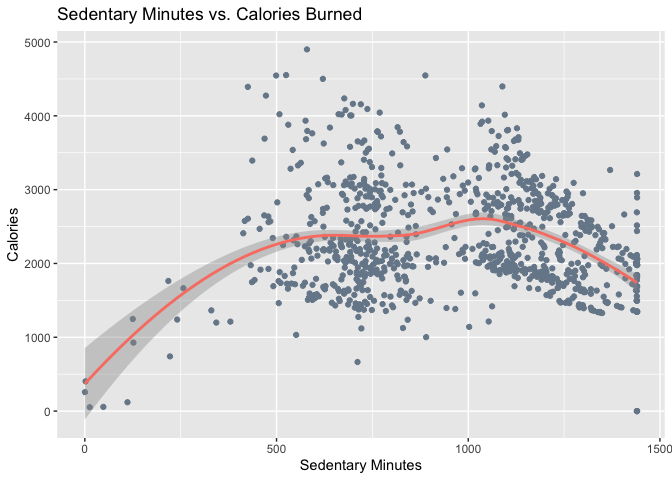
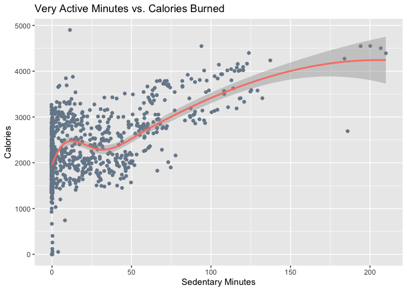

Helping BellaBeat learn from FitBit
================
2026-01-26

- [Introduction](#introduction)
  - [Business task](#business-task)
  - [Key stakeholders](#key-stakeholders)
  - [Data Source and Description](#data-source-and-description)
  - [Issues with bias or credibility in this
    data](#issues-with-bias-or-credibility-in-this-data)
  - [Privacy concerns](#privacy-concerns)
  - [Using R and SQL](#using-r-and-sql)
    - [Setting Up](#setting-up)
- [Part 1: Daily Level Analysis](#part-1-daily-level-analysis)
  - [Data Processing and Cleaning](#data-processing-and-cleaning)
    - [Shortlisting Tables](#shortlisting-tables)
      - [Creating tables from the CSV
        files](#creating-tables-from-the-csv-files)
      - [Unique ID’s in each table](#unique-ids-in-each-table)
      - [Checking for Shared Column Names via a Pivot
        Table](#checking-for-shared-column-names-via-a-pivot-table)
      - [Resolving Inconsistencies in Column Names and
        Values](#resolving-inconsistencies-in-column-names-and-values)
    - [Shortlisting Columns to Include in the
      Join](#shortlisting-columns-to-include-in-the-join)
      - [Clean Dates](#clean-dates)
      - [Finalize and Validate Columns from the Activity
        table](#finalize-and-validate-columns-from-the-activity-table)
        - [Validate Distance and Minutes
          Columns\*\*](#validate-distance-and-minutes-columns)
      - [Finalize and Validate Columns from the Sleep
        table](#finalize-and-validate-columns-from-the-sleep-table)
    - [Checking for Duplicates and Missing
      Values](#checking-for-duplicates-and-missing-values)
    - [Joining the Activity and Sleep
      tables](#joining-the-activity-and-sleep-tables)
      - [Constructing the Join](#constructing-the-join)
      - [Validating the Join](#validating-the-join)
  - [Data Visualizations and Plots](#data-visualizations-and-plots)
    - [Reviewing Composition of Total Min, TotalActiveMin and
      TotalDist](#reviewing-composition-of-total-min-totalactivemin-and-totaldist)
      - [Composition of Total Active
        Min](#composition-of-total-active-min)
      - [Composition of Total Min](#composition-of-total-min)
    - [Reviewing Distribution](#reviewing-distribution)
      - [Calories](#calories)
      - [Total Hours Asleep](#total-hours-asleep)
      - [Total Steps](#total-steps)
      - [Total Active Distance](#total-active-distance)
      - [Total Active Hours](#total-active-hours)
      - [Total Sedentary Hours](#total-sedentary-hours)
    - [Identifying Relationships](#identifying-relationships)
      - [Correlation Matrix Heat Map](#correlation-matrix-heat-map)
      - [Lightly Active Minutes and Calories
        Burned](#lightly-active-minutes-and-calories-burned)
      - [Total Minutes Asleep and Sedentary
        Minutes](#total-minutes-asleep-and-sedentary-minutes)
      - [Sedentary Minutes and Total
        Steps](#sedentary-minutes-and-total-steps)
      - [Very Active Min and Total
        Steps](#very-active-min-and-total-steps)
      - [Total Active Minutes and
        Calories](#total-active-minutes-and-calories)
      - [Total Steps and Calories](#total-steps-and-calories)
      - [Sedentary Minutes and
        Calories](#sedentary-minutes-and-calories)
      - [Very Active Minutes and
        Calories](#very-active-minutes-and-calories)
    - [Looking at Time Trends](#looking-at-time-trends)
      - [Daily Mean of Total Steps](#daily-mean-of-total-steps)
      - [Daily Mean of Total Calories
        Burned](#daily-mean-of-total-calories-burned)
      - [Daily Mean of Total Distance
        Covered](#daily-mean-of-total-distance-covered)
- [Part 2: Hourly Level Analysis](#part-2-hourly-level-analysis)
  - [Data Processing and Cleaning](#data-processing-and-cleaning-1)
    - [Column Types and Descriptions](#column-types-and-descriptions)
    - [Unique ID’s in each table](#unique-ids-in-each-table-1)
    - [Duplicates and missing values](#duplicates-and-missing-values)
    - [Join](#join)
  - [Data Visualization and Plots](#data-visualization-and-plots)
- [Conclusion and Recommendations](#conclusion-and-recommendations)

# Introduction

This case study is an integral component of the Google Data Analytics
Capstone project. Its objective is to analyze Fitbit Tracker Data to
inform the marketing strategy for Bellabeat, a high-technology
corporation specializing in health-focused smart products, co-founded by
Urška Sršen and Sando Mur.

Note: This project will use R and SQL to explore the Fitness Tracker
Data available at Kaggle

## Business task

This analysis aims to inform and guide Bellabeat’s marketing strategy by
ascertaining trends in smart device utilization and their applicability
to Bellabeat’s customer base. It aims to answer the following 3
questions

1.  What are some trends in smart device usage?
2.  How could these trends apply to Bellabeat customers?
3.  How could these trends help influence Bellabeat marketing strategy?

## Key stakeholders

Urška Sršen: Bellabeat’s cofounder and Chief Creative Officer Sando Mur:
Mathematician and Bellabeat’s cofounder; key member of the Bellabeat
executive team Bellabeat marketing analytics team

## Data Source and Description

**Data source**

The fitbit data is publicly available on Kaggle and can be downloaded
from this link: <https://www.kaggle.com/datasets/arashnic/fitbit>

The data was sourced using this link:
<https://zenodo.org/records/53894#.X9oeh3Uzaao>

It was collected by

- Furberg, Robert
- Brinton, Julia
- Keating, Michael
- Ortiz, Alexa1

**Data Description (as described by Authors)**

These datasets were generated by respondents to a distributed survey via
Amazon Mechanical Turk between 03.12.2016-05.12.2016. Thirty eligible
Fitbit users consented to the submission of personal tracker data,
including minute-level output for physical activity, heart rate, and
sleep monitoring. Individual reports can be parsed by export session ID
(column A) or timestamp (column B). Variation between output represents
use of different types of Fitbit trackers and individual tracking
behaviors / preferences.

This dataset has a total of 29 files spanning over two time periods:

1.  3-12-16 to 4-11-16
2.  4.12.16 to 5-12-16

Both timeperiods have different CSV files for the following indicators:

- Physical Activities (Daily, Hourly, Minute-level)
- Calories (Daily, Hourly, Minute-level)
- Daily Intensities (Daily, Hourly, Minute-level)
- Daily Steps (Daily, Hourly, Minute-level)
- Heart Rate in Seconds
- Sleep (Daily, Minute)
- Weight

Most of the data is in long format but the minute level output for
intensities, steps and calories for the April-May period is available in
the form of wide format as well

This case study is divided in two parts: Part 1 will focus on Daily data
and Part 2 on Hourly data.

Part 1 will be the main focus of this datastudy. It will only focus on
the Daily level data, for the **4.12.16 to 5-12-16** timeperiod, for the
following indicators:

- Daily Activity
- Daily Calories
- Daily Intensities
- Daily Steps
- Daily Sleep
- Weight

Part 2 will only focus at hourly level data, for the **4.12.16 to
5-12-16** timeperiod, for the following indicators:

- Hourly Calories
- Hourly Intensities
- Hourly Steps

The relevant datasets will be downloaded and created as tables in a
database before being cleaned in this R file using SQL code

## Issues with bias or credibility in this data

The dataset spanning the period of April 12, 2016, to May 12, 2016, is
limited in scope, containing information from only **33** respondents,
which increases the potential for bias. Furthermore, it lacks
demographic data, such as age, gender, education, and occupation. While
a dataset for weight exists, it is similarly constrained, covering only
eight respondents.

## Privacy concerns

The kaggle data is open source and 38 Fitbit users consented to the
submission of personal tracker data removing any privacy concerns

## Using R and SQL

This data study uses a combination of *R* and *SQL.* (via SQlite) <br>

SQL will be used for the following purposes:

- Basic data exploration
- Reviewing Column Names and Data Types
- Creating a Pivot Table
- Shortlisting tables for Join
- Basic Cleaning for Dates
- Joining the data

The rest of the analysis will be done via R. This includes: <br>

- Formatting any SQL data
- Any transformations post the join
- Data Visualization

### Setting Up

The code chunk below loads up the relevant libraties and sets up an SQL
connection via RSQlite.

``` r
#Load libraries
library(tidyverse)
library(readxl)
library(readr)
library(dplyr)
library(ggplot2)
library(ggcorrplot)
library(cowplot)
library(knitr)
library(kableExtra)
library(DBI)
library(RSQLite)

#Set up the SQL connection with a new database created purely in memory.
# I am storing it in memory rather than disk as I do not need these tables
# outside of this Rmd file
con <- dbConnect(RSQLite::SQLite(), dbname = ":memory:") 

#General Settings for Code chunks
knitr::opts_chunk$set(connection = con) # Enable the connection for all chunks
knitr::opts_chunk$set(fig.align = "center") # Align output when knitting the document
```

# Part 1: Daily Level Analysis

## Data Processing and Cleaning

This section outlines the process for data processing and cleaning in
preparation for the daily analysis.

Initially, it will identify the tables required for joining to derive
information for meaningful insights. Subsequently, it will select the
relevant columns from these tables through in-depth examination, data
validation, and checks for duplicate and missing values. The final steps
will involve cleaning and transforming the data, followed by joining it
into a consolidated dataframe.

### Shortlisting Tables

As mentioned in the description, individual records in each data file
represent an individual at a specific time period. This is significant
because it implies that any joins between the tables will necessitate
being performed at the individual-datetime level.

We have identified a total of six relevant daily data indicators. We
will assess which ones require joining.

- Activity
- Calories
- Intensities
- Steps
- Sleep
- Weight

Dedicated CSV data files exist for each of the indicators mentioned
above. All six of these CSV files are loaded as seperate tables for
analysis using SQL

#### Creating tables from the CSV files

``` r
dbWriteTable(con, "dailyactivity_merged", 
             read.csv("Fitbit_Data/dailyActivity_merged.csv"))
dbWriteTable(con, "dailyintensities_merged", 
             read.csv("Fitbit_Data/dailyIntensities_merged.csv"))
dbWriteTable(con, "dailycalories_merged", 
             read.csv("Fitbit_Data/dailyCalories_merged.csv"))
dbWriteTable(con, "dailysteps_merged", 
             read.csv("Fitbit_Data/dailySteps_merged.csv"))
dbWriteTable(con, "sleepday_merged", 
             read.csv("Fitbit_Data/sleepDay_merged.csv"))
dbWriteTable(con, "weightLogInfo_merged", 
             read.csv("Fitbit_Data/weightLogInfo_merged.csv"))
dbWriteTable(con, "hourlyintensities_merged", 
             read.csv("Fitbit_Data/hourlyIntensities_merged.csv"))
dbWriteTable(con, "hourlycalories_merged", 
             read.csv("Fitbit_Data/hourlyCalories_merged.csv"))
dbWriteTable(con, "hourlysteps_merged", 
             read.csv("Fitbit_Data/hourlySteps_merged.csv"))
```

#### Unique ID’s in each table

The following SQL query checks the number of unique ID’s in each table

``` sql
SELECT                            -- Activity Table
    'Activity' AS DataIndicator, -- Data indicators representing each table
    COUNT(DISTINCT Id) AS UniqueIds  -- Count of Unique IDs
FROM
    dailyactivity_merged
UNION             -- UNION to stack rows for all tables
    SELECT          -- Process Repeated for Weight
        'Weight' AS DataIndicator,
        COUNT(DISTINCT Id) AS UniqueIds
    FROM
        weightloginfo_merged
UNION
    SELECT           -- Process Repeated for Sleep
        'Sleep' AS DataIndicator,
        COUNT(DISTINCT Id) AS UniqueIds
    FROM
        sleepday_merged
UNION
    SELECT      -- Process Repeated for Steps
        'Steps' AS DataIndicator,
        COUNT(DISTINCT Id) AS UniqueIds
    FROM
        dailysteps_merged
UNION
    SELECT        -- Process Repeated for Intensities
        'Intensities' AS DataIndicator,
        COUNT(DISTINCT Id) AS UniqueIds
    FROM
        dailyintensities_merged
UNION
    SELECT             -- Process Repeated for Calories
        'Calories' AS DataIndicator,
        COUNT(DISTINCT Id) AS UniqueIds
    FROM
        dailycalories_merged
ORDER BY        -- Sort by Unique ID's
  UniqueIds    
```

<div class="knitsql-table">

| DataIndicator | UniqueIds |
|:--------------|----------:|
| Weight        |         8 |
| Sleep         |        24 |
| Activity      |        33 |
| Calories      |        33 |
| Intensities   |        33 |
| Steps         |        33 |

6 records

</div>

The results above indicate a maximum sample size of 33 respondents. <br>
The weight dataset will need to be dropped from this analysis due to
insufficient data. Only 8 respondents provided weight information,
making the sample size too small for meaningful insights

After dropping weight, we now have a total of 5 data indicators:

- Activity
- Calories
- Intensities
- Steps
- Sleep

#### Checking for Shared Column Names via a Pivot Table

Next, we will determine which data files require joining. Although each
indicator has its own dedicated data file, we need to check if any of
these already contain combined data from others.

Our first step is to review the column names in each table to identify
shared names.

The following code will generate a pivot table with the following
details:

- Rows: Combined a list of unique column names
- Columns: The 5 data indicators (Activity, Calories, Intensities, Steps
  and Sleep) columns.
- Values: 1 if a column is present in the tables as represented by the
  Data Indicator. 0 othwerwise.

``` sql

-- The Outer Query creates a pivot table from the pivot_data created by the subquery

-- Unique values from the Field column represent the rows of the pivot table 
-- This is achieved through group aggregation using the GROUP BY clause in 
-- conjunction with the SUM function
-- GROUP By groups all rows for a given field together 
-- The SUM() function for the CASE statement collapses all rows for a field in one

-- Columns for the Pivot Table and the Values in them are created using CASE
-- For each Field/Column Name, CASE checks if it is present in the table 
-- represented by the Data Indicator
-- If a given field is present, a Value of 1 is assigned to the relevant Column 
-- If a given field is not present, a value of 0 is assigned instead


SELECT 
      Field, 
    SUM(CASE WHEN DataIndicator = 'Activity' THEN 1 ELSE 0 END) AS Activity,
    SUM(CASE WHEN DataIndicator = 'Intensities' THEN 1 ELSE 0 END) AS Intensities,
    SUM(CASE WHEN DataIndicator = 'Steps' THEN 1 ELSE 0 END) AS Steps,
    SUM(CASE WHEN DataIndicator = 'Calories' THEN 1 ELSE 0 END) AS Calories,
      SUM(CASE WHEN DataIndicator = 'Sleep' THEN 1 ELSE 0 END) AS Sleep,
    Count(*) as Total -- Count total tables the field column is in
FROM
-- The Inner query below stores column names from each of the 6 tables 
-- in a column named Field

-- Column names are retrieved using PRAGMA table_info(table-name) 
-- This is a specialized command in SQLite used to retrieve metadata about the 
-- columns within a specific table

-- A DataIndicator value was also assigned to each table to represent it.
-- Results from the six tables rows are combined into a single output using the
-- UNION operation and are aliased as pivot_data
    (SELECT 
       name AS Field, 'Sleep' AS DataIndicator 
    FROM 
      PRAGMA_TABLE_INFO('sleepday_merged') 
    UNION
      SELECT 
        name AS Field, 'Activity' AS DataIndicator
      FROM 
        PRAGMA_TABLE_INFO('dailyactivity_merged')
    UNION
      SELECT 
          name AS Field, 'Steps' AS DataIndicator
        FROM 
        PRAGMA_TABLE_INFO('dailysteps_merged')
    UNION
      SELECT 
          name AS Field, 'Intensities' AS DataIndicator
      FROM 
          PRAGMA_TABLE_INFO('dailyintensities_merged')
    UNION
      SELECT 
        name AS Field, 'Calories' AS DataIndicator
      FROM 
          PRAGMA_TABLE_INFO('dailycalories_merged')) as pivot_data
Group By
    Field -- Group By Field and then use SUM() in the select statement for unqiue rows
Order by
    Activity, Total DESC, Field 
    -- Order by the Activity column, then by Total 
    -- Count (in descending order) and then by Field for easier visualization.
```

The results derived from the SQL query will be color-coded and formatted
to facilitate visualization. <br>

- All rows where ‘Activity’ is equal to 0, signifying rows for all
  columns not present in the ‘Activity’ table, are formatted in bold.
  Given that the SQL table was ordered by ‘Activity,’ these rows will
  appear at the top of the pivot table.
- The row corresponding to the ‘ID’ field is highlighted in , as this
  column will serve as the key for joining tables.
- The rows for ‘ActivityDay,’ ‘ActivityDate,’ and ‘Sleepday’ are
  highlighted in .
- The rows for ‘TotalSteps’ and ‘StepTotal’ are highlighted in .

``` r
pivot_table %>% 
  kable(caption  = "Presence of a Field in each Table. 1 if Yes, 0 if not", 
        booktabs=TRUE) %>% kable_styling("striped")  %>% #For striped rows
  row_spec(which(pivot_table$Activity == 0), bold=TRUE) %>% 
  row_spec(which(pivot_table$Field == 'Id'), background ='#C1FFC1') %>% 
  row_spec(which(pivot_table$Field == 'ActivityDay' | 
                   pivot_table$Field == 'ActivityDate' |
                   pivot_table$Field == 'SleepDay'),background ='#FA8072') %>%
  row_spec(which(pivot_table$Field == 'TotalSteps'|
             pivot_table$Field == 'StepTotal'), background ='#FAFAD2') 
```

<table class="table table-striped" style="margin-left: auto; margin-right: auto;">

<caption>

Presence of a Field in each Table. 1 if Yes, 0 if not
</caption>

<thead>

<tr>

<th style="text-align:left;">

Field
</th>

<th style="text-align:right;">

Activity
</th>

<th style="text-align:right;">

Intensities
</th>

<th style="text-align:right;">

Steps
</th>

<th style="text-align:right;">

Calories
</th>

<th style="text-align:right;">

Sleep
</th>

<th style="text-align:right;">

Total
</th>

</tr>

</thead>

<tbody>

<tr>

<td style="text-align:left;font-weight: bold;background-color: rgba(250, 128, 114, 255) !important;">

ActivityDay
</td>

<td style="text-align:right;font-weight: bold;background-color: rgba(250, 128, 114, 255) !important;">

0
</td>

<td style="text-align:right;font-weight: bold;background-color: rgba(250, 128, 114, 255) !important;">

1
</td>

<td style="text-align:right;font-weight: bold;background-color: rgba(250, 128, 114, 255) !important;">

1
</td>

<td style="text-align:right;font-weight: bold;background-color: rgba(250, 128, 114, 255) !important;">

1
</td>

<td style="text-align:right;font-weight: bold;background-color: rgba(250, 128, 114, 255) !important;">

0
</td>

<td style="text-align:right;font-weight: bold;background-color: rgba(250, 128, 114, 255) !important;">

3
</td>

</tr>

<tr>

<td style="text-align:left;font-weight: bold;background-color: rgba(250, 128, 114, 255) !important;">

SleepDay
</td>

<td style="text-align:right;font-weight: bold;background-color: rgba(250, 128, 114, 255) !important;">

0
</td>

<td style="text-align:right;font-weight: bold;background-color: rgba(250, 128, 114, 255) !important;">

0
</td>

<td style="text-align:right;font-weight: bold;background-color: rgba(250, 128, 114, 255) !important;">

0
</td>

<td style="text-align:right;font-weight: bold;background-color: rgba(250, 128, 114, 255) !important;">

0
</td>

<td style="text-align:right;font-weight: bold;background-color: rgba(250, 128, 114, 255) !important;">

1
</td>

<td style="text-align:right;font-weight: bold;background-color: rgba(250, 128, 114, 255) !important;">

1
</td>

</tr>

<tr>

<td style="text-align:left;font-weight: bold;background-color: rgba(250, 250, 210, 255) !important;">

StepTotal
</td>

<td style="text-align:right;font-weight: bold;background-color: rgba(250, 250, 210, 255) !important;">

0
</td>

<td style="text-align:right;font-weight: bold;background-color: rgba(250, 250, 210, 255) !important;">

0
</td>

<td style="text-align:right;font-weight: bold;background-color: rgba(250, 250, 210, 255) !important;">

1
</td>

<td style="text-align:right;font-weight: bold;background-color: rgba(250, 250, 210, 255) !important;">

0
</td>

<td style="text-align:right;font-weight: bold;background-color: rgba(250, 250, 210, 255) !important;">

0
</td>

<td style="text-align:right;font-weight: bold;background-color: rgba(250, 250, 210, 255) !important;">

1
</td>

</tr>

<tr>

<td style="text-align:left;font-weight: bold;">

TotalMinutesAsleep
</td>

<td style="text-align:right;font-weight: bold;">

0
</td>

<td style="text-align:right;font-weight: bold;">

0
</td>

<td style="text-align:right;font-weight: bold;">

0
</td>

<td style="text-align:right;font-weight: bold;">

0
</td>

<td style="text-align:right;font-weight: bold;">

1
</td>

<td style="text-align:right;font-weight: bold;">

1
</td>

</tr>

<tr>

<td style="text-align:left;font-weight: bold;">

TotalSleepRecords
</td>

<td style="text-align:right;font-weight: bold;">

0
</td>

<td style="text-align:right;font-weight: bold;">

0
</td>

<td style="text-align:right;font-weight: bold;">

0
</td>

<td style="text-align:right;font-weight: bold;">

0
</td>

<td style="text-align:right;font-weight: bold;">

1
</td>

<td style="text-align:right;font-weight: bold;">

1
</td>

</tr>

<tr>

<td style="text-align:left;font-weight: bold;">

TotalTimeInBed
</td>

<td style="text-align:right;font-weight: bold;">

0
</td>

<td style="text-align:right;font-weight: bold;">

0
</td>

<td style="text-align:right;font-weight: bold;">

0
</td>

<td style="text-align:right;font-weight: bold;">

0
</td>

<td style="text-align:right;font-weight: bold;">

1
</td>

<td style="text-align:right;font-weight: bold;">

1
</td>

</tr>

<tr>

<td style="text-align:left;background-color: rgba(193, 255, 193, 255) !important;">

Id
</td>

<td style="text-align:right;background-color: rgba(193, 255, 193, 255) !important;">

1
</td>

<td style="text-align:right;background-color: rgba(193, 255, 193, 255) !important;">

1
</td>

<td style="text-align:right;background-color: rgba(193, 255, 193, 255) !important;">

1
</td>

<td style="text-align:right;background-color: rgba(193, 255, 193, 255) !important;">

1
</td>

<td style="text-align:right;background-color: rgba(193, 255, 193, 255) !important;">

1
</td>

<td style="text-align:right;background-color: rgba(193, 255, 193, 255) !important;">

5
</td>

</tr>

<tr>

<td style="text-align:left;">

Calories
</td>

<td style="text-align:right;">

1
</td>

<td style="text-align:right;">

0
</td>

<td style="text-align:right;">

0
</td>

<td style="text-align:right;">

1
</td>

<td style="text-align:right;">

0
</td>

<td style="text-align:right;">

2
</td>

</tr>

<tr>

<td style="text-align:left;">

FairlyActiveMinutes
</td>

<td style="text-align:right;">

1
</td>

<td style="text-align:right;">

1
</td>

<td style="text-align:right;">

0
</td>

<td style="text-align:right;">

0
</td>

<td style="text-align:right;">

0
</td>

<td style="text-align:right;">

2
</td>

</tr>

<tr>

<td style="text-align:left;">

LightActiveDistance
</td>

<td style="text-align:right;">

1
</td>

<td style="text-align:right;">

1
</td>

<td style="text-align:right;">

0
</td>

<td style="text-align:right;">

0
</td>

<td style="text-align:right;">

0
</td>

<td style="text-align:right;">

2
</td>

</tr>

<tr>

<td style="text-align:left;">

LightlyActiveMinutes
</td>

<td style="text-align:right;">

1
</td>

<td style="text-align:right;">

1
</td>

<td style="text-align:right;">

0
</td>

<td style="text-align:right;">

0
</td>

<td style="text-align:right;">

0
</td>

<td style="text-align:right;">

2
</td>

</tr>

<tr>

<td style="text-align:left;">

ModeratelyActiveDistance
</td>

<td style="text-align:right;">

1
</td>

<td style="text-align:right;">

1
</td>

<td style="text-align:right;">

0
</td>

<td style="text-align:right;">

0
</td>

<td style="text-align:right;">

0
</td>

<td style="text-align:right;">

2
</td>

</tr>

<tr>

<td style="text-align:left;">

SedentaryActiveDistance
</td>

<td style="text-align:right;">

1
</td>

<td style="text-align:right;">

1
</td>

<td style="text-align:right;">

0
</td>

<td style="text-align:right;">

0
</td>

<td style="text-align:right;">

0
</td>

<td style="text-align:right;">

2
</td>

</tr>

<tr>

<td style="text-align:left;">

SedentaryMinutes
</td>

<td style="text-align:right;">

1
</td>

<td style="text-align:right;">

1
</td>

<td style="text-align:right;">

0
</td>

<td style="text-align:right;">

0
</td>

<td style="text-align:right;">

0
</td>

<td style="text-align:right;">

2
</td>

</tr>

<tr>

<td style="text-align:left;">

VeryActiveDistance
</td>

<td style="text-align:right;">

1
</td>

<td style="text-align:right;">

1
</td>

<td style="text-align:right;">

0
</td>

<td style="text-align:right;">

0
</td>

<td style="text-align:right;">

0
</td>

<td style="text-align:right;">

2
</td>

</tr>

<tr>

<td style="text-align:left;">

VeryActiveMinutes
</td>

<td style="text-align:right;">

1
</td>

<td style="text-align:right;">

1
</td>

<td style="text-align:right;">

0
</td>

<td style="text-align:right;">

0
</td>

<td style="text-align:right;">

0
</td>

<td style="text-align:right;">

2
</td>

</tr>

<tr>

<td style="text-align:left;background-color: rgba(250, 128, 114, 255) !important;">

ActivityDate
</td>

<td style="text-align:right;background-color: rgba(250, 128, 114, 255) !important;">

1
</td>

<td style="text-align:right;background-color: rgba(250, 128, 114, 255) !important;">

0
</td>

<td style="text-align:right;background-color: rgba(250, 128, 114, 255) !important;">

0
</td>

<td style="text-align:right;background-color: rgba(250, 128, 114, 255) !important;">

0
</td>

<td style="text-align:right;background-color: rgba(250, 128, 114, 255) !important;">

0
</td>

<td style="text-align:right;background-color: rgba(250, 128, 114, 255) !important;">

1
</td>

</tr>

<tr>

<td style="text-align:left;">

LoggedActivitiesDistance
</td>

<td style="text-align:right;">

1
</td>

<td style="text-align:right;">

0
</td>

<td style="text-align:right;">

0
</td>

<td style="text-align:right;">

0
</td>

<td style="text-align:right;">

0
</td>

<td style="text-align:right;">

1
</td>

</tr>

<tr>

<td style="text-align:left;">

TotalDistance
</td>

<td style="text-align:right;">

1
</td>

<td style="text-align:right;">

0
</td>

<td style="text-align:right;">

0
</td>

<td style="text-align:right;">

0
</td>

<td style="text-align:right;">

0
</td>

<td style="text-align:right;">

1
</td>

</tr>

<tr>

<td style="text-align:left;background-color: rgba(250, 250, 210, 255) !important;">

TotalSteps
</td>

<td style="text-align:right;background-color: rgba(250, 250, 210, 255) !important;">

1
</td>

<td style="text-align:right;background-color: rgba(250, 250, 210, 255) !important;">

0
</td>

<td style="text-align:right;background-color: rgba(250, 250, 210, 255) !important;">

0
</td>

<td style="text-align:right;background-color: rgba(250, 250, 210, 255) !important;">

0
</td>

<td style="text-align:right;background-color: rgba(250, 250, 210, 255) !important;">

0
</td>

<td style="text-align:right;background-color: rgba(250, 250, 210, 255) !important;">

1
</td>

</tr>

<tr>

<td style="text-align:left;">

TrackerDistance
</td>

<td style="text-align:right;">

1
</td>

<td style="text-align:right;">

0
</td>

<td style="text-align:right;">

0
</td>

<td style="text-align:right;">

0
</td>

<td style="text-align:right;">

0
</td>

<td style="text-align:right;">

1
</td>

</tr>

</tbody>

</table>

**Insights**

The following insights were derived from the Pivot Table analysis:

- Most columns are present in the Activity Dataset. Six out of a total
  of 21 rows exhibit a value of 0 for Activity (the top six rows are
  highlighted in bold).
- The ‘Id’ column is common across all five tables, as indicated in the
  green row.
- A single, consolidated Date Column is absent. Three potential date
  fields were identified due to their similar naming conventions:
  ‘ActivityDate’, ‘ActivityDay’, and ‘SleepDay’. These rows are
  highlighted in red.
- ‘ActivityDay’ and ‘SleepDay’ are included in the six rows highlighted
  in bold. ‘ActivityDay’ is found in the Steps, Calories, and
  Intensities tables, while ‘SleepDay’ is exclusive to the Sleep table.
  Further investigation is necessary to ascertain if these are
  equivalent to ‘ActivityDate’ in the Activity table.
- ‘StepTotal’ is another column name not present in the Activity table
  but found in the Steps table. Scrolling through the pivot table
  reveals that the Activity table contains ‘TotalSteps’. Additional
  analysis is required to confirm the equivalence of these two columns.
  See rows highlighted in Yellow
- The remaining three columns not present in the Activity table,
  ‘TotalMinutesAsleep’, ‘TotalSleepRecords’, and ‘TotalTimeinBed’, lack
  similarly named alternatives in the Activity dataset and are therefore
  unique columns from the Sleep table.

#### Resolving Inconsistencies in Column Names and Values

Insights form the pivot table show that when compared with the Activity
table:<br>

- Steps contains two additional columns; ActivityDay and StepTotal
- Calories contains one additional columns; ActivityDay
- Intensities contains one additional columns; ActivityDay
- Sleep contains 4 additional columns; SleepDay, TotalMinutesAsleep’,
  ‘TotalSleepRecords’, and ’TotalTimeinBed

The SQL query below will check:

- The number of records when TotalSteps is not the same as StepTotal
- The number of records when ActivityDate is not the same as ActivityDay
  in each of Calories, Steps and Intensities tables
- The number of records when ActivityDate is not the same as SleepDay

``` sql
WITH step_diff as (   -- Create a temporary table when TotalSteps != StepTotal
SELECT
    Count(*) as StepsDiff, -- Count for total Rows
    1 as UniId       -- 1 set as a uniqueid which will be used for the Join
FROM
    (SELECT 
      TotalSteps
     FROM 
      dailyactivity_merged
    EXCEPT           -- EXCEPT operator is a set operation that returns distinct 
    -- rows from the result set of the first SELECT query that are not present 
    -- in the result set of the second
      SELECT 
        StepTotal 
    FROM 
       dailysteps_merged) as tab1
),        -- Repeat for ActivityDate != ActivityDay in Steps
date_diff_step as (       
SELECT
    Count(*) as DatesDiffSteps,
    1 as UniId
FROM
    (SELECT 
       ActivityDate
    FROM 
         dailyactivity_merged
    EXCEPT
    SELECT 
        ActivityDay
    FROM 
          dailysteps_merged) as tab2
),   -- Repeat for ActivityDate != ActivityDay in Calories 
date_diff_cal as (
SELECT
    Count(*) as DatesDiffCal,
    1 as UniId
FROM
    (SELECT 
        ActivityDate
    FROM 
        dailyactivity_merged
    EXCEPT
    SELECT 
      ActivityDay 
  FROM 
        dailycalories_merged) as tab3
),  -- -- Repeat for ActivityDate != ActivityDay in Intensities 
date_diff_inten as (
SELECT
    Count(*) as DatesDiffInten,
    1 as UniId
FROM
    (SELECT 
        ActivityDate
    FROM 
        dailyactivity_merged
    EXCEPT
    SELECT 
      ActivityDay 
  FROM 
        dailyintensities_merged) as tab4
), -- Repeat for ActivityDate != SleepDay
date_diff_sleep as (
SELECT
    Count(*) as DatesDiffSleep,
    1 as UniId
FROM
    (SELECT 
        ActivityDate
    FROM 
        dailyactivity_merged
    EXCEPT
    SELECT 
      SleepDay 
    FROM 
        sleepday_merged) as tab5
)      -- Join rows from all 5 temporary tables in 1 using UniId as the key
SELECT 
  A.StepsDiff,
  B.DatesDiffSteps,
  C.DatesDiffCal,
  D.DatesDiffInten,
  E.DatesDiffSleep
FROM
  step_diff as A
JOIN
  date_diff_step as B ON A.UniId=B.UniId
JOIN
 date_diff_cal as C ON A.UniId=C.UniId
JOIN
 date_diff_inten as D ON A.UniId=D.UniId
JOIN
 date_diff_sleep as E ON A.UniId=E.UniId
```

<div class="knitsql-table">

| StepsDiff | DatesDiffSteps | DatesDiffCal | DatesDiffInten | DatesDiffSleep |
|----------:|---------------:|-------------:|---------------:|---------------:|
|         0 |              0 |            0 |              0 |             31 |

1 records

</div>

There is no supplmentary information in the Steps, Calories and
Intensities tables as they already possess corresponding columns in the
Activity table. This is because:

- 0 records are returned when TotalSteps in the Activity table is
  **not** the same as StepTotal in the Steps table.
- 0 records are returned when ActivityDate in the Activitiy table is the
  **not** the ssame as ActivityDay in the Steps table.
- 0 records are returned when ActivityDate in the Activity table is not
  the same as ActivityDay in the Calories table.
- 0 records are returned when ActivityDate in the Activity table is not
  the same as ActivityDay in the Intensities table

Therefore, any additional joins for these three tables are unnecessary.

However dates in the Activity table are very different from dates in the
Sleep table.

- 31 records are returned when ActivityDate is not the same as SleepDay.
  This includes all 31 days for the whole time-period. This will need to
  be explored and cleaned further in the next section.

To summarize all columns from the calories, steps and intensities tables
already exist in the activities table. However, the sleep table contains
additional information related to sleep as well as dates in a different
format. Therefore the Sleep and the Activity tables would need to be
joined, once the relevant dates columns have been cleaned.

### Shortlisting Columns to Include in the Join

Now that we have identified the tables requiring a join, namely the
Activity and the Sleep tables, the subsequent step would be to finalize
columns in each table that need to be joined and idenftify any cleaning
or transformations that need to take place

``` sql
With sleep as ( -- Create a temporary table with the first row of the Sleep table
SELECT 
    SleepDay as Dates,    -- Rename as Dates
    'Sleep' as Tablename  -- Tablename to distinguish table
FROM 
    sleepday_merged
LIMIT
  1     -- 1st row only
),
activity as (    -- Repeat for Activity with a new temporary table
SELECT 
     ActivityDate as Dates,
     'Activity' as Tablename
FROM 
     dailyactivity_merged
LIMIT
  1
)
SELECT 
  *
FROM
  sleep
UNION      -- Union results from both tables
SELECT
    *
FROM
  activity
```

<div class="knitsql-table">

| Dates                 | Tablename |
|:----------------------|:----------|
| 4/12/2016             | Activity  |
| 4/12/2016 12:00:00 AM | Sleep     |

2 records

</div>

The results show that while the SleepDay column also represents dates,
its values are of a different format. They contain timestamps as well.

We can create new clean columns for both Activity and Sleep

#### Clean Dates

In both tables, we will create new columns, named as RecordedDate, to
store cleaned values from the current date fields

**Activity Table**

``` sql
ALTER TABLE dailyactivity_merged -- Create a new column named as RecordedDate
ADD COLUMN RecordedDate TEXT
```

Currently values in ActivityDate are either in the M/DD/YYYY or M/D/YYYY
format. These need to be standardized to YYYY-MM-DD format

``` sql
UPDATE dailyactivity_merged 

-- Update RecordedDate with Cleaned Values from the ActivityDate field
-- Last 4 digits as YYYY
-- Month as MM (All months are currently either 4 or 5, these will be formatted 
-- to 04 or 05)
-- Day as DD (Dates when Days are represented in single digits eg 1 will need to
-- be treated seperately from Days in double digits eg 10)

SET RecordedDate = (    
    SUBSTR(ActivityDate, -4) || '-0' ||  -- Last 4 digits for YYYY
    SUBSTR(ActivityDate, 1,1) || --  0 and First digit for MM 
    CASE -- 0 and Third, or, Third and Fourth Digits for DD
        WHEN SUBSTR(ActivityDate, 4, 1) = '/' 
        THEN '-0' || SUBSTR(ActivityDate, 3, 1) 
        ELSE '-' || SUBSTR(ActivityDate, 3, 2) 
    END
)
```

Check that RecordedDate stores the correct values from ActivityDate
regardless of the format (M/DD/YYYY or M/D/YYYY)

``` sql

With doubleday as ( -- Create a temporary table with rows where the ActivityDate
SELECT              --format is  M/DD/YYYY
   ActivityDate, RecordedDate  
FROM 
    dailyactivity_merged 
WHERE
  LENGTH(ActivityDate) = 9
LIMIT
  1     -- 1st row only
),
singleday as (    -- Create a temporary table with rows where the ActivityDate
SELECT             --format is  M/D/YYYY
   ActivityDate, RecordedDate  
FROM 
    dailyactivity_merged 
WHERE
  LENGTH(ActivityDate) = 8
LIMIT
  1     -- 1st row only
)
SELECT 
  *
FROM
  doubleday
UNION      -- Union results from both tables
SELECT
    *
FROM
  singleday
```

<div class="knitsql-table">

| ActivityDate | RecordedDate |
|:-------------|:-------------|
| 4/12/2016    | 2016-04-12   |
| 5/1/2016     | 2016-05-01   |

2 records

</div>

**Sleep Table**

``` sql
ALTER TABLE sleepday_merged -- Create a new column named as RecordedDate
ADD COLUMN RecordedDate TEXT
```

Currently values in SleepDay are either in the M/DD/YYYY hh:mm:s or
M/D/YYYY hh:mm:s format. These need to be standardized to YYYY-MM-DD
format

``` sql

-- Update RecordedDate with Cleaned Values from the SleepyDaty field

-- When Day are in Single Digits:
-- Digits 5-9 as YYYY
-- 0 and First digit for MM 
-- 0 and Third Digit, or , Third and Fourth Digit DDD
-- Day as DD (Dates when Days are represented in single digits eg 1 will need to
-- be treated seperately from Days in double digits eg 10)


UPDATE sleepday_merged
SET RecordedDate = (
    CASE 
        WHEN SUBSTR(SleepDay, 4, 1) = '/' 
        THEN SUBSTR(SleepDay, 5,4) || '-0' || SUBSTR(SleepDay, 1,1) || 
        '-0' || SUBSTR(SleepDay, 3, 1) 
        ELSE  SUBSTR(SleepDay, 6,4) || '-0' || SUBSTR(SleepDay, 1,1) || 
        '-' || SUBSTR(SleepDay, 3, 2) 
    END
)
```

Check that RecordedDate stores the correct values from SleepDay
regardless of the format (M/DD/YYYY or M/D/YYYY)

``` sql
With doubleday as ( -- Create a temporary table with rows where the SleepDay
SELECT              --format is  M/DD/YYYY hh:mm:ss
   SleepDay, RecordedDate  
FROM 
    SleepDay_merged 
WHERE
  LENGTH(SleepDay) = 21
LIMIT
  1     -- 1st row only
),
singleday as (    -- Create a temporary table with rows where the ActivityDate
SELECT             --format is  M/D/YYYY hh:mm:ss
   SleepDay, RecordedDate  
FROM 
    sleepday_merged 
WHERE
  LENGTH(SleepDay) = 20
LIMIT
  1     -- 1st row only
)
SELECT 
  *
FROM
  doubleday
UNION      -- Union results from both tables
SELECT
    *
FROM
  singleday
```

<div class="knitsql-table">

| SleepDay              | RecordedDate |
|:----------------------|:-------------|
| 4/12/2016 12:00:00 AM | 2016-04-12   |
| 5/1/2016 12:00:00 AM  | 2016-05-01   |

2 records

</div>

**Now that we have created new date fields with cleaned data, we will
exclude the ActivityDate and SleepDay fields from the Join and any
relevant code below**

Next we will see if any other columns in the two tables would need to be
dropped or transformed.

First let’s get some brief description of the columns in the two tables

``` sql
PRAGMA table_info(dailyactivity_merged)
```

<div class="knitsql-table">

| cid | name                     | type    | notnull | dflt_value |  pk |
|:----|:-------------------------|:--------|--------:|:-----------|----:|
| 0   | Id                       | REAL    |       0 | NA         |   0 |
| 1   | ActivityDate             | TEXT    |       0 | NA         |   0 |
| 2   | TotalSteps               | INTEGER |       0 | NA         |   0 |
| 3   | TotalDistance            | REAL    |       0 | NA         |   0 |
| 4   | TrackerDistance          | REAL    |       0 | NA         |   0 |
| 5   | LoggedActivitiesDistance | REAL    |       0 | NA         |   0 |
| 6   | VeryActiveDistance       | REAL    |       0 | NA         |   0 |
| 7   | ModeratelyActiveDistance | REAL    |       0 | NA         |   0 |
| 8   | LightActiveDistance      | REAL    |       0 | NA         |   0 |
| 9   | SedentaryActiveDistance  | REAL    |       0 | NA         |   0 |
| 10  | VeryActiveMinutes        | INTEGER |       0 | NA         |   0 |
| 11  | FairlyActiveMinutes      | INTEGER |       0 | NA         |   0 |
| 12  | LightlyActiveMinutes     | INTEGER |       0 | NA         |   0 |
| 13  | SedentaryMinutes         | INTEGER |       0 | NA         |   0 |
| 14  | Calories                 | INTEGER |       0 | NA         |   0 |
| 15  | RecordedDate             | TEXT    |       0 | NA         |   0 |

16 records

</div>

``` sql
PRAGMA table_info(sleepday_merged)
```

<div class="knitsql-table">

| cid | name               | type    | notnull | dflt_value |  pk |
|:----|:-------------------|:--------|--------:|:-----------|----:|
| 0   | Id                 | REAL    |       0 | NA         |   0 |
| 1   | SleepDay           | TEXT    |       0 | NA         |   0 |
| 2   | TotalSleepRecords  | INTEGER |       0 | NA         |   0 |
| 3   | TotalMinutesAsleep | INTEGER |       0 | NA         |   0 |
| 4   | TotalTimeInBed     | INTEGER |       0 | NA         |   0 |
| 5   | RecordedDate       | TEXT    |       0 | NA         |   0 |

6 records

</div>

Let’s also review their descriptions. The table below lists descriptions
for the relevant columns from the Fitabase
[](https://www.fitabase.com/media/2126/fitabase-fitbit-data-dictionary-as-of-05162025.pdf)

``` r
datadescription <- read_excel("datadescription.xlsx", sheet='Daily')
kable(datadescription, booktabs=TRUE) %>%  kable_styling("striped") %>% 
  column_spec(2, width = "12cm")
```

<table class="table table-striped" style="margin-left: auto; margin-right: auto;">

<thead>

<tr>

<th style="text-align:left;">

Data Header
</th>

<th style="text-align:left;">

Data Description
</th>

</tr>

</thead>

<tbody>

<tr>

<td style="text-align:left;">

ActivityDate
</td>

<td style="text-align:left;width: 12cm; ">

Date value in mm/dd/yyyy format.
</td>

</tr>

<tr>

<td style="text-align:left;">

TotalSteps
</td>

<td style="text-align:left;width: 12cm; ">

Total number of steps taken.
</td>

</tr>

<tr>

<td style="text-align:left;">

TotalDistance
</td>

<td style="text-align:left;width: 12cm; ">

Total kilometers tracked.
</td>

</tr>

<tr>

<td style="text-align:left;">

TrackerDistance
</td>

<td style="text-align:left;width: 12cm; ">

Total kilometers tracked by Fitbit device.
</td>

</tr>

<tr>

<td style="text-align:left;">

LoggedActivitiesDistance
</td>

<td style="text-align:left;width: 12cm; ">

Total kilometers from logged activities.
</td>

</tr>

<tr>

<td style="text-align:left;">

VeryActiveDistance
</td>

<td style="text-align:left;width: 12cm; ">

Kilometers travelled during very active activity.
</td>

</tr>

<tr>

<td style="text-align:left;">

ModeratelyActiveDistance
</td>

<td style="text-align:left;width: 12cm; ">

Kilometers travelled during moderate activity.
</td>

</tr>

<tr>

<td style="text-align:left;">

LightActiveDistance
</td>

<td style="text-align:left;width: 12cm; ">

Kilometers travelled during light activity.
</td>

</tr>

<tr>

<td style="text-align:left;">

SedentaryActiveDistance
</td>

<td style="text-align:left;width: 12cm; ">

Kilometers travelled during sedentary activity.
</td>

</tr>

<tr>

<td style="text-align:left;">

VeryActiveMinutes
</td>

<td style="text-align:left;width: 12cm; ">

Total minutes spent in very active activity.
</td>

</tr>

<tr>

<td style="text-align:left;">

FairlyActiveMinutes
</td>

<td style="text-align:left;width: 12cm; ">

Total minutes spent in moderate activity.
</td>

</tr>

<tr>

<td style="text-align:left;">

LightlyActiveMinutes
</td>

<td style="text-align:left;width: 12cm; ">

Total minutes spent in light activity.
</td>

</tr>

<tr>

<td style="text-align:left;">

SedentaryMinutes
</td>

<td style="text-align:left;width: 12cm; ">

Total minutes spent in sedentary activity.
</td>

</tr>

<tr>

<td style="text-align:left;">

Calories
</td>

<td style="text-align:left;width: 12cm; ">

Total estimated energy expenditure (in kilocalories).
</td>

</tr>

<tr>

<td style="text-align:left;">

SleepDay
</td>

<td style="text-align:left;width: 12cm; ">

Date on which the sleep event started. (in mm/dd/yyyy hh:mm:ss format)
</td>

</tr>

<tr>

<td style="text-align:left;">

TotalSleepRecords
</td>

<td style="text-align:left;width: 12cm; ">

Number of recorded sleep periods for that day. Includes naps \> 60min
</td>

</tr>

<tr>

<td style="text-align:left;">

TotalMinutesAsleep
</td>

<td style="text-align:left;width: 12cm; ">

Total number of minutes classified as being “asleep”.
</td>

</tr>

<tr>

<td style="text-align:left;">

TotalTimeInBed
</td>

<td style="text-align:left;width: 12cm; ">

Total minutes spent in bed, including asleep, restless, and awake, that
occurred during a defined sleep record.
</td>

</tr>

</tbody>

</table>

#### Finalize and Validate Columns from the Activity table

We will investigate the distance and minutes columns from the Activity
table to finalize which ones to keep.

**Variables name are renamed below for easier analysis and
visualization. This renaming will be repeatedly used in other codes as
well including the Join**

##### Validate Distance and Minutes Columns\*\*

The distance columns

``` sql
SELECT 
   LoggedActivitiesDistance as LogActDist, 
   TotalDistance as TotalDist, 
   TrackerDistance as TrackDist,  
   SedentaryActiveDistance as SedActDist, 
   LightActiveDistance as LightActDist,
   VeryActiveDistance as VeryActDist,  
   ModeratelyActiveDistance as ModActDist
FROM
  dailyactivity_merged
LIMIT 
  5
```

<div class="knitsql-table">

| LogActDist | TotalDist | TrackDist | SedActDist | LightActDist | VeryActDist | ModActDist |
|-----------:|----------:|----------:|-----------:|-------------:|------------:|-----------:|
|          0 |      8.50 |      8.50 |          0 |         6.06 |        1.88 |       0.55 |
|          0 |      6.97 |      6.97 |          0 |         4.71 |        1.57 |       0.69 |
|          0 |      6.74 |      6.74 |          0 |         3.91 |        2.44 |       0.40 |
|          0 |      6.28 |      6.28 |          0 |         2.83 |        2.14 |       1.26 |
|          0 |      8.16 |      8.16 |          0 |         5.04 |        2.71 |       0.41 |

5 records

</div>

The minutes columns

``` sql
SELECT 
   VeryActiveMinutes as VeryActMin, 
   FairlyActiveMinutes as FairlyActMin, 
   LightlyActiveMinutes as LightlyActMin, 
   SedentaryMinutes as SedMin
FROM
  dailyactivity_merged
LIMIT 
  5
```

<div class="knitsql-table">

| VeryActMin | FairlyActMin | LightlyActMin | SedMin |
|-----------:|-------------:|--------------:|-------:|
|         25 |           13 |           328 |    728 |
|         21 |           19 |           217 |    776 |
|         30 |           11 |           181 |   1218 |
|         29 |           34 |           209 |    726 |
|         36 |           10 |           221 |    773 |

5 records

</div>

It appears that Tracker Distance and Total Distance are largely
equivalent. To confirm this, we can calculate the difference between
these two variables and then compute summary statistics to check if the
difference is zero.

Additionally, LoggedActivitiesDistance and Sedentary Active Distance
appear to be mostly zero. We can calculate summary statistics to verify
this observation.

The following query calculates the average difference between Tracker
Distance and Total Distance and determines the percentage of rows where
the difference is zero. It also computes the average values for
LoggedActivitiesDistance and Sedentary Active Distance and counts the
percentage of rows where these values are zero

``` sql
SELECT
  avg(DistDiff) as AvgDistDiff,  -- Mean of the difference
  COUNT(CASE WHEN DistDiff=0 THEN 1 END)*100/940 as PerDistDiffZero, -- % when 0
  avg(LogActDist) as AvgLogActDist, -- Mean of LoggedActivitiesDistance 
  COUNT(CASE WHEN LogActDist=0 THEN 1 END)*100/940 as PerLogActDistZero, -- % when 0   
  avg(SedActDist) as AvgSedActDist, -- Mean of SedentaryActiveDistance
  COUNT(CASE WHEN SedActDist=0 THEN 1 END)*100/940 as PedActDistZero -- % when 0
  FROM -- Inner query to select relevant columns
  (SELECT 
    TrackerDistance,
    TotalDistance,
    LoggedActivitiesDistance as LogActDist,
    SedentaryActiveDistance as SedActDist,
      TrackerDistance - TotalDistance as DistDiff -- Difference the two
  FROM 
      dailyactivity_merged) as table1
```

<div class="knitsql-table">

| AvgDistDiff | PerDistDiffZero | AvgLogActDist | PerLogActDistZero | AvgSedActDist | PedActDistZero |
|---:|---:|---:|---:|---:|---:|
| -0.0143511 | 98 | 0.1081709 | 96 | 0.0016064 | 91 |

1 records

</div>

The mean difference between ‘Tracker distance’ and ‘total distance’ is
negligible, averaging approximately -0.01. The difference is precisely
zero in 98.4% of instances.

Similarly, the mean of ‘LoggedActivitiesDistance’ is close to zero,
registering as zero in 96.6% of cases. The Sedentary Active Distance is
consistently zero (0) across all observations. This anomaly may be
attributed to an import error; however, it has been confirmed that the
actual values were so minuscule—only negligibly above zero—that the data
import process rounded them down to zero.

Given the preceding analysis, Tracker Distance,
LoggedActivitiesDistance, and SedentaryActiveDistance can be excluded
from the scope of our analysis.

It is also apparent that the Total Distance is the sum of
VeryActiveDistance, ModeratelyActiveDistance, and LightActiveDistance
(disregarding Sedentary Active Distance, as its value is uniformly
zero).

We can assess the discrepancy by summing the values for
VeryActiveDistance, ModeratelyActiveDistance, and LightActiveDistance
and subsequently calculating the difference from the Total Distance.

The subsequent query calculates the difference between the sum of
VeryActiveDistance, ModeratelyActiveDistance, and LightActiveDistance
and the TotalDistance. It then computes the minimum, maximum, and
average values for this difference.

``` sql
SELECT
  'TotalDistanceDifference' as Field,
  min((TotalDistance_Diff)) as Minimum,
  avg(TotalDistance_Diff) as Average,
  max((TotalDistance_Diff)) as Maximum
FROM
(SELECT
    VeryActiveDistance + ModeratelyActiveDistance + 
    LightActiveDistance - TotalDistance as TotalDistance_Diff
FROM
    dailyactivity_merged) as table1
```

<div class="knitsql-table">

| Field                   | Minimum |    Average |   Maximum |
|:------------------------|--------:|-----------:|----------:|
| TotalDistanceDifference |   -9.37 | -0.0786596 | 0.0100006 |

1 records

</div>

The “Total distance” metric is not precisely equivalent to the sum of
“VeryActiveDistance,” “ModeratelyActiveDistance,” and
“LightActiveDistance”; however, it is highly comparable. Consequently,
the “TotalDistance” column will be excluded, and a new, comprehensive
total will be calculated by aggregating the three active distance
categories.

Furthermore, it would be beneficial to introduce columns for “Total
Active Minutes” and “Total Minutes.” The creation of these aggregate
values will be advantageous for conducting a composition breakdown. We
will keep this in mind while constructing the SQL query for the join

#### Finalize and Validate Columns from the Sleep table

Now let’s explore the first few rows from the Sleep table

``` sql
SELECT 
  *
FROM
  sleepday_merged
LIMIT 5
```

<div class="knitsql-table">

| Id | SleepDay | TotalSleepRecords | TotalMinutesAsleep | TotalTimeInBed | RecordedDate |
|---:|:---|---:|---:|---:|:---|
| 1503960366 | 4/12/2016 12:00:00 AM | 1 | 327 | 346 | 2016-04-12 |
| 1503960366 | 4/13/2016 12:00:00 AM | 2 | 384 | 407 | 2016-04-13 |
| 1503960366 | 4/15/2016 12:00:00 AM | 1 | 412 | 442 | 2016-04-15 |
| 1503960366 | 4/16/2016 12:00:00 AM | 2 | 340 | 367 | 2016-04-16 |
| 1503960366 | 4/17/2016 12:00:00 AM | 1 | 700 | 712 | 2016-04-17 |

5 records

</div>

The Sleep table just contains 5 columns. As discussed earlier, the
SleepDay variable would need to be cleaned to make it consistent with
the ActivityDate column in the Activity table.

Lets explore the TotalSleepRecords column with some summary statistics.

``` sql
SELECT
  'TotalSleepRecords' as Field,
  min(TotalSleepRecords) as Minimum,
  avg(TotalSleepRecords) as Average,
  max(TotalSleepRecords) as Maximum,
  COUNT(CASE WHEN TotalSleepRecords = 1 THEN 1 END)*100/413 as PerEqualOne 
FROM
(SELECT 
  TotalSleepRecords
FROM
  sleepday_merged) as table1
```

<div class="knitsql-table">

| Field             | Minimum |  Average | Maximum | PerEqualOne |
|:------------------|--------:|---------:|--------:|------------:|
| TotalSleepRecords |       1 | 1.118644 |       3 |          88 |

1 records

</div>

The TotalSleepRecords variable ranges from 1 to 3, with a value of 1
occurring approximately 89% of the time. As this variable does not
appear to provide meaningful data, it will be excluded from the
analysis.

Next, we will verify whether “minutes asleep” is consistently less than
“time in bed.”

``` sql
SELECT 
  count(*) as AsleepMoreThanInBed
FROM
  sleepday_merged 
WHERE 
  TotalMinutesAsleep > TotalTimeInBed
```

<div class="knitsql-table">

| AsleepMoreThanInBed |
|--------------------:|
|                   0 |

1 records

</div>

Yes, we can confirm that time spent asleep is always less than the time
spent in bed

### Checking for Duplicates and Missing Values

Next we will check for any duplicates and missing values that exist for
our finalized column lists for both activities and sleep,

``` sql
WITH dup_act as (     -- Create a temporary table to calculate Duplicates 
SELECT                
  1 as UniId,    -- Define UniId in each temporary table to facilitate the join
  COUNT(*) -     -- Calculate the difference between the count of total rows 
(SELECT          -- and distinct rows. This difference will be the # of duplicates
  count(*) 
FROM
(SELECT DISTINCT      -- This inner query counts distinct rows 
  RecordedDate,
  Id,
    Calories,
    TotalSteps,
    LightlyActiveMinutes,
    FairlyActiveMinutes,
    VeryActiveMinutes,
    SedentaryMinutes,
    LightActiveDistance,
    ModeratelyActiveDistance,
    VeryActiveDistance  
FROM
  dailyactivity_merged) as t1) as DuplicatesActivity
FROM
  dailyactivity_merged
),
miss_act as ( -- Create a temporary table to calculate Missing Values
SELECT       
    COUNT(*) AS MissingValuesActivity,  -- Count values when any one of the columns  
    1 as UniId                          -- specified is null. See where
FROM
    dailyactivity_merged
WHERE
    RecordedDate IS NULL OR
  Id IS NULL OR
    Calories IS NULL OR
    TotalSteps IS NULL OR
    LightlyActiveMinutes IS NULL OR
    FairlyActiveMinutes IS NULL OR
    VeryActiveMinutes IS NULL OR
    SedentaryMinutes IS NULL OR
    LightActiveDistance IS NULL OR
    ModeratelyActiveDistance IS NULL OR
    VeryActiveDistance IS NULL 
),
dup_sleep as (     -- Repeat the process for the sleep table 
SELECT
  1 as UniId,
  COUNT(*) -
(SELECT
  count(*)
FROM
(SELECT DISTINCT
  Id,
  RecordedDate,
  TotalMinutesAsleep,
  TotalTimeInBed
FROM
  sleepday_merged) as t2) as DuplicatesSleep
FROM
  sleepday_merged
),
miss_sleep as (
SELECT
    COUNT(*) AS MissingValuesSleep,
    1 as UniId
FROM
  sleepday_merged
WHERE
    Id IS NULL OR
  RecordedDate IS NULL OR
  TotalMinutesAsleep IS NULL OR
    TotalTimeInBed IS NULL
)
SELECT               -- Join results from all tables into one
  A.DuplicatesActivity,
  B.MissingValuesActivity,
  C.DuplicatesSleep,
  D.MissingValuesSleep
FROM
  dup_act as A
JOIN
  miss_act as B on A.UniId=B.UniId
JOIN
  dup_sleep as C on A.UniId=C.UniId
JOIN
  miss_sleep as D on A.UniId=D.UniId
```

<div class="knitsql-table">

| DuplicatesActivity | MissingValuesActivity | DuplicatesSleep | MissingValuesSleep |
|-------------------:|----------------------:|----------------:|-------------------:|
|                  0 |                     0 |               3 |                  0 |

1 records

</div>

We have 0 missing values in both tables. We also have 0 duplicates in
the activity table. However, we have 3 duplicate rows in our Sleep
Dataset. We will exclude these while constructing the SQL query for the
join

### Joining the Activity and Sleep tables

With the columns finalized, the Activity and Sleep tables can be joined.

When joining, we will exclude the column names for the previously
discussed variables.

- A column for TotalActiveMinutes (LightlyActiveMinutes +
  FairlyActiveMinutes + VeryActiveMinutes) will be created.
- A column for TotalMinutes (TotalActiveMinutes + SedentaryMinutes) will
  be created.
- A column for TotalActiveDistance (LightActiveDistance +
  ModeratelyActiveDistance + VeryActiveDistance) will be created.
- A column for Day is created based on the date
- A column for DayType (Weekend or Weekday)
- The cleaned date columns for both datasets are used
- A left join will be utilized to combine the two tables.
- Unique rows will be selected from the Right i.e. Sleep table in order
  to account for the duplicate rows in this table.

**As disucssed earlier, variables name are renamed for easier analysis
and visualization.**

#### Constructing the Join

The subsequent SQL query employs a left join on the Id and date columns
to merge the two tables. It also generates the three identified columns
and cleans the date columns. This code chunk will produce a dataframe
named daily_activity_sleep, containing the results of the query.

``` sql
-- This SQL Query will output a dataframe named as named as daily_activity_sleep 
-- with the results of the query.

SELECT 
    A.Id,
    A.RecordedDate,      -- Cleaned Date variable
    --STRFTIME('%', A.RecordedDate) AS DayName,  -- Day Name
    CASE CAST(STRFTIME('%w', A.RecordedDate) AS INTEGER)
      WHEN 0 THEN 'Weekend'  
      WHEN 6 THEN 'Weekend' 
      ELSE 'Weekday' -- DayType; Weekday or Weekend
    END AS DayType,
    A.Calories,
  A.TotalSteps as Steps,
    A.LightlyActiveMinutes as LightlyActMin,
    A.FairlyActiveMinutes as FairlyActMin,
    A.VeryActiveMinutes VeryActMin,
    A.LightlyActiveMinutes + A.FairlyActiveMinutes + 
    A.VeryActiveMinutes as TotalActMin,  -- Add all active minutes
    A.SedentaryMinutes as SedMin,
    A.LightlyActiveMinutes + A.FairlyActiveMinutes + A.VeryActiveMinutes + 
    A.SedentaryMinutes as TotalMin,   -- Add all active and sedentary minutes
    A.LightActiveDistance as LightActDist,
    A.ModeratelyActiveDistance as ModActDist,
    A.VeryActiveDistance as VeryActDist,
    A.LightActiveDistance + A.ModeratelyActiveDistance + 
    A.VeryActiveDistance as TotalDist, -- Add all distance
    B.TotalMinutesAsleep as AsleepMin,
    B.TotalTimeInBed as TimeInBed
FROM 
    dailyactivity_merged as A
LEFT JOIN
    (SELECT DISTINCT        -- Select Distinct rows to drop duplicates
        Id,
        TotalMinutesAsleep,
        TotalTimeInBed,
        RecordedDate -- Cleaned Date variable
    FROM 
        sleepday_merged) as B
ON             
    A.Id = B.Id  -- Join on ID and Date
    AND
    A.RecordedDate = B.RecordedDate
```

#### Validating the Join

In this section we will review he daily_activity_sleep dataframe that
contains the results from the Join. We will confirm that the join
happened correctly.

**Review Data** First we will preview, the first few rows of the
dataframe. We will split the view for easier visualization

``` r
kable(head(daily_activity_sleep,5)[,1:6]) %>% 
  kable_styling("striped")
```

<table class="table table-striped" style="margin-left: auto; margin-right: auto;">

<thead>

<tr>

<th style="text-align:right;">

Id
</th>

<th style="text-align:left;">

RecordedDate
</th>

<th style="text-align:left;">

DayType
</th>

<th style="text-align:right;">

Calories
</th>

<th style="text-align:right;">

Steps
</th>

<th style="text-align:right;">

LightlyActMin
</th>

</tr>

</thead>

<tbody>

<tr>

<td style="text-align:right;">

1503960366
</td>

<td style="text-align:left;">

2016-04-12
</td>

<td style="text-align:left;">

Weekday
</td>

<td style="text-align:right;">

1985
</td>

<td style="text-align:right;">

13162
</td>

<td style="text-align:right;">

328
</td>

</tr>

<tr>

<td style="text-align:right;">

1503960366
</td>

<td style="text-align:left;">

2016-04-13
</td>

<td style="text-align:left;">

Weekday
</td>

<td style="text-align:right;">

1797
</td>

<td style="text-align:right;">

10735
</td>

<td style="text-align:right;">

217
</td>

</tr>

<tr>

<td style="text-align:right;">

1503960366
</td>

<td style="text-align:left;">

2016-04-14
</td>

<td style="text-align:left;">

Weekday
</td>

<td style="text-align:right;">

1776
</td>

<td style="text-align:right;">

10460
</td>

<td style="text-align:right;">

181
</td>

</tr>

<tr>

<td style="text-align:right;">

1503960366
</td>

<td style="text-align:left;">

2016-04-15
</td>

<td style="text-align:left;">

Weekday
</td>

<td style="text-align:right;">

1745
</td>

<td style="text-align:right;">

9762
</td>

<td style="text-align:right;">

209
</td>

</tr>

<tr>

<td style="text-align:right;">

1503960366
</td>

<td style="text-align:left;">

2016-04-16
</td>

<td style="text-align:left;">

Weekend
</td>

<td style="text-align:right;">

1863
</td>

<td style="text-align:right;">

12669
</td>

<td style="text-align:right;">

221
</td>

</tr>

</tbody>

</table>

``` r
kable(head(daily_activity_sleep,5)[,7:12]) %>% 
  kable_styling("striped")
```

<table class="table table-striped" style="margin-left: auto; margin-right: auto;">

<thead>

<tr>

<th style="text-align:right;">

FairlyActMin
</th>

<th style="text-align:right;">

VeryActMin
</th>

<th style="text-align:right;">

TotalActMin
</th>

<th style="text-align:right;">

SedMin
</th>

<th style="text-align:right;">

TotalMin
</th>

<th style="text-align:right;">

LightActDist
</th>

</tr>

</thead>

<tbody>

<tr>

<td style="text-align:right;">

13
</td>

<td style="text-align:right;">

25
</td>

<td style="text-align:right;">

366
</td>

<td style="text-align:right;">

728
</td>

<td style="text-align:right;">

1094
</td>

<td style="text-align:right;">

6.06
</td>

</tr>

<tr>

<td style="text-align:right;">

19
</td>

<td style="text-align:right;">

21
</td>

<td style="text-align:right;">

257
</td>

<td style="text-align:right;">

776
</td>

<td style="text-align:right;">

1033
</td>

<td style="text-align:right;">

4.71
</td>

</tr>

<tr>

<td style="text-align:right;">

11
</td>

<td style="text-align:right;">

30
</td>

<td style="text-align:right;">

222
</td>

<td style="text-align:right;">

1218
</td>

<td style="text-align:right;">

1440
</td>

<td style="text-align:right;">

3.91
</td>

</tr>

<tr>

<td style="text-align:right;">

34
</td>

<td style="text-align:right;">

29
</td>

<td style="text-align:right;">

272
</td>

<td style="text-align:right;">

726
</td>

<td style="text-align:right;">

998
</td>

<td style="text-align:right;">

2.83
</td>

</tr>

<tr>

<td style="text-align:right;">

10
</td>

<td style="text-align:right;">

36
</td>

<td style="text-align:right;">

267
</td>

<td style="text-align:right;">

773
</td>

<td style="text-align:right;">

1040
</td>

<td style="text-align:right;">

5.04
</td>

</tr>

</tbody>

</table>

``` r
kable(head(daily_activity_sleep,5)[,13:17]) %>% 
  kable_styling("striped")
```

<table class="table table-striped" style="margin-left: auto; margin-right: auto;">

<thead>

<tr>

<th style="text-align:right;">

ModActDist
</th>

<th style="text-align:right;">

VeryActDist
</th>

<th style="text-align:right;">

TotalDist
</th>

<th style="text-align:right;">

AsleepMin
</th>

<th style="text-align:right;">

TimeInBed
</th>

</tr>

</thead>

<tbody>

<tr>

<td style="text-align:right;">

0.55
</td>

<td style="text-align:right;">

1.88
</td>

<td style="text-align:right;">

8.49
</td>

<td style="text-align:right;">

327
</td>

<td style="text-align:right;">

346
</td>

</tr>

<tr>

<td style="text-align:right;">

0.69
</td>

<td style="text-align:right;">

1.57
</td>

<td style="text-align:right;">

6.97
</td>

<td style="text-align:right;">

384
</td>

<td style="text-align:right;">

407
</td>

</tr>

<tr>

<td style="text-align:right;">

0.40
</td>

<td style="text-align:right;">

2.44
</td>

<td style="text-align:right;">

6.75
</td>

<td style="text-align:right;">

NA
</td>

<td style="text-align:right;">

NA
</td>

</tr>

<tr>

<td style="text-align:right;">

1.26
</td>

<td style="text-align:right;">

2.14
</td>

<td style="text-align:right;">

6.23
</td>

<td style="text-align:right;">

412
</td>

<td style="text-align:right;">

442
</td>

</tr>

<tr>

<td style="text-align:right;">

0.41
</td>

<td style="text-align:right;">

2.71
</td>

<td style="text-align:right;">

8.16
</td>

<td style="text-align:right;">

340
</td>

<td style="text-align:right;">

367
</td>

</tr>

</tbody>

</table>

All of the columns appear to be error-free.

**Review Summary Statistics**

Next we will display some summary statistics for the joined dataframe.
We will split the view easier visualization

``` r
kable(daily_activity_sleep[,1:6] %>% summary()) %>% 
  kable_styling("striped")
```

<table class="table table-striped" style="margin-left: auto; margin-right: auto;">

<thead>

<tr>

<th style="text-align:left;">

</th>

<th style="text-align:left;">

Id
</th>

<th style="text-align:left;">

RecordedDate
</th>

<th style="text-align:left;">

DayType
</th>

<th style="text-align:left;">

Calories
</th>

<th style="text-align:left;">

Steps
</th>

<th style="text-align:left;">

LightlyActMin
</th>

</tr>

</thead>

<tbody>

<tr>

<td style="text-align:left;">

</td>

<td style="text-align:left;">

Min. :1.504e+09
</td>

<td style="text-align:left;">

Length:940
</td>

<td style="text-align:left;">

Length:940
</td>

<td style="text-align:left;">

Min. : 0
</td>

<td style="text-align:left;">

Min. : 0
</td>

<td style="text-align:left;">

Min. : 0.0
</td>

</tr>

<tr>

<td style="text-align:left;">

</td>

<td style="text-align:left;">

1st Qu.:2.320e+09
</td>

<td style="text-align:left;">

Class :character
</td>

<td style="text-align:left;">

Class :character
</td>

<td style="text-align:left;">

1st Qu.:1828
</td>

<td style="text-align:left;">

1st Qu.: 3790
</td>

<td style="text-align:left;">

1st Qu.:127.0
</td>

</tr>

<tr>

<td style="text-align:left;">

</td>

<td style="text-align:left;">

Median :4.445e+09
</td>

<td style="text-align:left;">

Mode :character
</td>

<td style="text-align:left;">

Mode :character
</td>

<td style="text-align:left;">

Median :2134
</td>

<td style="text-align:left;">

Median : 7406
</td>

<td style="text-align:left;">

Median :199.0
</td>

</tr>

<tr>

<td style="text-align:left;">

</td>

<td style="text-align:left;">

Mean :4.855e+09
</td>

<td style="text-align:left;">

NA
</td>

<td style="text-align:left;">

NA
</td>

<td style="text-align:left;">

Mean :2304
</td>

<td style="text-align:left;">

Mean : 7638
</td>

<td style="text-align:left;">

Mean :192.8
</td>

</tr>

<tr>

<td style="text-align:left;">

</td>

<td style="text-align:left;">

3rd Qu.:6.962e+09
</td>

<td style="text-align:left;">

NA
</td>

<td style="text-align:left;">

NA
</td>

<td style="text-align:left;">

3rd Qu.:2793
</td>

<td style="text-align:left;">

3rd Qu.:10727
</td>

<td style="text-align:left;">

3rd Qu.:264.0
</td>

</tr>

<tr>

<td style="text-align:left;">

</td>

<td style="text-align:left;">

Max. :8.878e+09
</td>

<td style="text-align:left;">

NA
</td>

<td style="text-align:left;">

NA
</td>

<td style="text-align:left;">

Max. :4900
</td>

<td style="text-align:left;">

Max. :36019
</td>

<td style="text-align:left;">

Max. :518.0
</td>

</tr>

</tbody>

</table>

The mean for Calories is within the general dietary guidelines of
2000-2500 daily value. The mean for Steps is slightly above the top
range for the general average of 5000-7000

``` r
kable(daily_activity_sleep[,7:12] %>% summary()) %>% 
  kable_styling("striped")
```

<table class="table table-striped" style="margin-left: auto; margin-right: auto;">

<thead>

<tr>

<th style="text-align:left;">

</th>

<th style="text-align:left;">

FairlyActMin
</th>

<th style="text-align:left;">

VeryActMin
</th>

<th style="text-align:left;">

TotalActMin
</th>

<th style="text-align:left;">

SedMin
</th>

<th style="text-align:left;">

TotalMin
</th>

<th style="text-align:left;">

LightActDist
</th>

</tr>

</thead>

<tbody>

<tr>

<td style="text-align:left;">

</td>

<td style="text-align:left;">

Min. : 0.00
</td>

<td style="text-align:left;">

Min. : 0.00
</td>

<td style="text-align:left;">

Min. : 0.0
</td>

<td style="text-align:left;">

Min. : 0.0
</td>

<td style="text-align:left;">

Min. : 2.0
</td>

<td style="text-align:left;">

Min. : 0.000
</td>

</tr>

<tr>

<td style="text-align:left;">

</td>

<td style="text-align:left;">

1st Qu.: 0.00
</td>

<td style="text-align:left;">

1st Qu.: 0.00
</td>

<td style="text-align:left;">

1st Qu.:146.8
</td>

<td style="text-align:left;">

1st Qu.: 729.8
</td>

<td style="text-align:left;">

1st Qu.: 989.8
</td>

<td style="text-align:left;">

1st Qu.: 1.945
</td>

</tr>

<tr>

<td style="text-align:left;">

</td>

<td style="text-align:left;">

Median : 6.00
</td>

<td style="text-align:left;">

Median : 4.00
</td>

<td style="text-align:left;">

Median :247.0
</td>

<td style="text-align:left;">

Median :1057.5
</td>

<td style="text-align:left;">

Median :1440.0
</td>

<td style="text-align:left;">

Median : 3.365
</td>

</tr>

<tr>

<td style="text-align:left;">

</td>

<td style="text-align:left;">

Mean : 13.56
</td>

<td style="text-align:left;">

Mean : 21.16
</td>

<td style="text-align:left;">

Mean :227.5
</td>

<td style="text-align:left;">

Mean : 991.2
</td>

<td style="text-align:left;">

Mean :1218.8
</td>

<td style="text-align:left;">

Mean : 3.341
</td>

</tr>

<tr>

<td style="text-align:left;">

</td>

<td style="text-align:left;">

3rd Qu.: 19.00
</td>

<td style="text-align:left;">

3rd Qu.: 32.00
</td>

<td style="text-align:left;">

3rd Qu.:317.2
</td>

<td style="text-align:left;">

3rd Qu.:1229.5
</td>

<td style="text-align:left;">

3rd Qu.:1440.0
</td>

<td style="text-align:left;">

3rd Qu.: 4.783
</td>

</tr>

<tr>

<td style="text-align:left;">

</td>

<td style="text-align:left;">

Max. :143.00
</td>

<td style="text-align:left;">

Max. :210.00
</td>

<td style="text-align:left;">

Max. :552.0
</td>

<td style="text-align:left;">

Max. :1440.0
</td>

<td style="text-align:left;">

Max. :1440.0
</td>

<td style="text-align:left;">

Max. :10.710
</td>

</tr>

</tbody>

</table>

Lightly Active Minutes have very high values as compared to fairly
active and very active minutes. The mean for lightly active minutes is
around 193, around 14 times that of Fairly Active Minutes and 9 times
that of Very Active Minutes

Sedentary minutes have very high values as compared to the Total Active
Minutes. The Mean for sedentary minutes is around 4 times that of total
active minutes.

``` r
kable(daily_activity_sleep[,13:17] %>% summary()) %>% 
  kable_styling("striped")
```

<table class="table table-striped" style="margin-left: auto; margin-right: auto;">

<thead>

<tr>

<th style="text-align:left;">

</th>

<th style="text-align:left;">

ModActDist
</th>

<th style="text-align:left;">

VeryActDist
</th>

<th style="text-align:left;">

TotalDist
</th>

<th style="text-align:left;">

AsleepMin
</th>

<th style="text-align:left;">

TimeInBed
</th>

</tr>

</thead>

<tbody>

<tr>

<td style="text-align:left;">

</td>

<td style="text-align:left;">

Min. :0.0000
</td>

<td style="text-align:left;">

Min. : 0.000
</td>

<td style="text-align:left;">

Min. : 0.000
</td>

<td style="text-align:left;">

Min. : 58.0
</td>

<td style="text-align:left;">

Min. : 61.0
</td>

</tr>

<tr>

<td style="text-align:left;">

</td>

<td style="text-align:left;">

1st Qu.:0.0000
</td>

<td style="text-align:left;">

1st Qu.: 0.000
</td>

<td style="text-align:left;">

1st Qu.: 2.540
</td>

<td style="text-align:left;">

1st Qu.:361.0
</td>

<td style="text-align:left;">

1st Qu.:403.8
</td>

</tr>

<tr>

<td style="text-align:left;">

</td>

<td style="text-align:left;">

Median :0.2400
</td>

<td style="text-align:left;">

Median : 0.210
</td>

<td style="text-align:left;">

Median : 5.175
</td>

<td style="text-align:left;">

Median :432.5
</td>

<td style="text-align:left;">

Median :463.0
</td>

</tr>

<tr>

<td style="text-align:left;">

</td>

<td style="text-align:left;">

Mean :0.5675
</td>

<td style="text-align:left;">

Mean : 1.503
</td>

<td style="text-align:left;">

Mean : 5.411
</td>

<td style="text-align:left;">

Mean :419.2
</td>

<td style="text-align:left;">

Mean :458.5
</td>

</tr>

<tr>

<td style="text-align:left;">

</td>

<td style="text-align:left;">

3rd Qu.:0.8000
</td>

<td style="text-align:left;">

3rd Qu.: 2.052
</td>

<td style="text-align:left;">

3rd Qu.: 7.638
</td>

<td style="text-align:left;">

3rd Qu.:490.0
</td>

<td style="text-align:left;">

3rd Qu.:526.0
</td>

</tr>

<tr>

<td style="text-align:left;">

</td>

<td style="text-align:left;">

Max. :6.4800
</td>

<td style="text-align:left;">

Max. :21.920
</td>

<td style="text-align:left;">

Max. :28.020
</td>

<td style="text-align:left;">

Max. :796.0
</td>

<td style="text-align:left;">

Max. :961.0
</td>

</tr>

<tr>

<td style="text-align:left;">

</td>

<td style="text-align:left;">

NA
</td>

<td style="text-align:left;">

NA
</td>

<td style="text-align:left;">

NA
</td>

<td style="text-align:left;">

NA’s :530
</td>

<td style="text-align:left;">

NA’s :530
</td>

</tr>

</tbody>

</table>

The means for time in bed are and minutes asleep are very close to each
other as expected.

The dataset sourced from the Sleep table exhibits 530 missing values.
This discrepancy is logical, given that the Sleep table contained a
total of 410 rows (after dropping the 3 duplicates), in contrast to the
940 rows present in the activities dataset.

The join operation was successful, as indicated by the presence of
relevant columns and reasonably associated statistics. Furthermore, the
data preview confirmed the accurate matching of the relevant columns.

## Data Visualizations and Plots

Noe that we have our data consolidated and cleaned, we can move forward
with the Data Visualization

### Reviewing Composition of Total Min, TotalActiveMin and TotalDist

#### Composition of Total Active Min

Recall that Total Active Minutes was created in the Join statement as
the sum of Fairly Active Minutes, Lightly Active Miutes and Very Active
Minutes .

``` r
# Identify data for the plot

# Select FairlyActMin, LightlyActMin, VeryActMin
# Use the apply function to sum all rows in each of the columns
# Add percentage as well
plot_data <- daily_activity_sleep[,c("FairlyActMin","LightlyActMin","VeryActMin")] %>% 
  apply(2,sum) %>% as.data.frame() %>% setNames("value") %>%  
  rownames_to_column("category") %>% 
  mutate(percentage = value / sum(value) * 100) %>% 
  arrange(value)

#Plot the data using geom_bar
ggplot(plot_data, aes(x = "", y = value, fill = category)) +
  geom_bar(stat = "identity", width = 1) + #stacked bar chart
  coord_polar(theta = "y") + #To convert the chart into a piechart
  theme_void() + # Removes background grid and axes
  labs(title = "Composition of Total Active Minutes") + #Add title
  geom_text(aes(label = paste0(round(percentage, 1), "%")), 
            position = position_stack(vjust = 0.5)) + #Add labels for %age
  scale_fill_brewer(palette = "Pastel2")
```


#### Composition of Total Min

Recall that Total Minutes was created in the Join statement as the sum
of Total Active Minutes and Sedentary Minutes

``` r
# Identify data for the plot

# Select TotalActiveMinutes and SedentaryMinutes
# Use the apply function to sum all rows in each of the columns
# Add percentage as well 
plot_data <- daily_activity_sleep[,c("TotalActMin","SedMin")] %>% 
  apply(2,sum) %>% as.data.frame() %>% setNames("value") %>%  
  rownames_to_column("category") %>% 
  mutate(percentage = value / sum(value) * 100) %>% 
  arrange(value)

#Plot the data using geom_bar
ggplot(plot_data, aes(x = "", y = value, fill = category)) +
  geom_bar(stat = "identity", width = 1) + #stacked bar chart
  coord_polar(theta = "y") + #To convert the chart into a piechart
  theme_void() + # Removes background grid and axes
  labs(title = "Composition of Total Minutes") + #Add title
  geom_text(aes(label = paste0(round(percentage, 1), "%")), 
            position = position_stack(vjust = 0.5)) + #Add labels for %age
  scale_fill_brewer(palette = "Pastel2")
```


\#### Composition of Total Distance

Recall that Total Minutes was created in the Join statement as the sum
of Light Active Distance, Moderately Active Distance and Very Active
Distance

``` r
# Identify data for the plot

# Select LightActDist, ModActDist, VeryActDist
# Use the apply function to sum all rows in each of the columns
# Add percentage as well
plot_data <- daily_activity_sleep[,c("LightActDist","ModActDist","VeryActDist")] %>% 
  apply(2,sum) %>% as.data.frame() %>% setNames("value") %>%  
  rownames_to_column("category") %>% 
  mutate(percentage = value / sum(value) * 100) %>% 
  arrange(value)

#Plot the data using geom_bar
ggplot(plot_data, aes(x = "", y = value, fill = category)) +
  geom_bar(stat = "identity", width = 1) + #stacked bar chart
  coord_polar(theta = "y") + #To convert the chart into a piechart
  theme_void() + # Removes background grid and axes
  labs(title = "Composition of Total Distance") + #Add title
  geom_text(aes(label = paste0(round(percentage, 1), "%")), 
            position = position_stack(vjust = 0.5)) + #Add labels for %age
  scale_fill_brewer(palette = "Pastel2")
```


### Reviewing Distribution

This section uses histograms to visually display the frequency
distribution of different numerical indicators

\[Compare to global avergaes\] \[Add line for global average\]

#### Calories

``` r
ggplot(daily_activity_sleep, aes(Calories)) +
 geom_histogram(fill = 'brown', color = 'white') +
  labs(title ="Histogram of Calories", 
  x = 'Calories (kilocal)', 
  y = "Frequency") 
```


#### Total Hours Asleep

7-8 hours as recommended

``` r
ggplot(daily_activity_sleep, aes(AsleepMin/60)) +
 geom_histogram(fill = 'slategray', color = 'white', binwidth = 1) +
  labs(title ="Histogram of Total Hours Alseep", 
  x = 'Time Sleeping (hours)', 
  y = "Frequency") 
```


#### Total Steps

Most people are covering the daily goal of 5000-7000 steps

``` r
ggplot(daily_activity_sleep, aes(Steps)) +
 geom_histogram(fill = 'salmon', color = 'white') +
  labs(title ="Histogram of Total Steps", 
  x = 'Total Steps', 
  y = "Frequency") 
```


#### Total Active Distance

``` r
ggplot(daily_activity_sleep, aes(TotalDist)) +
 geom_histogram(fill = 'pink3', color = 'white') +
  labs(title ="Histogram of Total Active Distance", 
  x = "Total Active Distance (km)", 
  y = "Frequency") 
```


#### Total Active Hours

``` r
ggplot(daily_activity_sleep, aes(TotalActMin/60)) +
 geom_histogram(fill = 'darkolivegreen', color = 'white') +
  labs(title ="Histogram of Total Active Hours", 
  x = "Total Activity (Hours)", 
  y = "Frequency") 
```

    ## `stat_bin()` using `bins = 30`. Pick better value `binwidth`.


#### Total Sedentary Hours

``` r
ggplot(daily_activity_sleep, aes(SedMin/60)) +
 geom_histogram(fill = 'midnightblue', color = 'white', binwidth = 1) +
  labs(title ="Histogram of Sedentary Hours", 
  x = "Sedentary Hours", 
  y = "Frequency")
```


### Identifying Relationships

#### Correlation Matrix Heat Map

Exlcude columns we created that are a sum of other variables

``` r
data_corr <- daily_activity_sleep %>% 
  relocate(TotalMin, TotalDist, TotalActMin) #relocate columns to be excluded
                                            # to the beginning
# Create correlation matrix 
corr_matrix <- cor(data_corr[,7:17], #Only select numeric data
                   use="pairwise.complete.obs") %>% 
  round(2) #round correlation matrix

ggcorrplot(corr_matrix, 
           method='square',
           hc.order = TRUE,   # Automatic hierarchical clustering
           colors = c("midnightblue", "white", "darkorange"),
           lab = TRUE,        # Add correlation coefficients
           outline.color='white', #Add outline color
           lab_size = 3.2,     # Adjust label size
           tl.cex = 10,  # Adjust textlabel size
           legend.title='Correlation', #Add legend title
           ggtheme = ggplot2::theme_bw, # Set theme
           title= 'Heatmap') +
           theme(legend.key.size = unit(1.2, "cm")) #Set legend size
```


sed minutes has strongest corr with light active min, negative
correlations with all fairlyact min with asleep in bed calories and
vactive min, steps and vactivemin (plots) strong corr with min and
distance shows that people are walkers (plot total act min and distance)

**Weekdays Vs Weekend**

``` r
# correlation matrix with data filtered for weekday
corr_mat_wd <- cor(data_corr %>% filter(DayType == 'Weekday')  %>% .[,7:17], 
                   use="pairwise.complete.obs")  %>% round(2)
 
#fcorrelation matrix with data filtered for weekend
corr_mat_wend <- cor(data_corr %>% filter(DayType == 'Weekend') %>% .[,7:17],
                     use="pairwise.complete.obs") %>% round(2)

p1 <- ggcorrplot(corr_mat_wd, 
           method='square',
           type='upper',
           hc.order = TRUE,   
           colors = c("midnightblue", "white", "darkorange"),
           lab = TRUE,        
           outline.color='white',
           lab_size = 2.8,     
           tl.cex = 8,  
           ggtheme = ggplot2::theme_bw,
           show.legend=FALSE) + theme(plot.margin = unit(c(0, 0, 0, 0), "cm"))

p2 <- ggcorrplot(corr_mat_wend, 
           method='square',
           type='lower',
           hc.order = TRUE,   
           colors = c("midnightblue", "white", "darkorange"),
           lab = TRUE,       
           outline.color='white',
           lab_size = 2.8,     
           tl.cex = 8,  
           ggtheme = ggplot2::theme_bw,
           show.legend = FALSE) + theme(plot.margin = unit(c(0, 0, 0, 0), "cm"))

plot_grid(p1, p2, ncol = 1, labels = c('Weekday', 'Weekend'), label_size = 12)
```


Calories and sed minutes; relationship stronger on weekends

Maximum differentials of correlations

``` r
data.frame(Max=apply(abs(corr_mat_wend-corr_mat_wd),2,max)) %>% 
  arrange(desc(Max)) %>% kable(booktabs=TRUE) %>% kable_styling("striped")  %>% 
  row_spec(1:5, bold=TRUE , background ='#FA8072') #highlight top 5 rows
```

<table class="table table-striped" style="margin-left: auto; margin-right: auto;">

<thead>

<tr>

<th style="text-align:left;">

</th>

<th style="text-align:right;">

Max
</th>

</tr>

</thead>

<tbody>

<tr>

<td style="text-align:left;font-weight: bold;background-color: rgba(250, 128, 114, 255) !important;">

SedMin
</td>

<td style="text-align:right;font-weight: bold;background-color: rgba(250, 128, 114, 255) !important;">

0.24
</td>

</tr>

<tr>

<td style="text-align:left;font-weight: bold;background-color: rgba(250, 128, 114, 255) !important;">

AsleepMin
</td>

<td style="text-align:right;font-weight: bold;background-color: rgba(250, 128, 114, 255) !important;">

0.24
</td>

</tr>

<tr>

<td style="text-align:left;font-weight: bold;background-color: rgba(250, 128, 114, 255) !important;">

TimeInBed
</td>

<td style="text-align:right;font-weight: bold;background-color: rgba(250, 128, 114, 255) !important;">

0.23
</td>

</tr>

<tr>

<td style="text-align:left;font-weight: bold;background-color: rgba(250, 128, 114, 255) !important;">

LightlyActMin
</td>

<td style="text-align:right;font-weight: bold;background-color: rgba(250, 128, 114, 255) !important;">

0.20
</td>

</tr>

<tr>

<td style="text-align:left;font-weight: bold;background-color: rgba(250, 128, 114, 255) !important;">

Calories
</td>

<td style="text-align:right;font-weight: bold;background-color: rgba(250, 128, 114, 255) !important;">

0.12
</td>

</tr>

<tr>

<td style="text-align:left;">

FairlyActMin
</td>

<td style="text-align:right;">

0.11
</td>

</tr>

<tr>

<td style="text-align:left;">

ModActDist
</td>

<td style="text-align:right;">

0.11
</td>

</tr>

<tr>

<td style="text-align:left;">

Steps
</td>

<td style="text-align:right;">

0.09
</td>

</tr>

<tr>

<td style="text-align:left;">

VeryActDist
</td>

<td style="text-align:right;">

0.09
</td>

</tr>

<tr>

<td style="text-align:left;">

VeryActMin
</td>

<td style="text-align:right;">

0.08
</td>

</tr>

<tr>

<td style="text-align:left;">

LightActDist
</td>

<td style="text-align:right;">

0.08
</td>

</tr>

</tbody>

</table>

as expected sed min, min asleep and time in bed have biggest changes

light act min and calories also saw come changes

``` r
# Calculate differences in correlations
# Sort by sedentary minutes as this is the column that showed the highest changes
# Once sorted all the relevant information was in the top 3 rows for sedentary 
# minutes and lightlyactiveminutes so we will limit our view to that

data.frame(abs(corr_mat_wend-corr_mat_wd)) %>% arrange(desc(SedMin)) %>% 
 .[1:5,c("SedMin","LightlyActMin")] %>% 
   kable() %>%  kable_styling("striped") 
```

<table class="table table-striped" style="margin-left: auto; margin-right: auto;">

<thead>

<tr>

<th style="text-align:left;">

</th>

<th style="text-align:right;">

SedMin
</th>

<th style="text-align:right;">

LightlyActMin
</th>

</tr>

</thead>

<tbody>

<tr>

<td style="text-align:left;">

AsleepMin
</td>

<td style="text-align:right;">

0.24
</td>

<td style="text-align:right;">

0.14
</td>

</tr>

<tr>

<td style="text-align:left;">

TimeInBed
</td>

<td style="text-align:right;">

0.23
</td>

<td style="text-align:right;">

0.20
</td>

</tr>

<tr>

<td style="text-align:left;">

Calories
</td>

<td style="text-align:right;">

0.12
</td>

<td style="text-align:right;">

0.09
</td>

</tr>

<tr>

<td style="text-align:left;">

FairlyActMin
</td>

<td style="text-align:right;">

0.08
</td>

<td style="text-align:right;">

0.04
</td>

</tr>

<tr>

<td style="text-align:left;">

LightlyActMin
</td>

<td style="text-align:right;">

0.07
</td>

<td style="text-align:right;">

0.00
</td>

</tr>

</tbody>

</table>

#### Lightly Active Minutes and Calories Burned

``` r
ggplot(data=daily_activity_sleep) + 
geom_jitter(aes(x=LightlyActMin,y=Calories), color='slategray') + 
geom_smooth(aes(x=LightlyActMin,y=Calories, color=DayType)) + 
#coord_cartesian(xlim = c(0, 25000), ylim = c(0, 820)) +
labs(
    x = "Lightly Active Minutes", # New x-axis title
    y = "Calories Burned", # New y-axis title
    title = "Lightly Active Minutes Vs Calories Burned"
  )
```


\#### Lightly Active Minutes and Sedentary Minutes

``` r
ggplot(data=daily_activity_sleep) + 
geom_jitter(aes(x=LightlyActMin,y=SedMin), color='slategray') + 
geom_smooth(aes(x=LightlyActMin,y=SedMin, color=DayType)) + 
#coord_cartesian(xlim = c(0, 25000), ylim = c(0, 820)) +
labs(
    x = "Lightly Active Minutes", # New x-axis title
    y = "Sedentary Minutes", # New y-axis title
    title = "Lightly Active Minutes Vs Sedentary Minutes"
  )
```



#### Total Minutes Asleep and Sedentary Minutes

``` r
ggplot(data=daily_activity_sleep) + 
geom_jitter(aes(x=SedMin,y=AsleepMin),color='slategray') + 
geom_smooth(aes(x=SedMin,y=AsleepMin,color=DayType)) +
labs(
    x = "Sedentary Minutes", # New x-axis title
    y = "Total Minutes while Sleeping", # New y-axis title
    title = "Total Sedentary Minutes Vs Total Minutes while Sleeping"
  )
```


very strong for weekends as compared to weekday. sharp fall for both for
those days when an indivdual had high amount of sdeneatrt minutes.
weekends: relaxing, watching movies, reading books, scrolling social
media

#### Sedentary Minutes and Total Steps

``` r
ggplot(data=daily_activity_sleep) + 
geom_jitter(aes(x=SedMin, y=Steps), color='lightslategray') + 
geom_smooth(aes(x=SedMin, y=Steps, color=DayType)) + 
  labs(
    x = "Sedentary Minutes", # New x-axis title
    y = "Steps", # New y-axis title
    title = "Total Sedentary Minutes Vs Total Steps"
  )
```


- Days when sedenatry minutes are upto 500, total steps also increase
  and total time asleep also increases
- Days when sedenatry minutes are more 1000, total steps also decrease
  and total time asleep also increases

#### Very Active Min and Total Steps

``` r
ggplot(data=daily_activity_sleep) + 
geom_jitter(aes(x=Steps,y=VeryActMin), color='slategray') + 
geom_smooth(aes(x=Steps,y=VeryActMin), color='salmon',) + 
labs(
    x = "Total Steps", # New x-axis title
    y = "Very Active Minutes", # New y-axis title
    title = "Total Steps Vs Very Active Minutes"
  )
```



#### Total Active Minutes and Calories

``` r
ggplot(data=daily_activity_sleep) + 
geom_jitter(aes(x=TotalActMin,y=Calories), color='lightslategray') + 
geom_smooth(aes(x=TotalActMin,y=Calories, color=DayType)) + 
  labs(
    x = "Total Active Minutes", # New x-axis title
    y = "Calories", # New y-axis title
    title = "Total Active Minutes Vs Calories Burned"
  )
```


steep rise on weekends

#### Total Steps and Calories

``` r
ggplot(data=daily_activity_sleep,) + 
geom_jitter(aes(x=Steps,y=Calories), color='lightslategray') + 
geom_smooth(aes(x=Steps,y=Calories), color='salmon') +
  labs(title = "Total Steps vs. Calories Burned")
```


very sharp trend

#### Sedentary Minutes and Calories

``` r
ggplot(data=daily_activity_sleep,) + 
geom_jitter(aes(x=SedMin,y=Calories), color='lightslategray') + 
geom_smooth(aes(x=SedMin,y=Calories), color='salmon') +
  labs(title = "Sedentary Minutes vs. Calories Burned", x="Sedentary Minutes")
```



#### Very Active Minutes and Calories

``` r
ggplot(data=daily_activity_sleep,) + 
geom_jitter(aes(x=VeryActMin,y=Calories), color='lightslategray') + 
geom_smooth(aes(x=VeryActMin,y=Calories), color='salmon') +
  labs(title = "Very Active Minutes vs. Calories Burned", x="Sedentary Minutes")
```



### Looking at Time Trends

#### Daily Mean of Total Steps

``` r
daily_activity_sleep %>% group_by(RecordedDate,DayType) %>% 
  summarise(daily_avg= mean(Steps), .groups = 'drop') %>% #Calculate mean per day
  ggplot(aes(x=format(as.Date(RecordedDate), format = "%m-%d"), #format date to just month-day as 2016 
             y=daily_avg, group = 1, color=DayType)) + 
  geom_point(shape=18, size=2.5) +
  geom_smooth(color = "navyblue") +
  theme(axis.text.x = element_text(angle = 45, hjust = 1, vjust = 1)) +
  labs(
    x = "Date", # New x-axis title
    y = "Average Steps", # New y-axis title
    title = "Average Steps Per Day", 
    caption = "Average Calculated for all 33 respondents per day, Year=2016"
  )
```


#### Daily Mean of Total Calories Burned

``` r
daily_activity_sleep %>% group_by(RecordedDate,DayType) %>% 
  summarise(daily_avg= mean(Calories), .groups = 'drop') %>% #Calculate mean per day
  ggplot(aes(x=format(as.Date(RecordedDate), format = "%m-%d"), #format date to just month-day as 2016 
             y=daily_avg, group = 1, color=DayType)) + 
  geom_point(shape=18, size=2.5) +
  geom_smooth(color = "navyblue") +
  theme(axis.text.x = element_text(angle = 45, hjust = 1, vjust = 1)) +
  labs(
    x = "Date", # New x-axis title
    y = "Average Calories", # New y-axis title
    title = "Average Calories Per Day", 
    caption = "Average Calculated for all 33 respondents per day, Year=2016"
  )
```


#### Daily Mean of Total Distance Covered

``` r
daily_activity_sleep %>% group_by(RecordedDate,DayType) %>% 
  summarise(daily_avg= mean(TotalDist), .groups = 'drop') %>% #Calculate mean per day
  ggplot(aes(x=format(as.Date(RecordedDate), format = "%m-%d"), #format date to just month-day as 2016 
             y=daily_avg, group = 1, color=DayType)) + 
  geom_point(shape=18, size=2.5) +
  geom_smooth(color = "navyblue") +
  theme(axis.text.x = element_text(angle = 45, hjust = 1, vjust = 1)) +
  labs(
    x = "Date", # New x-axis title
    y = "Average Distance (km)", # New y-axis title
    title = "Average Distance covered", 
    caption = "Average Calculated for all 33 respondents per day, Year=2016"
  )
```


``` r
daily_activity_sleep %>% 
  group_by(RecordedDate, DayType) %>% 
  summarize(Observations = n(), .groups = 'drop') %>% arrange(Observations) %>% 
  head(8) %>% kable(booktabs = TRUE) %>% kable_styling("striped")
```

<table class="table table-striped" style="margin-left: auto; margin-right: auto;">

<thead>

<tr>

<th style="text-align:left;">

RecordedDate
</th>

<th style="text-align:left;">

DayType
</th>

<th style="text-align:right;">

Observations
</th>

</tr>

</thead>

<tbody>

<tr>

<td style="text-align:left;">

2016-05-12
</td>

<td style="text-align:left;">

Weekday
</td>

<td style="text-align:right;">

21
</td>

</tr>

<tr>

<td style="text-align:left;">

2016-05-11
</td>

<td style="text-align:left;">

Weekday
</td>

<td style="text-align:right;">

24
</td>

</tr>

<tr>

<td style="text-align:left;">

2016-05-10
</td>

<td style="text-align:left;">

Weekday
</td>

<td style="text-align:right;">

26
</td>

</tr>

<tr>

<td style="text-align:left;">

2016-05-08
</td>

<td style="text-align:left;">

Weekend
</td>

<td style="text-align:right;">

27
</td>

</tr>

<tr>

<td style="text-align:left;">

2016-05-09
</td>

<td style="text-align:left;">

Weekday
</td>

<td style="text-align:right;">

27
</td>

</tr>

<tr>

<td style="text-align:left;">

2016-05-02
</td>

<td style="text-align:left;">

Weekday
</td>

<td style="text-align:right;">

29
</td>

</tr>

<tr>

<td style="text-align:left;">

2016-05-03
</td>

<td style="text-align:left;">

Weekday
</td>

<td style="text-align:right;">

29
</td>

</tr>

<tr>

<td style="text-align:left;">

2016-05-04
</td>

<td style="text-align:left;">

Weekday
</td>

<td style="text-align:right;">

29
</td>

</tr>

</tbody>

</table>

# Part 2: Hourly Level Analysis

## Data Processing and Cleaning

### Column Types and Descriptions

Review column names in all 3 tables

``` sql
PRAGMA table_info(hourlyintensities_merged)
```

<div class="knitsql-table">

| cid | name             | type    | notnull | dflt_value |  pk |
|:----|:-----------------|:--------|--------:|:-----------|----:|
| 0   | Id               | REAL    |       0 | NA         |   0 |
| 1   | ActivityHour     | TEXT    |       0 | NA         |   0 |
| 2   | TotalIntensity   | INTEGER |       0 | NA         |   0 |
| 3   | AverageIntensity | REAL    |       0 | NA         |   0 |

4 records

</div>

``` sql
PRAGMA table_info(hourlysteps_merged)
```

<div class="knitsql-table">

| cid | name         | type    | notnull | dflt_value |  pk |
|:----|:-------------|:--------|--------:|:-----------|----:|
| 0   | Id           | REAL    |       0 | NA         |   0 |
| 1   | ActivityHour | TEXT    |       0 | NA         |   0 |
| 2   | StepTotal    | INTEGER |       0 | NA         |   0 |

3 records

</div>

``` sql
PRAGMA table_info(hourlycalories_merged)
```

<div class="knitsql-table">

| cid | name         | type    | notnull | dflt_value |  pk |
|:----|:-------------|:--------|--------:|:-----------|----:|
| 0   | Id           | REAL    |       0 | NA         |   0 |
| 1   | ActivityHour | TEXT    |       0 | NA         |   0 |
| 2   | Calories     | INTEGER |       0 | NA         |   0 |

3 records

</div>

Id and ActivityHour are in all 3 tables which can be used to join the
tables

Description obtained from this
[](https://www.fitabase.com/media/2126/fitabase-fitbit-data-dictionary-as-of-05162025.pdf)

``` r
datadescription <- read_excel("datadescription.xlsx", sheet='Hourly')
kable(datadescription) %>% 
  kable_styling("striped") %>% column_spec(2, width = "12cm")
```

<table class="table table-striped" style="margin-left: auto; margin-right: auto;">

<thead>

<tr>

<th style="text-align:left;">

Data Header
</th>

<th style="text-align:left;">

Data Description
</th>

</tr>

</thead>

<tbody>

<tr>

<td style="text-align:left;">

ActivityHour
</td>

<td style="text-align:left;width: 12cm; ">

Date and hour value in mm/dd/yyyy hh:mm:ss format.
</td>

</tr>

<tr>

<td style="text-align:left;">

TotalIntensity
</td>

<td style="text-align:left;width: 12cm; ">

Value calculated by adding all the minute-level intensity values that
occurred within the hour
</td>

</tr>

<tr>

<td style="text-align:left;">

AverageIntensity
</td>

<td style="text-align:left;width: 12cm; ">

Average intensity state exhibited during that hour (TotalIntensity for
that ActivityHour divided by 60).
</td>

</tr>

<tr>

<td style="text-align:left;">

StepTotal
</td>

<td style="text-align:left;width: 12cm; ">

Total number of steps taken.
</td>

</tr>

<tr>

<td style="text-align:left;">

Calories
</td>

<td style="text-align:left;width: 12cm; ">

Total number of estimated calories burned.
</td>

</tr>

</tbody>

</table>

\[add table for describing column names\]

### Unique ID’s in each table

The following SQL query checks the number of unique ID’s in each table

``` sql
SELECT        -- Intensities Table
  'HourlyIntensities' AS DataIndicator, -- Data indicators representing each table
    COUNT(DISTINCT Id) AS UniqueIds  -- Count of Unique IDs
FROM
    hourlyintensities_merged
UNION
SELECT      -- Process Repeated for Steps
    'HourlySteps' AS DataIndicator,
    COUNT(DISTINCT Id) AS UniqueIds
FROM
        hourlysteps_merged
UNION
SELECT             -- Process Repeated for Calories
    'Calories' AS DataIndicator,
    COUNT(DISTINCT Id) AS UniqueIds
FROM
    hourlycalories_merged
ORDER BY        -- Sort by Unique ID's
  UniqueIds    
```

<div class="knitsql-table">

| DataIndicator     | UniqueIds |
|:------------------|----------:|
| Calories          |        33 |
| HourlyIntensities |        33 |
| HourlySteps       |        33 |

3 records

</div>

Data for all 33 respondents in all 3 tables

### Duplicates and missing values

Next we will check for any duplicates and missing values for the 3
hourly tables

``` sql
WITH dup_inten as (     -- Create a temporary table to calculate Duplicates  
SELECT                
  1 as UniId,    -- Define UniId in each temporary table to facilitate the join
  COUNT(*) -     -- Calculate the difference between the count of total rows 
(SELECT          -- and distinct rows. This difference will be the # of duplicates
  count(*) 
FROM
(SELECT DISTINCT      -- This inner query counts distinct rows 
  Id,   
  ActivityHour,     
  TotalIntensity,   
  AverageIntensity
FROM
  hourlyintensities_merged) as t1) as DuplicatesIntensities
FROM
  hourlyintensities_merged
),
miss_inten as ( -- Create a temporary table to calculate Missing Values
SELECT       
    COUNT(*) AS MissingIntensities,  -- Count values when any one of the columns  
    1 as UniId                          -- specified is null.
FROM
    hourlyintensities_merged
WHERE
    Id IS NULL OR   
  ActivityHour IS NULL OR       
  TotalIntensity IS NULL OR
  AverageIntensity IS NULL 
),
dup_steps as (     -- Repeat the process for the steps table 
SELECT
  1 as UniId,
  COUNT(*) -
(SELECT
  count(*)
FROM
(SELECT DISTINCT
  Id,   
  ActivityHour,     
  StepTotal
FROM
  hourlysteps_merged) as t2) as DuplicatesSteps
FROM
  hourlysteps_merged
),
miss_steps as (
SELECT
    COUNT(*) AS MissingSteps,
    1 as UniId
FROM
  hourlysteps_merged
WHERE
    Id IS NULL OR   
  ActivityHour IS NULL OR       
  StepTotal IS NULL
),
dup_cals as (     -- Repeat the process for the calories table 
SELECT
  1 as UniId,
  COUNT(*) -
(SELECT
  count(*)
FROM
(SELECT DISTINCT
  Id,   
  ActivityHour,     
  Calories
FROM
  hourlycalories_merged) as t2) as DuplicatesCals
FROM
  hourlycalories_merged
),
miss_cals as (
SELECT
    COUNT(*) AS MissingCals,
    1 as UniId
FROM
  hourlycalories_merged
WHERE
    Id IS NULL OR   
  ActivityHour IS NULL OR       
  Calories IS NULL
)
SELECT               -- Join results from all tables into one
  A.DuplicatesIntensities,
  B.MissingIntensities,
  C.DuplicatesSteps,
  D.MissingSteps,
  E.DuplicatesCals,
  F.MissingCals
FROM
  dup_inten as A
JOIN
  miss_inten as B on A.UniId=B.UniId
JOIN
  dup_steps as C on A.UniId=C.UniId
JOIN
  miss_steps as D on A.UniId=D.UniId
JOIN
  dup_cals as E on A.UniId=E.UniId
JOIN
  miss_cals as F on A.UniId=F.UniId
```

<div class="knitsql-table">

| DuplicatesIntensities | MissingIntensities | DuplicatesSteps | MissingSteps | DuplicatesCals | MissingCals |
|---:|---:|---:|---:|---:|---:|
| 0 | 0 | 0 | 0 | 0 | 0 |

1 records

</div>

0 duplicates and missing values in all 3 tables

### Join

``` sql
SELECT 
  I.*,
  S.StepTotal,
  C.Calories
FROM hourlyintensities_merged as I
JOIN
    hourlysteps_merged as S 
ON 
    I.Id = S.Id
AND
    I.ActivityHour = S.ActivityHour
JOIN    
    hourlycalories_merged as C
ON 
    I.Id = C.Id
AND
    I.ActivityHour = C.ActivityHour
```

``` r
kable(head(hourly_activity,5)) %>% 
  kable_styling("striped")
```

<table class="table table-striped" style="margin-left: auto; margin-right: auto;">

<thead>

<tr>

<th style="text-align:right;">

Id
</th>

<th style="text-align:left;">

ActivityHour
</th>

<th style="text-align:right;">

TotalIntensity
</th>

<th style="text-align:right;">

AverageIntensity
</th>

<th style="text-align:right;">

StepTotal
</th>

<th style="text-align:right;">

Calories
</th>

</tr>

</thead>

<tbody>

<tr>

<td style="text-align:right;">

1503960366
</td>

<td style="text-align:left;">

4/12/2016 12:00:00 AM
</td>

<td style="text-align:right;">

20
</td>

<td style="text-align:right;">

0.333333
</td>

<td style="text-align:right;">

373
</td>

<td style="text-align:right;">

81
</td>

</tr>

<tr>

<td style="text-align:right;">

1503960366
</td>

<td style="text-align:left;">

4/12/2016 1:00:00 AM
</td>

<td style="text-align:right;">

8
</td>

<td style="text-align:right;">

0.133333
</td>

<td style="text-align:right;">

160
</td>

<td style="text-align:right;">

61
</td>

</tr>

<tr>

<td style="text-align:right;">

1503960366
</td>

<td style="text-align:left;">

4/12/2016 2:00:00 AM
</td>

<td style="text-align:right;">

7
</td>

<td style="text-align:right;">

0.116667
</td>

<td style="text-align:right;">

151
</td>

<td style="text-align:right;">

59
</td>

</tr>

<tr>

<td style="text-align:right;">

1503960366
</td>

<td style="text-align:left;">

4/12/2016 3:00:00 AM
</td>

<td style="text-align:right;">

0
</td>

<td style="text-align:right;">

0.000000
</td>

<td style="text-align:right;">

0
</td>

<td style="text-align:right;">

47
</td>

</tr>

<tr>

<td style="text-align:right;">

1503960366
</td>

<td style="text-align:left;">

4/12/2016 4:00:00 AM
</td>

<td style="text-align:right;">

0
</td>

<td style="text-align:right;">

0.000000
</td>

<td style="text-align:right;">

0
</td>

<td style="text-align:right;">

48
</td>

</tr>

</tbody>

</table>

``` r
kable(hourly_activity %>% summary()) %>% 
  kable_styling("striped")
```

<table class="table table-striped" style="margin-left: auto; margin-right: auto;">

<thead>

<tr>

<th style="text-align:left;">

</th>

<th style="text-align:left;">

Id
</th>

<th style="text-align:left;">

ActivityHour
</th>

<th style="text-align:left;">

TotalIntensity
</th>

<th style="text-align:left;">

AverageIntensity
</th>

<th style="text-align:left;">

StepTotal
</th>

<th style="text-align:left;">

Calories
</th>

</tr>

</thead>

<tbody>

<tr>

<td style="text-align:left;">

</td>

<td style="text-align:left;">

Min. :1.504e+09
</td>

<td style="text-align:left;">

Length:22099
</td>

<td style="text-align:left;">

Min. : 0.00
</td>

<td style="text-align:left;">

Min. :0.0000
</td>

<td style="text-align:left;">

Min. : 0.0
</td>

<td style="text-align:left;">

Min. : 42.00
</td>

</tr>

<tr>

<td style="text-align:left;">

</td>

<td style="text-align:left;">

1st Qu.:2.320e+09
</td>

<td style="text-align:left;">

Class :character
</td>

<td style="text-align:left;">

1st Qu.: 0.00
</td>

<td style="text-align:left;">

1st Qu.:0.0000
</td>

<td style="text-align:left;">

1st Qu.: 0.0
</td>

<td style="text-align:left;">

1st Qu.: 63.00
</td>

</tr>

<tr>

<td style="text-align:left;">

</td>

<td style="text-align:left;">

Median :4.445e+09
</td>

<td style="text-align:left;">

Mode :character
</td>

<td style="text-align:left;">

Median : 3.00
</td>

<td style="text-align:left;">

Median :0.0500
</td>

<td style="text-align:left;">

Median : 40.0
</td>

<td style="text-align:left;">

Median : 83.00
</td>

</tr>

<tr>

<td style="text-align:left;">

</td>

<td style="text-align:left;">

Mean :4.848e+09
</td>

<td style="text-align:left;">

NA
</td>

<td style="text-align:left;">

Mean : 12.04
</td>

<td style="text-align:left;">

Mean :0.2006
</td>

<td style="text-align:left;">

Mean : 320.2
</td>

<td style="text-align:left;">

Mean : 97.39
</td>

</tr>

<tr>

<td style="text-align:left;">

</td>

<td style="text-align:left;">

3rd Qu.:6.962e+09
</td>

<td style="text-align:left;">

NA
</td>

<td style="text-align:left;">

3rd Qu.: 16.00
</td>

<td style="text-align:left;">

3rd Qu.:0.2667
</td>

<td style="text-align:left;">

3rd Qu.: 357.0
</td>

<td style="text-align:left;">

3rd Qu.:108.00
</td>

</tr>

<tr>

<td style="text-align:left;">

</td>

<td style="text-align:left;">

Max. :8.878e+09
</td>

<td style="text-align:left;">

NA
</td>

<td style="text-align:left;">

Max. :180.00
</td>

<td style="text-align:left;">

Max. :3.0000
</td>

<td style="text-align:left;">

Max. :10554.0
</td>

<td style="text-align:left;">

Max. :948.00
</td>

</tr>

</tbody>

</table>

## Data Visualization and Plots

``` r
hourly_activity %>% 
  mutate(activity_time = mdy_hms(ActivityHour), time = hour(activity_time)) %>% 
  group_by(time) %>% summarise(hourly_avg = mean(TotalIntensity)) %>% 
ggplot(aes(x=time, y=hourly_avg)) + geom_col(fill='salmon') +
  labs(title="Average Total Intensity", x='Hour of the Day (24-hr)', 
       y='Average Total Intensity')
```


``` r
hourly_activity %>% 
  mutate(activity_time = mdy_hms(ActivityHour), time = hour(activity_time)) %>% 
  group_by(time) %>% summarise(hourly_avg = mean(Calories)) %>% 
ggplot(aes(x=time, y=hourly_avg)) + geom_col(fill='pink4') +
  labs(title="Average Calories", x='Hour of the Day (24-hr)', 
       y='Average Calories Burned')
```


``` r
hourly_activity %>% 
  mutate(activity_time = mdy_hms(ActivityHour), time = hour(activity_time)) %>% 
  group_by(time) %>% summarise(hourly_avg = mean(StepTotal)) %>% 
ggplot(aes(x=time, y=hourly_avg)) + geom_col(fill='brown') +
  labs(title="Average Total Steps", x='Hour of the Day (24-hr)', 
       y='Average Steps')
```


# Conclusion and Recommendations

``` r
# Code to close database connection
DBI::dbDisconnect(con)
```
