Helping BellaBeat learn from FitBit
================
2026-01-29

- [Introduction](#introduction)
  - [Business task](#business-task)
  - [Key stakeholders](#key-stakeholders)
  - [Data Source and Description](#data-source-and-description)
  - [Issues with bias or credibility in this
    data](#issues-with-bias-or-credibility-in-this-data)
  - [Privacy concerns](#privacy-concerns)
  - [Using R and SQL](#using-r-and-sql)
- [Part 1: Daily Level Analysis](#part-1-daily-level-analysis)
  - [Data Processing and Cleaning](#data-processing-and-cleaning)
    - [Shortlisting Tables](#shortlisting-tables)
      - [Unique ID’s in each table](#unique-ids-in-each-table)
      - [Checking for Shared Column Names via a Pivot
        Table](#checking-for-shared-column-names-via-a-pivot-table)
      - [Resolving Inconsistencies in Column Names and
        Values](#resolving-inconsistencies-in-column-names-and-values)
    - [Shortlisting Columns to Include in the
      Join](#shortlisting-columns-to-include-in-the-join)
      - [Cleaning Dates](#cleaning-dates)
      - [Finalize and Validate Remaining
        Columns](#finalize-and-validate-remaining-columns)
      - [Checking for Duplicates and Missing
        Values](#checking-for-duplicates-and-missing-values)
    - [Joining the Daily tables](#joining-the-daily-tables)
    - [Review Joined Data](#review-joined-data)
  - [Data Visualizations and Plots](#data-visualizations-and-plots)
    - [Distributions and Compositions](#distributions-and-compositions)
      - [Summary Statistics](#summary-statistics)
      - [Analyzing Calories](#analyzing-calories)
      - [Analyzing Steps](#analyzing-steps)
      - [Analyzing Total Active Minutes and Sedantary
        Minutes](#analyzing-total-active-minutes-and-sedantary-minutes)
      - [Analyzing Distance](#analyzing-distance)
      - [Analyzing Hours Asleep](#analyzing-hours-asleep)
    - [Identifying Relationships](#identifying-relationships)
      - [Correlation Matrix Heat Map](#correlation-matrix-heat-map)
      - [Sedentary Minutes and Total Minutes
        Asleep](#sedentary-minutes-and-total-minutes-asleep)
      - [Sedentary Minutes and
        Calories](#sedentary-minutes-and-calories)
      - [Sedentary Minutes and Total Active
        Minutes](#sedentary-minutes-and-total-active-minutes)
      - [Sedentary Minutes and Steps](#sedentary-minutes-and-steps)
      - [Total Active Minutes and Total Minutes
        Asleep](#total-active-minutes-and-total-minutes-asleep)
      - [Total Active Minutes and
        Calories](#total-active-minutes-and-calories)
      - [Total Active Minutes and Total
        Steps](#total-active-minutes-and-total-steps)
      - [Total Steps and Calories](#total-steps-and-calories)
- [Part 2: Hourly Level Analysis](#part-2-hourly-level-analysis)
  - [Data Processing and Cleaning](#data-processing-and-cleaning-1)
    - [Shortlisting Tables and
      Columns](#shortlisting-tables-and-columns)
      - [Unique ID’s in each table](#unique-ids-in-each-table-1)
      - [Finalize and Validate Remaining
        Columns](#finalize-and-validate-remaining-columns-1)
      - [Checking for Duplicates and Missing
        Values](#checking-for-duplicates-and-missing-values-1)
    - [Joining the Daily tables](#joining-the-daily-tables-1)
      - [Review Joined data](#review-joined-data-1)
  - [Data Visualization and Plots](#data-visualization-and-plots)
    - [Summary Statistics](#summary-statistics-1)
    - [Variation in Averages at each Hour of the
      Day](#variation-in-averages-at-each-hour-of-the-day)
      - [Average Total Intensities at each Hour of the
        Day](#average-total-intensities-at-each-hour-of-the-day)
      - [Average Calories at each Hour of the
        Day](#average-calories-at-each-hour-of-the-day)
      - [Average Total Steps at each Hour of the
        Day](#average-total-steps-at-each-hour-of-the-day)
- [Conclusion and Recommendations](#conclusion-and-recommendations)

# Introduction

This case study, part of the Google Data Analytics Capstone, analyzes
Fitbit tracker data to provide actionable insights for Bellabeat’s
marketing strategy. Bellabeat is a high-tech manufacturer of
health-focused smart products for womenand was co-founded by Urška Sršen
and Sando Mur.

Note: This project will use R and SQL to explore the Fitness Tracker
Data available at Kaggle

## Business task

The goal of this analysis is to identify smart device usage trends and
determine how these patterns can be applied to Bellabeat’s customers to
optimize their marketing strategy. It aims to answer the following 3
questions

1.  What are some trends in smart device usage?
2.  How could these trends apply to Bellabeat customers?
3.  How could these trends help influence Bellabeat marketing strategy?

## Key stakeholders

1.  Urška Sršen: Bellabeat’s cofounder and Chief Creative Officer
2.  Sando Mur: Mathematician and Bellabeat’s cofounder; key member of
    the Bellabeat executive team
3.  Bellabeat marketing analytics team

## Data Source and Description

**Data source**

The dataset, hosted on Kaggle, contains personal tracker data from 30
Fitbit users who consented to a distributed survey via Amazon Mechanical
Turk. The data can be accessed from the following link:

<https://www.kaggle.com/datasets/arashnic/fitbit>

The orignal source of the data is the following:

<https://zenodo.org/records/53894#.X9oeh3Uzaao>

It was collected by

- Furberg, Robert
- Brinton, Julia
- Keating, Michael
- Ortiz, Alexa1

**Data Description (as described by Authors)**

As mentioned on Kaggle:

*These datasets were generated by respondents to a distributed survey
via Amazon Mechanical Turk between 03.12.2016-05.12.2016. Thirty
eligible Fitbit users consented to the submission of personal tracker
data, including minute-level output for physical activity, heart rate,
and sleep monitoring. Individual reports can be parsed by export session
ID (column A) or time stamp (column B). Variation between output
represents use of different types of Fitbit trackers and individual
tracking behaviors / preferences.*

This data set has a total of 29 files spanning over two time periods:

1.  3-12-16 to 4-11-16
2.  4-12-16 to 5-12-16

**This analysis focuses specifically on the period between April 12,
2016, and May 12, 2016**

There are **18** CSV files for the following indicators for the given
time period:

- Physical Activities (Daily, Hourly, Minute-level)
- Calories (Daily, Hourly, Minute-level)
- Daily Intensities (Daily, Hourly, Minute-level)
- Daily Steps (Daily, Hourly, Minute-level)
- Heart Rate in Seconds
- Sleep (Daily, Minute)
- Weight

The majority of the data is in a long format. However, minute-level
output for intensities, steps, and calories from April to May is also
provided in a wide format.

This case study is structured into two parts:

- Part 1 will analyze **Daily** data for the following indicators:

  - Daily Activity
  - Daily Calories
  - Daily Intensities
  - Daily Steps
  - Daily Sleep
  - Weight

- Part 2 will analyze **Hourly** data for the following indicators:

  - Hourly Calories
  - Hourly Intensities
  - Hourly Steps

## Issues with bias or credibility in this data

The dataset has a limited sample size (**33** respondents) and lacks
critical demographic information such as age, gender, and occupation.
Additionally, the weight dataset is too small (8 respondents) to provide
statistically significant insights and will be excluded.

To gain meaningful insight into seasonal distribution, data collection
should span at least a full year. Two months is insufficient for drawing
definitive conclusions, as it doesn’t account for variation across an
entire annual cycle.

## Privacy concerns

The kaggle data is open source and all Fitbit users consented to the
submission of personal tracker data removing any privacy concerns

## Using R and SQL

This data study uses a combination of *R* and *SQL.* (via SQlite) <br>

SQL will be used for all Data Processing and Cleaning upto and including
the Join <br>

R will be used for formatting any SQL data and Data Visualization and
Plots (including any analysis and transformations post the join).

**Setting Up**

The code below loads up the relevant libraries and sets up an SQL
connection via SQlite.

``` r
#Load libraries
library(tidyverse)
library(readxl)
library(readr)
library(dplyr)
library(ggplot2)
library(ggcorrplot)
library(cowplot)
library(knitr)
library(kableExtra)
library(DBI)
library(RSQLite)

#Set up the SQL connection with a new database created purely in memory.
# I am storing it in memory rather than disk as I do not need these tables
# outside of this Rmd file
con <- dbConnect(RSQLite::SQLite(), dbname = ":memory:") 

#General Settings for Code chunks
knitr::opts_chunk$set(connection = con) # Enable the connection for all chunks
knitr::opts_chunk$set(fig.align = "center") # Align output when knitting the document
```

**Creating tables from the CSV files**

Dedicated CSV data files exist for each of the indicators mentioned
above. The code below loads all six of these CSV files as separate
tables for analysis using SQL

``` r
dbWriteTable(con, "dailyactivity_merged", 
             read.csv("Fitbit_Data/dailyActivity_merged.csv"))
dbWriteTable(con, "dailyintensities_merged", 
             read.csv("Fitbit_Data/dailyIntensities_merged.csv"))
dbWriteTable(con, "dailycalories_merged", 
             read.csv("Fitbit_Data/dailyCalories_merged.csv"))
dbWriteTable(con, "dailysteps_merged", 
             read.csv("Fitbit_Data/dailySteps_merged.csv"))
dbWriteTable(con, "sleepday_merged", 
             read.csv("Fitbit_Data/sleepDay_merged.csv"))
dbWriteTable(con, "weightLogInfo_merged", 
             read.csv("Fitbit_Data/weightLogInfo_merged.csv"))
dbWriteTable(con, "hourlyintensities_merged", 
             read.csv("Fitbit_Data/hourlyIntensities_merged.csv"))
dbWriteTable(con, "hourlycalories_merged", 
             read.csv("Fitbit_Data/hourlyCalories_merged.csv"))
dbWriteTable(con, "hourlysteps_merged", 
             read.csv("Fitbit_Data/hourlySteps_merged.csv"))
```

# Part 1: Daily Level Analysis

## Data Processing and Cleaning

This section details the process for data processing and cleaning in
preparation for the daily analysis.

Initially, it will identify the tables required for joining to derive
information for meaningful insights. Subsequently, it will select the
relevant columns from these tables through in-depth examination, data
validation, and checks for duplicate and missing values. The final steps
will involve cleaning and transforming the data, followed by joining it
into a consolidated data frame.

### Shortlisting Tables

As mentioned in the description, individual records in each data file
represent an individual at a specific time period. This is significant
because it implies that any joins between the tables will necessitate
being performed at the individual-datetime level.

We have identified a total of six relevant daily data indicators. We
will assess which ones require joining.

- Activity
- Calories
- Intensities
- Steps
- Sleep
- Weight

#### Unique ID’s in each table

Let’s first check the number of Unique ID’s in each of the daily tables.
This will help determine any tables that do not contain information for
all tables

The following SQL query checks the number of unique ID’s in all 6
tables.

``` sql
SELECT                            -- Activity Table
    'Activity' AS DataIndicator, -- Data indicators representing each table
    COUNT(DISTINCT Id) AS UniqueIds  -- Count of Unique IDs
FROM
    dailyactivity_merged
UNION             -- UNION to stack rows for all tables
    SELECT          -- Process Repeated for Weight
        'Weight' AS DataIndicator,
        COUNT(DISTINCT Id) AS UniqueIds
    FROM
        weightloginfo_merged
UNION
    SELECT           -- Process Repeated for Sleep
        'Sleep' AS DataIndicator,
        COUNT(DISTINCT Id) AS UniqueIds
    FROM
        sleepday_merged
UNION
    SELECT      -- Process Repeated for Steps
        'Steps' AS DataIndicator,
        COUNT(DISTINCT Id) AS UniqueIds
    FROM
        dailysteps_merged
UNION
    SELECT        -- Process Repeated for Intensities
        'Intensities' AS DataIndicator,
        COUNT(DISTINCT Id) AS UniqueIds
    FROM
        dailyintensities_merged
UNION
    SELECT             -- Process Repeated for Calories
        'Calories' AS DataIndicator,
        COUNT(DISTINCT Id) AS UniqueIds
    FROM
        dailycalories_merged
ORDER BY        -- Sort by Unique ID's
  UniqueIds    
```

<div class="knitsql-table">

| DataIndicator | UniqueIds |
|:--------------|----------:|
| Weight        |         8 |
| Sleep         |        24 |
| Activity      |        33 |
| Calories      |        33 |
| Intensities   |        33 |
| Steps         |        33 |

6 records

</div>

The results above indicate a maximum sample size of 33 respondents.

The weight data set will need to be dropped from this analysis due to
insufficient data. Only 8 respondents provided weight information,
making the sample size too small for meaningful insights

The sleep data, while limited to only 24 respondents, will be retained.
However, it’s important to be aware that merging this data with other
tables will likely result in missing values for the columns originating
from the sleep table.

After dropping weight, we now have a total of 5 data indicators:

- Activity
- Calories
- Intensities
- Steps
- Sleep

#### Checking for Shared Column Names via a Pivot Table

Next, we will determine which of the remaining tables require joining.
Although each indicator has its own dedicated data file, we need to
check if any of these already contain combined data from others.

Our first step is to review the column names in each table to identify
shared names.

The following code will generate a pivot table with the following
details:

- Rows: Combined a list of unique column names
- Columns: The 5 data indicators (Activity, Calories, Intensities, Steps
  and Sleep) columns.
- Values: 1 if a column is present in the tables as represented by the
  Data Indicator. 0 otherwise.

``` sql

-- The Outer Query creates a pivot table from the pivot_data created by the subquery

-- Unique values from the Field column represent the rows of the pivot table 
-- This is achieved through group aggregation using the GROUP BY clause in 
-- conjunction with the SUM function
-- GROUP By groups all rows for a given field together 
-- The SUM() function for the CASE statement collapses all rows for a field in one

-- Columns for the Pivot Table and the Values in them are created using CASE
-- For each Field/Column Name, CASE checks if it is present in the table 
-- represented by the Data Indicator
-- If a given field is present, a Value of 1 is assigned to the relevant Column 
-- If a given field is not present, a value of 0 is assigned instead


SELECT 
      Field, 
    SUM(CASE WHEN DataIndicator = 'Activity' THEN 1 ELSE 0 END) AS Activity,
    SUM(CASE WHEN DataIndicator = 'Intensities' THEN 1 ELSE 0 END) AS Intensities,
    SUM(CASE WHEN DataIndicator = 'Steps' THEN 1 ELSE 0 END) AS Steps,
    SUM(CASE WHEN DataIndicator = 'Calories' THEN 1 ELSE 0 END) AS Calories,
      SUM(CASE WHEN DataIndicator = 'Sleep' THEN 1 ELSE 0 END) AS Sleep,
    Count(*) as Total -- Count total tables the field column is in
FROM
-- The Inner query below stores column names from each of the 6 tables 
-- in a column named Field

-- Column names are retrieved using PRAGMA table_info(table-name) 
-- This is a specialized command in SQLite used to retrieve metadata about the 
-- columns within a specific table

-- A DataIndicator value was also assigned to each table to represent it.
-- Results from the six tables rows are combined into a single output using the
-- UNION operation and are aliased as pivot_data
    (SELECT 
       name AS Field, 'Sleep' AS DataIndicator 
    FROM 
      PRAGMA_TABLE_INFO('sleepday_merged') 
    UNION
      SELECT 
        name AS Field, 'Activity' AS DataIndicator
      FROM 
        PRAGMA_TABLE_INFO('dailyactivity_merged')
    UNION
      SELECT 
          name AS Field, 'Steps' AS DataIndicator
        FROM 
        PRAGMA_TABLE_INFO('dailysteps_merged')
    UNION
      SELECT 
          name AS Field, 'Intensities' AS DataIndicator
      FROM 
          PRAGMA_TABLE_INFO('dailyintensities_merged')
    UNION
      SELECT 
        name AS Field, 'Calories' AS DataIndicator
      FROM 
          PRAGMA_TABLE_INFO('dailycalories_merged')) as pivot_data
Group By
    Field -- Group By Field and then use SUM() in the select statement for unique rows
Order by
    Activity, Total DESC, Field 
    -- Order by the Activity column, then by Total 
    -- Count (in descending order) and then by Field for easier visualization.
```

The results derived from the SQL query will be color-coded and formatted
to facilitate visualization. <br>

- All rows where ‘Activity’ is equal to 0, signifying rows for all
  columns not present in the ‘Activity’ table, are formatted in bold.
  Given that the SQL table was ordered by ‘Activity,’ these rows will
  appear at the top of the pivot table.
- The row corresponding to the ‘ID’ field is highlighted in **green**,
  as this column will serve as the key for joining tables.
- The rows for ‘ActivityDay,’ ‘ActivityDate,’ and ‘Sleepday’ are
  highlighted in **salmon red**.
- The rows for ‘TotalSteps’ and ‘StepTotal’ are highlighted in
  \*yellow\*\*.

``` r
pivot_table %>% 
  kable(caption  = "Presence of a Field in each Table. 1 if Yes, 0 if not", 
        booktabs=TRUE) %>% kable_styling("striped")  %>% #For striped rows
  row_spec(which(pivot_table$Activity == 0), bold=TRUE) %>% 
  row_spec(which(pivot_table$Field == 'Id'), background ='#C1FFC1') %>% 
  row_spec(which(pivot_table$Field == 'ActivityDay' | 
                   pivot_table$Field == 'ActivityDate' |
                   pivot_table$Field == 'SleepDay'),background ='#FA8072') %>%
  row_spec(which(pivot_table$Field == 'TotalSteps'|
             pivot_table$Field == 'StepTotal'), background ='#FAFAD2') 
```

<table class="table table-striped" style="margin-left: auto; margin-right: auto;">

<caption>

Presence of a Field in each Table. 1 if Yes, 0 if not
</caption>

<thead>

<tr>

<th style="text-align:left;">

Field
</th>

<th style="text-align:right;">

Activity
</th>

<th style="text-align:right;">

Intensities
</th>

<th style="text-align:right;">

Steps
</th>

<th style="text-align:right;">

Calories
</th>

<th style="text-align:right;">

Sleep
</th>

<th style="text-align:right;">

Total
</th>

</tr>

</thead>

<tbody>

<tr>

<td style="text-align:left;font-weight: bold;background-color: rgba(250, 128, 114, 255) !important;">

ActivityDay
</td>

<td style="text-align:right;font-weight: bold;background-color: rgba(250, 128, 114, 255) !important;">

0
</td>

<td style="text-align:right;font-weight: bold;background-color: rgba(250, 128, 114, 255) !important;">

1
</td>

<td style="text-align:right;font-weight: bold;background-color: rgba(250, 128, 114, 255) !important;">

1
</td>

<td style="text-align:right;font-weight: bold;background-color: rgba(250, 128, 114, 255) !important;">

1
</td>

<td style="text-align:right;font-weight: bold;background-color: rgba(250, 128, 114, 255) !important;">

0
</td>

<td style="text-align:right;font-weight: bold;background-color: rgba(250, 128, 114, 255) !important;">

3
</td>

</tr>

<tr>

<td style="text-align:left;font-weight: bold;background-color: rgba(250, 128, 114, 255) !important;">

SleepDay
</td>

<td style="text-align:right;font-weight: bold;background-color: rgba(250, 128, 114, 255) !important;">

0
</td>

<td style="text-align:right;font-weight: bold;background-color: rgba(250, 128, 114, 255) !important;">

0
</td>

<td style="text-align:right;font-weight: bold;background-color: rgba(250, 128, 114, 255) !important;">

0
</td>

<td style="text-align:right;font-weight: bold;background-color: rgba(250, 128, 114, 255) !important;">

0
</td>

<td style="text-align:right;font-weight: bold;background-color: rgba(250, 128, 114, 255) !important;">

1
</td>

<td style="text-align:right;font-weight: bold;background-color: rgba(250, 128, 114, 255) !important;">

1
</td>

</tr>

<tr>

<td style="text-align:left;font-weight: bold;background-color: rgba(250, 250, 210, 255) !important;">

StepTotal
</td>

<td style="text-align:right;font-weight: bold;background-color: rgba(250, 250, 210, 255) !important;">

0
</td>

<td style="text-align:right;font-weight: bold;background-color: rgba(250, 250, 210, 255) !important;">

0
</td>

<td style="text-align:right;font-weight: bold;background-color: rgba(250, 250, 210, 255) !important;">

1
</td>

<td style="text-align:right;font-weight: bold;background-color: rgba(250, 250, 210, 255) !important;">

0
</td>

<td style="text-align:right;font-weight: bold;background-color: rgba(250, 250, 210, 255) !important;">

0
</td>

<td style="text-align:right;font-weight: bold;background-color: rgba(250, 250, 210, 255) !important;">

1
</td>

</tr>

<tr>

<td style="text-align:left;font-weight: bold;">

TotalMinutesAsleep
</td>

<td style="text-align:right;font-weight: bold;">

0
</td>

<td style="text-align:right;font-weight: bold;">

0
</td>

<td style="text-align:right;font-weight: bold;">

0
</td>

<td style="text-align:right;font-weight: bold;">

0
</td>

<td style="text-align:right;font-weight: bold;">

1
</td>

<td style="text-align:right;font-weight: bold;">

1
</td>

</tr>

<tr>

<td style="text-align:left;font-weight: bold;">

TotalSleepRecords
</td>

<td style="text-align:right;font-weight: bold;">

0
</td>

<td style="text-align:right;font-weight: bold;">

0
</td>

<td style="text-align:right;font-weight: bold;">

0
</td>

<td style="text-align:right;font-weight: bold;">

0
</td>

<td style="text-align:right;font-weight: bold;">

1
</td>

<td style="text-align:right;font-weight: bold;">

1
</td>

</tr>

<tr>

<td style="text-align:left;font-weight: bold;">

TotalTimeInBed
</td>

<td style="text-align:right;font-weight: bold;">

0
</td>

<td style="text-align:right;font-weight: bold;">

0
</td>

<td style="text-align:right;font-weight: bold;">

0
</td>

<td style="text-align:right;font-weight: bold;">

0
</td>

<td style="text-align:right;font-weight: bold;">

1
</td>

<td style="text-align:right;font-weight: bold;">

1
</td>

</tr>

<tr>

<td style="text-align:left;background-color: rgba(193, 255, 193, 255) !important;">

Id
</td>

<td style="text-align:right;background-color: rgba(193, 255, 193, 255) !important;">

1
</td>

<td style="text-align:right;background-color: rgba(193, 255, 193, 255) !important;">

1
</td>

<td style="text-align:right;background-color: rgba(193, 255, 193, 255) !important;">

1
</td>

<td style="text-align:right;background-color: rgba(193, 255, 193, 255) !important;">

1
</td>

<td style="text-align:right;background-color: rgba(193, 255, 193, 255) !important;">

1
</td>

<td style="text-align:right;background-color: rgba(193, 255, 193, 255) !important;">

5
</td>

</tr>

<tr>

<td style="text-align:left;">

Calories
</td>

<td style="text-align:right;">

1
</td>

<td style="text-align:right;">

0
</td>

<td style="text-align:right;">

0
</td>

<td style="text-align:right;">

1
</td>

<td style="text-align:right;">

0
</td>

<td style="text-align:right;">

2
</td>

</tr>

<tr>

<td style="text-align:left;">

FairlyActiveMinutes
</td>

<td style="text-align:right;">

1
</td>

<td style="text-align:right;">

1
</td>

<td style="text-align:right;">

0
</td>

<td style="text-align:right;">

0
</td>

<td style="text-align:right;">

0
</td>

<td style="text-align:right;">

2
</td>

</tr>

<tr>

<td style="text-align:left;">

LightActiveDistance
</td>

<td style="text-align:right;">

1
</td>

<td style="text-align:right;">

1
</td>

<td style="text-align:right;">

0
</td>

<td style="text-align:right;">

0
</td>

<td style="text-align:right;">

0
</td>

<td style="text-align:right;">

2
</td>

</tr>

<tr>

<td style="text-align:left;">

LightlyActiveMinutes
</td>

<td style="text-align:right;">

1
</td>

<td style="text-align:right;">

1
</td>

<td style="text-align:right;">

0
</td>

<td style="text-align:right;">

0
</td>

<td style="text-align:right;">

0
</td>

<td style="text-align:right;">

2
</td>

</tr>

<tr>

<td style="text-align:left;">

ModeratelyActiveDistance
</td>

<td style="text-align:right;">

1
</td>

<td style="text-align:right;">

1
</td>

<td style="text-align:right;">

0
</td>

<td style="text-align:right;">

0
</td>

<td style="text-align:right;">

0
</td>

<td style="text-align:right;">

2
</td>

</tr>

<tr>

<td style="text-align:left;">

SedentaryActiveDistance
</td>

<td style="text-align:right;">

1
</td>

<td style="text-align:right;">

1
</td>

<td style="text-align:right;">

0
</td>

<td style="text-align:right;">

0
</td>

<td style="text-align:right;">

0
</td>

<td style="text-align:right;">

2
</td>

</tr>

<tr>

<td style="text-align:left;">

SedentaryMinutes
</td>

<td style="text-align:right;">

1
</td>

<td style="text-align:right;">

1
</td>

<td style="text-align:right;">

0
</td>

<td style="text-align:right;">

0
</td>

<td style="text-align:right;">

0
</td>

<td style="text-align:right;">

2
</td>

</tr>

<tr>

<td style="text-align:left;">

VeryActiveDistance
</td>

<td style="text-align:right;">

1
</td>

<td style="text-align:right;">

1
</td>

<td style="text-align:right;">

0
</td>

<td style="text-align:right;">

0
</td>

<td style="text-align:right;">

0
</td>

<td style="text-align:right;">

2
</td>

</tr>

<tr>

<td style="text-align:left;">

VeryActiveMinutes
</td>

<td style="text-align:right;">

1
</td>

<td style="text-align:right;">

1
</td>

<td style="text-align:right;">

0
</td>

<td style="text-align:right;">

0
</td>

<td style="text-align:right;">

0
</td>

<td style="text-align:right;">

2
</td>

</tr>

<tr>

<td style="text-align:left;background-color: rgba(250, 128, 114, 255) !important;">

ActivityDate
</td>

<td style="text-align:right;background-color: rgba(250, 128, 114, 255) !important;">

1
</td>

<td style="text-align:right;background-color: rgba(250, 128, 114, 255) !important;">

0
</td>

<td style="text-align:right;background-color: rgba(250, 128, 114, 255) !important;">

0
</td>

<td style="text-align:right;background-color: rgba(250, 128, 114, 255) !important;">

0
</td>

<td style="text-align:right;background-color: rgba(250, 128, 114, 255) !important;">

0
</td>

<td style="text-align:right;background-color: rgba(250, 128, 114, 255) !important;">

1
</td>

</tr>

<tr>

<td style="text-align:left;">

LoggedActivitiesDistance
</td>

<td style="text-align:right;">

1
</td>

<td style="text-align:right;">

0
</td>

<td style="text-align:right;">

0
</td>

<td style="text-align:right;">

0
</td>

<td style="text-align:right;">

0
</td>

<td style="text-align:right;">

1
</td>

</tr>

<tr>

<td style="text-align:left;">

TotalDistance
</td>

<td style="text-align:right;">

1
</td>

<td style="text-align:right;">

0
</td>

<td style="text-align:right;">

0
</td>

<td style="text-align:right;">

0
</td>

<td style="text-align:right;">

0
</td>

<td style="text-align:right;">

1
</td>

</tr>

<tr>

<td style="text-align:left;background-color: rgba(250, 250, 210, 255) !important;">

TotalSteps
</td>

<td style="text-align:right;background-color: rgba(250, 250, 210, 255) !important;">

1
</td>

<td style="text-align:right;background-color: rgba(250, 250, 210, 255) !important;">

0
</td>

<td style="text-align:right;background-color: rgba(250, 250, 210, 255) !important;">

0
</td>

<td style="text-align:right;background-color: rgba(250, 250, 210, 255) !important;">

0
</td>

<td style="text-align:right;background-color: rgba(250, 250, 210, 255) !important;">

0
</td>

<td style="text-align:right;background-color: rgba(250, 250, 210, 255) !important;">

1
</td>

</tr>

<tr>

<td style="text-align:left;">

TrackerDistance
</td>

<td style="text-align:right;">

1
</td>

<td style="text-align:right;">

0
</td>

<td style="text-align:right;">

0
</td>

<td style="text-align:right;">

0
</td>

<td style="text-align:right;">

0
</td>

<td style="text-align:right;">

1
</td>

</tr>

</tbody>

</table>

**Insights**

The following insights were derived from the Pivot Table analysis:

- Most columns are present in the Activity Data set. Six out of a total
  of 21 rows exhibit a value of 0 for Activity (the top six rows are
  highlighted in bold).
- The ‘Id’ column is common across all five tables, as indicated in the
  green row.
- A single, consolidated Date Column is absent. Three potential date
  fields were identified due to their similar naming conventions:
  ‘ActivityDate’, ‘ActivityDay’, and ‘SleepDay’. These rows are
  highlighted in red.
- ‘ActivityDay’ and ‘SleepDay’ are included in the six rows highlighted
  in bold. ‘ActivityDay’ is found in the Steps, Calories, and
  Intensities tables, while ‘SleepDay’ is exclusive to the Sleep table.
  Further investigation is necessary to ascertain if these are
  equivalent to ‘ActivityDate’ in the Activity table.
- ‘StepTotal’ is another column name not present in the Activity table
  but found in the Steps table. Scrolling through the pivot table
  reveals that the Activity table contains ‘TotalSteps’. Additional
  analysis is required to confirm the equivalence of these two columns.
  See rows highlighted in Yellow
- The remaining three columns not present in the Activity table,
  ‘TotalMinutesAsleep’, ‘TotalSleepRecords’, and ‘TotalTimeinBed’, lack
  similarly named alternatives in the Activity data set and are
  therefore unique columns from the Sleep table.

#### Resolving Inconsistencies in Column Names and Values

Insights form the pivot table show that when compared with the Activity
table:<br>

- Steps contains two additional columns; ActivityDay and StepTotal
- Calories contains one additional columns; ActivityDay
- Intensities contains one additional columns; ActivityDay
- Sleep contains 4 additional columns; SleepDay, TotalMinutesAsleep’,
  ‘TotalSleepRecords’, and ’TotalTimeinBed. *Any analysis for the last 3
  columns with the data from any other table warrants a join*

The SQL query below will check:

- The number of records when TotalSteps is not the same as StepTotal
- The number of records when ActivityDate is not the same as ActivityDay
  in each of Calories, Steps and Intensities tables
- The number of records when ActivityDate is not the same as SleepDay

``` sql
WITH step_diff as (   -- Create a temporary table when TotalSteps != StepTotal
SELECT
    Count(*) as StepsDiff, -- Count for total Rows
    1 as UniId       -- 1 set as a uniqueid which will be used for the Join
FROM
    (SELECT 
      TotalSteps
     FROM 
      dailyactivity_merged
    EXCEPT           -- EXCEPT operator is a set operation that returns distinct 
    -- rows from the result set of the first SELECT query that are not present 
    -- in the result set of the second
      SELECT 
        StepTotal 
    FROM 
       dailysteps_merged) as tab1
),        -- Repeat for ActivityDate != ActivityDay in Steps
date_diff_step as (       
SELECT
    Count(*) as DatesDiffSteps,
    1 as UniId
FROM
    (SELECT 
       ActivityDate
    FROM 
         dailyactivity_merged
    EXCEPT
    SELECT 
        ActivityDay
    FROM 
          dailysteps_merged) as tab2
),   -- Repeat for ActivityDate != ActivityDay in Calories 
date_diff_cal as (
SELECT
    Count(*) as DatesDiffCal,
    1 as UniId
FROM
    (SELECT 
        ActivityDate
    FROM 
        dailyactivity_merged
    EXCEPT
    SELECT 
      ActivityDay 
  FROM 
        dailycalories_merged) as tab3
),  -- -- Repeat for ActivityDate != ActivityDay in Intensities 
date_diff_inten as (
SELECT
    Count(*) as DatesDiffInten,
    1 as UniId
FROM
    (SELECT 
        ActivityDate
    FROM 
        dailyactivity_merged
    EXCEPT
    SELECT 
      ActivityDay 
  FROM 
        dailyintensities_merged) as tab4
), -- Repeat for ActivityDate != SleepDay
date_diff_sleep as (
SELECT
    Count(*) as DatesDiffSleep,
    1 as UniId
FROM
    (SELECT 
        ActivityDate
    FROM 
        dailyactivity_merged
    EXCEPT
    SELECT 
      SleepDay 
    FROM 
        sleepday_merged) as tab5
)      -- Join rows from all 5 temporary tables in 1 using UniId as the key
SELECT 
  A.StepsDiff,
  B.DatesDiffSteps,
  C.DatesDiffCal,
  D.DatesDiffInten,
  E.DatesDiffSleep
FROM
  step_diff as A
JOIN
  date_diff_step as B ON A.UniId=B.UniId
JOIN
 date_diff_cal as C ON A.UniId=C.UniId
JOIN
 date_diff_inten as D ON A.UniId=D.UniId
JOIN
 date_diff_sleep as E ON A.UniId=E.UniId
```

<div class="knitsql-table">

| StepsDiff | DatesDiffSteps | DatesDiffCal | DatesDiffInten | DatesDiffSleep |
|----------:|---------------:|-------------:|---------------:|---------------:|
|         0 |              0 |            0 |              0 |             31 |

1 records

</div>

- 0 records are returned when TotalSteps in the Activity table is *not*
  the same as StepTotal in the Steps table.
- 0 records are returned when ActivityDate in the Activity table is
  *not* the seams as ActivityDay in the Steps table.
- 0 records are returned when ActivityDate in the Activity table is
  *not* the same as ActivityDay in the Calories table.
- 0 records are returned when ActivityDate in the Activity table is
  *not* the same as ActivityDay in the Intensities table
- 31 records are returned when ActivityDate is *not* the same as
  SleepDay. This includes all 31 days for the whole time-period. This
  will need to be explored and cleaned further in the next section.

Subsequently, the Steps, Calories, and Intensities tables were found to
be redundant, as their data is already captured within the Daily
Activity table. Therefore, only the **Activity** and **Sleep** tables
will be merged for this analysis.

### Shortlisting Columns to Include in the Join

Having identified that the Activity and Sleep tables require a join, the
next steps are to determine the specific columns for the join and to
identify any necessary data cleaning or transformations.

#### Cleaning Dates

The inconsistency between the ActivityDate and SleepDay values, as
previously noted, will be addressed in this section to ensure they are
uniform.

**Compare SleepDay with ActivityDate**

First, let’s retrieve the values from both tables for comparison. .

``` sql
With sleep as ( -- Create a temporary table with the first row of the Sleep table
SELECT 
    SleepDay as Dates,    -- Rename as Dates
    'Sleep' as Tablename  -- Tablename to distinguish table
FROM 
    sleepday_merged
LIMIT
  1     -- 1st row only
),
activity as (    -- Repeat for Activity with a new temporary table
SELECT 
     ActivityDate as Dates,
     'Activity' as Tablename
FROM 
     dailyactivity_merged
LIMIT
  1
)
SELECT 
  *
FROM
  sleep
UNION      -- Union results from both tables
SELECT
    *
FROM
  activity
```

<div class="knitsql-table">

| Dates                 | Tablename |
|:----------------------|:----------|
| 4/12/2016             | Activity  |
| 4/12/2016 12:00:00 AM | Sleep     |

2 records

</div>

The results show that while the SleepDay column also represents dates,
its values are in a completely different format; they contain time
stamps as well.

The next step involves creating new columns, labeled RecordedDate, in
both tables. These columns will store the date values after they have
been cleaned and transformed into a consistent format.

**Activity Table**

Currently values in ActivityDate are either in the M/DD/YYYY or M/D/YYYY
format. These need to be standardized to the YYYY-MM-DD format and
stored in a column named RecordedDate

The code below creates a new column for RecordedDate

``` sql
ALTER TABLE dailyactivity_merged -- Create a new column named as RecordedDate
ADD COLUMN RecordedDate TEXT
```

The code below updates the RecordedDate column standardizing
corresponding values in the ActivityDate table to the YYYY-MM-DD format

``` sql
UPDATE dailyactivity_merged 

-- Update RecordedDate with Cleaned Values from the ActivityDate field
-- Last 4 digits as YYYY
-- Month as MM (All months are currently either 4 or 5, these will be formatted 
-- to 04 or 05)
-- Day as DD (Dates when Days are represented in single digits eg 1 will need to
-- be treated separately from Days in double digits eg 10)

SET RecordedDate = (    
    SUBSTR(ActivityDate, -4) || '-0' ||  -- Last 4 digits for YYYY
    SUBSTR(ActivityDate, 1,1) || --  0 and First digit for MM 
    CASE -- 0 and Third, or, Third and Fourth Digits for DD
        WHEN SUBSTR(ActivityDate, 4, 1) = '/' 
        THEN '-0' || SUBSTR(ActivityDate, 3, 1) 
        ELSE '-' || SUBSTR(ActivityDate, 3, 2) 
    END
)
```

The code beow checks that RecordedDate stores the correct values from
ActivityDate regardless of the format (M/DD/YYYY or M/D/YYYY)

``` sql

With doubleday as ( -- Create a temporary table with rows where the ActivityDate
SELECT              --format is  M/DD/YYYY
   ActivityDate, RecordedDate  
FROM 
    dailyactivity_merged 
WHERE
  LENGTH(ActivityDate) = 9
LIMIT
  1     -- 1st row only
),
singleday as (    -- Create a temporary table with rows where the ActivityDate
SELECT             --format is  M/D/YYYY
   ActivityDate, RecordedDate  
FROM 
    dailyactivity_merged 
WHERE
  LENGTH(ActivityDate) = 8
LIMIT
  1     -- 1st row only
)
SELECT 
  *
FROM
  doubleday
UNION      -- Union results from both tables
SELECT
    *
FROM
  singleday
```

<div class="knitsql-table">

| ActivityDate | RecordedDate |
|:-------------|:-------------|
| 4/12/2016    | 2016-04-12   |
| 5/1/2016     | 2016-05-01   |

2 records

</div>

**Sleep Table**

Currently values in SleepDay are either in the M/DD/YYYY hh:mm:s or
M/D/YYYY hh:mm:s format. These need to be standardized to the YYYY-MM-DD
format and stored in a column named RecordedDate

The code below creates a new column for RecordedDate

``` sql
ALTER TABLE sleepday_merged -- Create a new column named as RecordedDate
ADD COLUMN RecordedDate TEXT
```

The code below updates the RecordedDate column standardizing
corresponding values in the SleepDay table to the YYYY-MM-DD format

``` sql

-- Update RecordedDate with Cleaned Values from the SleepyDaty field

-- When Day are in Single Digits:
-- Digits 5-9 as YYYY
-- 0 and First digit for MM 
-- 0 and Third Digit, or , Third and Fourth Digit DDD
-- Day as DD (Dates when Days are represented in single digits eg 1 will need to
-- be treated separately from Days in double digits eg 10)


UPDATE sleepday_merged
SET RecordedDate = (
    CASE 
        WHEN SUBSTR(SleepDay, 4, 1) = '/' 
        THEN SUBSTR(SleepDay, 5,4) || '-0' || SUBSTR(SleepDay, 1,1) || 
        '-0' || SUBSTR(SleepDay, 3, 1) 
        ELSE  SUBSTR(SleepDay, 6,4) || '-0' || SUBSTR(SleepDay, 1,1) || 
        '-' || SUBSTR(SleepDay, 3, 2) 
    END
)
```

The code beow checks that RecordedDate stores the correct values from
SleepDay regardless of the format (M/DD/YYYY or M/D/YYYY)

``` sql
With doubleday as ( -- Create a temporary table with rows where the SleepDay
SELECT              --format is  M/DD/YYYY hh:mm:ss
   SleepDay, RecordedDate  
FROM 
    SleepDay_merged 
WHERE
  LENGTH(SleepDay) = 21
LIMIT
  1     -- 1st row only
),
singleday as (    -- Create a temporary table with rows where the ActivityDate
SELECT             --format is  M/D/YYYY hh:mm:ss
   SleepDay, RecordedDate  
FROM 
    sleepday_merged 
WHERE
  LENGTH(SleepDay) = 20
LIMIT
  1     -- 1st row only
)
SELECT 
  *
FROM
  doubleday
UNION      -- Union results from both tables
SELECT
    *
FROM
  singleday
```

<div class="knitsql-table">

| SleepDay              | RecordedDate |
|:----------------------|:-------------|
| 4/12/2016 12:00:00 AM | 2016-04-12   |
| 5/1/2016 12:00:00 AM  | 2016-05-01   |

2 records

</div>

**The fields ActivityDate and SleepDay will now be excluded from the
Join and any subsequent relevant code, as we have successfully created
new date fields with cleaned data**

#### Finalize and Validate Remaining Columns

Next, we will assess if any other columns in the two tables require
dropping or transformation. To begin, let’s obtain a brief description
of the columns within both tables.

``` sql
PRAGMA table_info(dailyactivity_merged)
```

<div class="knitsql-table">

| cid | name                     | type    | notnull | dflt_value |  pk |
|:----|:-------------------------|:--------|--------:|:-----------|----:|
| 0   | Id                       | REAL    |       0 | NA         |   0 |
| 1   | ActivityDate             | TEXT    |       0 | NA         |   0 |
| 2   | TotalSteps               | INTEGER |       0 | NA         |   0 |
| 3   | TotalDistance            | REAL    |       0 | NA         |   0 |
| 4   | TrackerDistance          | REAL    |       0 | NA         |   0 |
| 5   | LoggedActivitiesDistance | REAL    |       0 | NA         |   0 |
| 6   | VeryActiveDistance       | REAL    |       0 | NA         |   0 |
| 7   | ModeratelyActiveDistance | REAL    |       0 | NA         |   0 |
| 8   | LightActiveDistance      | REAL    |       0 | NA         |   0 |
| 9   | SedentaryActiveDistance  | REAL    |       0 | NA         |   0 |
| 10  | VeryActiveMinutes        | INTEGER |       0 | NA         |   0 |
| 11  | FairlyActiveMinutes      | INTEGER |       0 | NA         |   0 |
| 12  | LightlyActiveMinutes     | INTEGER |       0 | NA         |   0 |
| 13  | SedentaryMinutes         | INTEGER |       0 | NA         |   0 |
| 14  | Calories                 | INTEGER |       0 | NA         |   0 |
| 15  | RecordedDate             | TEXT    |       0 | NA         |   0 |

16 records

</div>

``` sql
PRAGMA table_info(sleepday_merged)
```

<div class="knitsql-table">

| cid | name               | type    | notnull | dflt_value |  pk |
|:----|:-------------------|:--------|--------:|:-----------|----:|
| 0   | Id                 | REAL    |       0 | NA         |   0 |
| 1   | SleepDay           | TEXT    |       0 | NA         |   0 |
| 2   | TotalSleepRecords  | INTEGER |       0 | NA         |   0 |
| 3   | TotalMinutesAsleep | INTEGER |       0 | NA         |   0 |
| 4   | TotalTimeInBed     | INTEGER |       0 | NA         |   0 |
| 5   | RecordedDate       | TEXT    |       0 | NA         |   0 |

6 records

</div>

Let’s also review their descriptions. The table below lists descriptions
for the relevant columns from the Fitabase data dictionary avaialble at
this link:

<https://www.fitabase.com/media/2126/fitabase-fitbit-data-dictionary-as-of-05162025.pdf>

``` r
datadescription <- read_excel("datadescription.xlsx", sheet='Daily')
kable(datadescription, booktabs=TRUE) %>%  kable_styling("striped") %>% 
  column_spec(2, width = "12cm")
```

<table class="table table-striped" style="margin-left: auto; margin-right: auto;">

<thead>

<tr>

<th style="text-align:left;">

Data Header
</th>

<th style="text-align:left;">

Data Description
</th>

</tr>

</thead>

<tbody>

<tr>

<td style="text-align:left;">

ActivityDate
</td>

<td style="text-align:left;width: 12cm; ">

Date value in mm/dd/yyyy format.
</td>

</tr>

<tr>

<td style="text-align:left;">

TotalSteps
</td>

<td style="text-align:left;width: 12cm; ">

Total number of steps taken.
</td>

</tr>

<tr>

<td style="text-align:left;">

TotalDistance
</td>

<td style="text-align:left;width: 12cm; ">

Total kilometers tracked.
</td>

</tr>

<tr>

<td style="text-align:left;">

TrackerDistance
</td>

<td style="text-align:left;width: 12cm; ">

Total kilometers tracked by Fitbit device.
</td>

</tr>

<tr>

<td style="text-align:left;">

LoggedActivitiesDistance
</td>

<td style="text-align:left;width: 12cm; ">

Total kilometers from logged activities.
</td>

</tr>

<tr>

<td style="text-align:left;">

VeryActiveDistance
</td>

<td style="text-align:left;width: 12cm; ">

Kilometers travelled during very active activity.
</td>

</tr>

<tr>

<td style="text-align:left;">

ModeratelyActiveDistance
</td>

<td style="text-align:left;width: 12cm; ">

Kilometers travelled during moderate activity.
</td>

</tr>

<tr>

<td style="text-align:left;">

LightActiveDistance
</td>

<td style="text-align:left;width: 12cm; ">

Kilometers travelled during light activity.
</td>

</tr>

<tr>

<td style="text-align:left;">

SedentaryActiveDistance
</td>

<td style="text-align:left;width: 12cm; ">

Kilometers travelled during sedentary activity.
</td>

</tr>

<tr>

<td style="text-align:left;">

VeryActiveMinutes
</td>

<td style="text-align:left;width: 12cm; ">

Total minutes spent in very active activity.
</td>

</tr>

<tr>

<td style="text-align:left;">

FairlyActiveMinutes
</td>

<td style="text-align:left;width: 12cm; ">

Total minutes spent in moderate activity.
</td>

</tr>

<tr>

<td style="text-align:left;">

LightlyActiveMinutes
</td>

<td style="text-align:left;width: 12cm; ">

Total minutes spent in light activity.
</td>

</tr>

<tr>

<td style="text-align:left;">

SedentaryMinutes
</td>

<td style="text-align:left;width: 12cm; ">

Total minutes spent in sedentary activity.
</td>

</tr>

<tr>

<td style="text-align:left;">

Calories
</td>

<td style="text-align:left;width: 12cm; ">

Total estimated energy expenditure (in kilocalories).
</td>

</tr>

<tr>

<td style="text-align:left;">

SleepDay
</td>

<td style="text-align:left;width: 12cm; ">

Date on which the sleep event started. (in mm/dd/yyyy hh:mm:ss format)
</td>

</tr>

<tr>

<td style="text-align:left;">

TotalSleepRecords
</td>

<td style="text-align:left;width: 12cm; ">

Number of recorded sleep periods for that day. Includes naps \> 60min
</td>

</tr>

<tr>

<td style="text-align:left;">

TotalMinutesAsleep
</td>

<td style="text-align:left;width: 12cm; ">

Total number of minutes classified as being “asleep”.
</td>

</tr>

<tr>

<td style="text-align:left;">

TotalTimeInBed
</td>

<td style="text-align:left;width: 12cm; ">

Total minutes spent in bed, including asleep, restless, and awake, that
occurred during a defined sleep record.
</td>

</tr>

</tbody>

</table>

**Finalize and Validate Columns from the Activity table**

Let’s examine the distance and minutes columns from the Activity table
to finalize which ones to keep.

**Note: Variables name are renamed below for easier analysis and
visualization. This renaming will be repeatedly used in other codes as
well including the Join**\*\*

**Validate Distance Columns**

The code below list first 5 observarions for the distance columns

``` sql
SELECT 
   LoggedActivitiesDistance as LogActDist, 
   TotalDistance as TotalDist, 
   TrackerDistance as TrackDist,  
   SedentaryActiveDistance as SedActDist, 
   LightActiveDistance as LightActDist,
   VeryActiveDistance as VeryActDist,  
   ModeratelyActiveDistance as ModActDist
FROM
  dailyactivity_merged
LIMIT 
  5
```

<div class="knitsql-table">

| LogActDist | TotalDist | TrackDist | SedActDist | LightActDist | VeryActDist | ModActDist |
|-----------:|----------:|----------:|-----------:|-------------:|------------:|-----------:|
|          0 |      8.50 |      8.50 |          0 |         6.06 |        1.88 |       0.55 |
|          0 |      6.97 |      6.97 |          0 |         4.71 |        1.57 |       0.69 |
|          0 |      6.74 |      6.74 |          0 |         3.91 |        2.44 |       0.40 |
|          0 |      6.28 |      6.28 |          0 |         2.83 |        2.14 |       1.26 |
|          0 |      8.16 |      8.16 |          0 |         5.04 |        2.71 |       0.41 |

5 records

</div>

It appears that Tracker Distance and Total Distance are largely
equivalent. To confirm this, we can calculate the difference between
these two variables and then compute summary statistics to check if the
difference is zero.

Additionally, LoggedActivitiesDistance and Sedentary Active Distance
appear to be mostly zero. We can calculate summary statistics to verify
this observation.

The following query calculates the average difference between Tracker
Distance and Total Distance and determines the percentage of rows where
the difference is zero. It also computes the average values for
LoggedActivitiesDistance and Sedentary Active Distance and counts the
percentage of rows where these values are zero

``` sql
SELECT
  avg(DistDiff) as AvgDistDiff,  -- Mean of the difference
  COUNT(CASE WHEN DistDiff=0 THEN 1 END)*100/940 as PerDistDiffZero, -- % when 0
  avg(LogActDist) as AvgLogActDist, -- Mean of LoggedActivitiesDistance 
  COUNT(CASE WHEN LogActDist=0 THEN 1 END)*100/940 as PerLogActDistZero, -- % when 0   
  avg(SedActDist) as AvgSedActDist, -- Mean of SedentaryActiveDistance
  COUNT(CASE WHEN SedActDist=0 THEN 1 END)*100/940 as PedActDistZero -- % when 0
  FROM -- Inner query to select relevant columns
  (SELECT 
    TrackerDistance,
    TotalDistance,
    LoggedActivitiesDistance as LogActDist,
    SedentaryActiveDistance as SedActDist,
      TrackerDistance - TotalDistance as DistDiff -- Difference the two
  FROM 
      dailyactivity_merged) as table1
```

<div class="knitsql-table">

| AvgDistDiff | PerDistDiffZero | AvgLogActDist | PerLogActDistZero | AvgSedActDist | PedActDistZero |
|---:|---:|---:|---:|---:|---:|
| -0.0143511 | 98 | 0.1081709 | 96 | 0.0016064 | 91 |

1 records

</div>

The mean difference between ‘Tracker distance’ and ‘total distance’ is
negligible, averaging approximately -0.01. The difference is precisely
zero in 98.4% of instances.

Similarly, the mean of ‘LoggedActivitiesDistance’ is close to zero,
registering as zero in 96.6% of cases. The Sedentary Active Distance is
consistently zero (0) across all observations. This anomaly may be
attributed to an import error; however, it has been confirmed that the
actual values were so minuscule—only negligibly above zero—that the data
import process rounded them down to zero.

**Given the preceding analysis, Tracker Distance,
LoggedActivitiesDistance, and SedentaryActiveDistance can be excluded
from the scope of our analysis.**

It is also apparent that the Total Distance is the sum of
VeryActiveDistance, ModeratelyActiveDistance, and LightActiveDistance
(disregarding Sedentary Active Distance, as its value is uniformly
zero). We can confirm this by summing the values for VeryActiveDistance,
ModeratelyActiveDistance, and LightActiveDistance and subsequently
calculating the difference of the sum from the Total Distance.

The subsequent query calculates the difference between the sum, of
VeryActiveDistance, ModeratelyActiveDistance, and LightActiveDistance,
and TotalDistance. It then computes the minimum, maximum, and average
values for this difference.

``` sql
SELECT
  'TotalDistanceDifference' as Field,
  min((TotalDistance_Diff)) as Minimum,
  avg(TotalDistance_Diff) as Average,
  max((TotalDistance_Diff)) as Maximum
FROM
(SELECT
    VeryActiveDistance + ModeratelyActiveDistance + 
    LightActiveDistance - TotalDistance as TotalDistance_Diff
FROM
    dailyactivity_merged) as table1
```

<div class="knitsql-table">

| Field                   | Minimum |    Average |   Maximum |
|:------------------------|--------:|-----------:|----------:|
| TotalDistanceDifference |   -9.37 | -0.0786596 | 0.0100006 |

1 records

</div>

The “Total distance” metric is not precisely equivalent to the sum of
“VeryActiveDistance,” “ModeratelyActiveDistance,” and
“LightActiveDistance”; however, it is highly comparable. **Consequently,
the “TotalDistance” column will be excluded, and a new, comprehensive
total will be calculated by aggregating the three active distance
categories.**

**Validate Minutes Columns**

The code below list first 5 observarions for the minutes columns

``` sql
SELECT 
   VeryActiveMinutes as VeryActMin, 
   FairlyActiveMinutes as FairlyActMin, 
   LightlyActiveMinutes as LightlyActMin, 
   SedentaryMinutes as SedMin
FROM
  dailyactivity_merged
LIMIT 
  5
```

<div class="knitsql-table">

| VeryActMin | FairlyActMin | LightlyActMin | SedMin |
|-----------:|-------------:|--------------:|-------:|
|         25 |           13 |           328 |    728 |
|         21 |           19 |           217 |    776 |
|         30 |           11 |           181 |   1218 |
|         29 |           34 |           209 |    726 |
|         36 |           10 |           221 |    773 |

5 records

</div>

**It would be beneficial to introduce columns for “Total Active
Minutes”** The creation of an aggregate value for Total Active Minutes
will be advantageous for analyzing activity as a whole. We will keep
this in mind while constructing the SQL query for the join

**Finalize and Validate Columns from the Sleep table**

Now let’s explore the first few rows from the Sleep table.

The code below list first 5 observarions for the minutes columns

``` sql
SELECT 
  *
FROM
  sleepday_merged
LIMIT 5
```

<div class="knitsql-table">

| Id | SleepDay | TotalSleepRecords | TotalMinutesAsleep | TotalTimeInBed | RecordedDate |
|---:|:---|---:|---:|---:|:---|
| 1503960366 | 4/12/2016 12:00:00 AM | 1 | 327 | 346 | 2016-04-12 |
| 1503960366 | 4/13/2016 12:00:00 AM | 2 | 384 | 407 | 2016-04-13 |
| 1503960366 | 4/15/2016 12:00:00 AM | 1 | 412 | 442 | 2016-04-15 |
| 1503960366 | 4/16/2016 12:00:00 AM | 2 | 340 | 367 | 2016-04-16 |
| 1503960366 | 4/17/2016 12:00:00 AM | 1 | 700 | 712 | 2016-04-17 |

5 records

</div>

The Sleep table just contains 5 columns. As discussed earlier, the
SleepDay variable would need to be cleaned to make it consistent with
the ActivityDate column in the Activity table.

Lets explore the TotalSleepRecords column with some summary statistics.

``` sql
SELECT
  'TotalSleepRecords' as Field,
  min(TotalSleepRecords) as Minimum,
  avg(TotalSleepRecords) as Average,
  max(TotalSleepRecords) as Maximum,
  COUNT(CASE WHEN TotalSleepRecords = 1 THEN 1 END)*100/413 as PerEqualOne 
FROM
(SELECT 
  TotalSleepRecords
FROM
  sleepday_merged) as table1
```

<div class="knitsql-table">

| Field             | Minimum |  Average | Maximum | PerEqualOne |
|:------------------|--------:|---------:|--------:|------------:|
| TotalSleepRecords |       1 | 1.118644 |       3 |          88 |

1 records

</div>

The **TotalSleepRecords** variable ranges from 1 to 3, with a value of 1
occurring approximately 89% of the time. As defined in the Data
Description this is the *“Number of recorded sleep periods for that day.
Includes naps \> 60min”*. The data suggests that most people only sleep
once in a day (presumably at night)

**As this variable does not appear to provide meaningful variation in
data, it will be excluded from the analysis**.

Next, we will verify whether “minutes asleep” is consistently less than
“time in bed.”

``` sql
SELECT 
  count(*) as AsleepMoreThanInBed
FROM
  sleepday_merged 
WHERE 
  TotalMinutesAsleep > TotalTimeInBed
```

<div class="knitsql-table">

| AsleepMoreThanInBed |
|--------------------:|
|                   0 |

1 records

</div>

Yes, we can confirm that time spent asleep is always less than the time
spent in bed

#### Checking for Duplicates and Missing Values

Next we will check for any duplicates and missing values that exist for
our finalized column lists for both activities and sleep,

``` sql
WITH dup_act as (     -- Create a temporary table to calculate Duplicates 
SELECT                
  1 as UniId,    -- Define UniId in each temporary table to facilitate the join
  COUNT(*) -     -- Calculate the difference between the count of total rows 
(SELECT          -- and distinct rows. This difference will be the # of duplicates
  count(*) 
FROM
(SELECT DISTINCT      -- This inner query counts distinct rows 
  RecordedDate,
  Id,
    Calories,
    TotalSteps,
    LightlyActiveMinutes,
    FairlyActiveMinutes,
    VeryActiveMinutes,
    SedentaryMinutes,
    LightActiveDistance,
    ModeratelyActiveDistance,
    VeryActiveDistance  
FROM
  dailyactivity_merged) as t1) as DuplicatesActivity
FROM
  dailyactivity_merged
),
miss_act as ( -- Create a temporary table to calculate Missing Values
SELECT       
    COUNT(*) AS MissingValuesActivity,  -- Count values when any one of the columns  
    1 as UniId                          -- specified is null. See where
FROM
    dailyactivity_merged
WHERE
    RecordedDate IS NULL OR
  Id IS NULL OR
    Calories IS NULL OR
    TotalSteps IS NULL OR
    LightlyActiveMinutes IS NULL OR
    FairlyActiveMinutes IS NULL OR
    VeryActiveMinutes IS NULL OR
    SedentaryMinutes IS NULL OR
    LightActiveDistance IS NULL OR
    ModeratelyActiveDistance IS NULL OR
    VeryActiveDistance IS NULL 
),
dup_sleep as (     -- Repeat the process for the sleep table 
SELECT
  1 as UniId,
  COUNT(*) -
(SELECT
  count(*)
FROM
(SELECT DISTINCT
  Id,
  RecordedDate,
  TotalMinutesAsleep,
  TotalTimeInBed
FROM
  sleepday_merged) as t2) as DuplicatesSleep
FROM
  sleepday_merged
),
miss_sleep as (
SELECT
    COUNT(*) AS MissingValuesSleep,
    1 as UniId
FROM
  sleepday_merged
WHERE
    Id IS NULL OR
  RecordedDate IS NULL OR
  TotalMinutesAsleep IS NULL OR
    TotalTimeInBed IS NULL
)
SELECT               -- Join results from all tables into one
  A.DuplicatesActivity,
  B.MissingValuesActivity,
  C.DuplicatesSleep,
  D.MissingValuesSleep
FROM
  dup_act as A
JOIN
  miss_act as B on A.UniId=B.UniId
JOIN
  dup_sleep as C on A.UniId=C.UniId
JOIN
  miss_sleep as D on A.UniId=D.UniId
```

<div class="knitsql-table">

| DuplicatesActivity | MissingValuesActivity | DuplicatesSleep | MissingValuesSleep |
|-------------------:|----------------------:|----------------:|-------------------:|
|                  0 |                     0 |               3 |                  0 |

1 records

</div>

Both tables are clean, with zero missing values. While the activity
table also has no duplicate rows, the Sleep Data set contains three
duplicate rows. These three duplicates will be excluded when the SQL
query for the join is constructed.

### Joining the Daily tables

Now that the columns are finalized, the Activity and Sleep tables can be
joined. This joining process will exclude the previously identified
columns and incorporate any newly discussed ones.

- A column for Total Active Minutes (LightlyActiveMinutes +
  FairlyActiveMinutes + VeryActiveMinutes) will be created.
- A column for Total Distance (LightActiveDistance +
  ModeratelyActiveDistance + VeryActiveDistance) will be created.
- A column for DayType is created (Weekend or Weekday)
- The cleaned date columns for both datasets are used
- A left join will be utilized to combine the two tables.
- Unique rows will be selected from the Right i.e. Sleep table in order
  to account for the duplicate rows in this table.

**As disucssed earlier, variables name are renamed for easier analysis
and visualization.**

The subsequent SQL query employs a left join (with the Activity as the
Left and Sleep as the right tables) using the Id and RecordedDate
columns. It also generates the new columns mentioned above and cleans
the date columns. This code chunk will produce a data frame named
**daily_activity_sleep**, containing the results of the query.

``` sql
-- This SQL Query will output a data frame named as named as daily_activity_sleep 
-- with the results of the query.

SELECT 
    A.Id,
    A.RecordedDate,      -- Cleaned Date variable
    CASE CAST(STRFTIME('%w', A.RecordedDate) AS INTEGER)
      WHEN 0 THEN 'Weekend'  
      WHEN 6 THEN 'Weekend' 
      ELSE 'Weekday' -- DayType; Weekday or Weekend
    END AS DayType,
    A.Calories,
  A.TotalSteps as Steps,
    A.LightlyActiveMinutes as LightlyActMin,
    A.FairlyActiveMinutes as FairlyActMin,
    A.VeryActiveMinutes VeryActMin,
    A.LightlyActiveMinutes + A.FairlyActiveMinutes + 
    A.VeryActiveMinutes as TotalActMin,  -- Add all active minutes
    A.SedentaryMinutes as SedMin,
    A.LightActiveDistance as LightActDist,
    A.ModeratelyActiveDistance as ModActDist,
    A.VeryActiveDistance as VeryActDist,
    A.LightActiveDistance + A.ModeratelyActiveDistance + 
    A.VeryActiveDistance as TotalDist, -- Add all distance
    B.TotalMinutesAsleep as AsleepMin,
    B.TotalTimeInBed as TimeInBed
FROM 
    dailyactivity_merged as A
LEFT JOIN
    (SELECT DISTINCT        -- Select Distinct rows to drop duplicates
        Id,
        TotalMinutesAsleep,
        TotalTimeInBed,
        RecordedDate -- Cleaned Date variable
    FROM 
        sleepday_merged) as B
ON             
    A.Id = B.Id  -- Join on ID and Date
    AND
    A.RecordedDate = B.RecordedDate
```

### Review Joined Data

Lets now the first few rows of the joined dataframe for some quick
validation. We will split the view for easier visualization

``` r
kable(head(daily_activity_sleep,5)[,1:5]) %>% 
  kable_styling("striped")
```

<table class="table table-striped" style="margin-left: auto; margin-right: auto;">

<thead>

<tr>

<th style="text-align:right;">

Id
</th>

<th style="text-align:left;">

RecordedDate
</th>

<th style="text-align:left;">

DayType
</th>

<th style="text-align:right;">

Calories
</th>

<th style="text-align:right;">

Steps
</th>

</tr>

</thead>

<tbody>

<tr>

<td style="text-align:right;">

1503960366
</td>

<td style="text-align:left;">

2016-04-12
</td>

<td style="text-align:left;">

Weekday
</td>

<td style="text-align:right;">

1985
</td>

<td style="text-align:right;">

13162
</td>

</tr>

<tr>

<td style="text-align:right;">

1503960366
</td>

<td style="text-align:left;">

2016-04-13
</td>

<td style="text-align:left;">

Weekday
</td>

<td style="text-align:right;">

1797
</td>

<td style="text-align:right;">

10735
</td>

</tr>

<tr>

<td style="text-align:right;">

1503960366
</td>

<td style="text-align:left;">

2016-04-14
</td>

<td style="text-align:left;">

Weekday
</td>

<td style="text-align:right;">

1776
</td>

<td style="text-align:right;">

10460
</td>

</tr>

<tr>

<td style="text-align:right;">

1503960366
</td>

<td style="text-align:left;">

2016-04-15
</td>

<td style="text-align:left;">

Weekday
</td>

<td style="text-align:right;">

1745
</td>

<td style="text-align:right;">

9762
</td>

</tr>

<tr>

<td style="text-align:right;">

1503960366
</td>

<td style="text-align:left;">

2016-04-16
</td>

<td style="text-align:left;">

Weekend
</td>

<td style="text-align:right;">

1863
</td>

<td style="text-align:right;">

12669
</td>

</tr>

</tbody>

</table>

``` r
kable(head(daily_activity_sleep,5)[,6:10]) %>% 
  kable_styling("striped")
```

<table class="table table-striped" style="margin-left: auto; margin-right: auto;">

<thead>

<tr>

<th style="text-align:right;">

LightlyActMin
</th>

<th style="text-align:right;">

FairlyActMin
</th>

<th style="text-align:right;">

VeryActMin
</th>

<th style="text-align:right;">

TotalActMin
</th>

<th style="text-align:right;">

SedMin
</th>

</tr>

</thead>

<tbody>

<tr>

<td style="text-align:right;">

328
</td>

<td style="text-align:right;">

13
</td>

<td style="text-align:right;">

25
</td>

<td style="text-align:right;">

366
</td>

<td style="text-align:right;">

728
</td>

</tr>

<tr>

<td style="text-align:right;">

217
</td>

<td style="text-align:right;">

19
</td>

<td style="text-align:right;">

21
</td>

<td style="text-align:right;">

257
</td>

<td style="text-align:right;">

776
</td>

</tr>

<tr>

<td style="text-align:right;">

181
</td>

<td style="text-align:right;">

11
</td>

<td style="text-align:right;">

30
</td>

<td style="text-align:right;">

222
</td>

<td style="text-align:right;">

1218
</td>

</tr>

<tr>

<td style="text-align:right;">

209
</td>

<td style="text-align:right;">

34
</td>

<td style="text-align:right;">

29
</td>

<td style="text-align:right;">

272
</td>

<td style="text-align:right;">

726
</td>

</tr>

<tr>

<td style="text-align:right;">

221
</td>

<td style="text-align:right;">

10
</td>

<td style="text-align:right;">

36
</td>

<td style="text-align:right;">

267
</td>

<td style="text-align:right;">

773
</td>

</tr>

</tbody>

</table>

``` r
kable(head(daily_activity_sleep,5)[,11:16]) %>% 
  kable_styling("striped")
```

<table class="table table-striped" style="margin-left: auto; margin-right: auto;">

<thead>

<tr>

<th style="text-align:right;">

LightActDist
</th>

<th style="text-align:right;">

ModActDist
</th>

<th style="text-align:right;">

VeryActDist
</th>

<th style="text-align:right;">

TotalDist
</th>

<th style="text-align:right;">

AsleepMin
</th>

<th style="text-align:right;">

TimeInBed
</th>

</tr>

</thead>

<tbody>

<tr>

<td style="text-align:right;">

6.06
</td>

<td style="text-align:right;">

0.55
</td>

<td style="text-align:right;">

1.88
</td>

<td style="text-align:right;">

8.49
</td>

<td style="text-align:right;">

327
</td>

<td style="text-align:right;">

346
</td>

</tr>

<tr>

<td style="text-align:right;">

4.71
</td>

<td style="text-align:right;">

0.69
</td>

<td style="text-align:right;">

1.57
</td>

<td style="text-align:right;">

6.97
</td>

<td style="text-align:right;">

384
</td>

<td style="text-align:right;">

407
</td>

</tr>

<tr>

<td style="text-align:right;">

3.91
</td>

<td style="text-align:right;">

0.40
</td>

<td style="text-align:right;">

2.44
</td>

<td style="text-align:right;">

6.75
</td>

<td style="text-align:right;">

NA
</td>

<td style="text-align:right;">

NA
</td>

</tr>

<tr>

<td style="text-align:right;">

2.83
</td>

<td style="text-align:right;">

1.26
</td>

<td style="text-align:right;">

2.14
</td>

<td style="text-align:right;">

6.23
</td>

<td style="text-align:right;">

412
</td>

<td style="text-align:right;">

442
</td>

</tr>

<tr>

<td style="text-align:right;">

5.04
</td>

<td style="text-align:right;">

0.41
</td>

<td style="text-align:right;">

2.71
</td>

<td style="text-align:right;">

8.16
</td>

<td style="text-align:right;">

340
</td>

<td style="text-align:right;">

367
</td>

</tr>

</tbody>

</table>

The data has been successfully and correctly joined. We will now proceed
to the Data Visualization phase.

## Data Visualizations and Plots

Now that we have our data cleaned and consolidated, we can move forward
with the Data Visualization phase. This Phase will first focus on
understanding the individual distributions and composition of variables
and then proceed to identifying any key relationships between them

### Distributions and Compositions

This section will concentrate on generating summary statistics,
distribution charts, and time trends to facilitate an understanding of
distributions and compositions.

#### Summary Statistics

The initial step involves generating summary statistics to facilitate a
more comprehensive understanding of the dataset. We will split the view
easier visualization

``` r
kable(daily_activity_sleep[,1:5] %>% summary(digits=2)) %>% 
  kable_styling("striped")
```

<table class="table table-striped" style="margin-left: auto; margin-right: auto;">

<thead>

<tr>

<th style="text-align:left;">

</th>

<th style="text-align:left;">

Id
</th>

<th style="text-align:left;">

RecordedDate
</th>

<th style="text-align:left;">

DayType
</th>

<th style="text-align:left;">

Calories
</th>

<th style="text-align:left;">

Steps
</th>

</tr>

</thead>

<tbody>

<tr>

<td style="text-align:left;">

</td>

<td style="text-align:left;">

Min. :1.5e+09
</td>

<td style="text-align:left;">

Length:940
</td>

<td style="text-align:left;">

Length:940
</td>

<td style="text-align:left;">

Min. : 0
</td>

<td style="text-align:left;">

Min. : 0
</td>

</tr>

<tr>

<td style="text-align:left;">

</td>

<td style="text-align:left;">

1st Qu.:2.3e+09
</td>

<td style="text-align:left;">

Class :character
</td>

<td style="text-align:left;">

Class :character
</td>

<td style="text-align:left;">

1st Qu.:1828
</td>

<td style="text-align:left;">

1st Qu.: 3790
</td>

</tr>

<tr>

<td style="text-align:left;">

</td>

<td style="text-align:left;">

Median :4.4e+09
</td>

<td style="text-align:left;">

Mode :character
</td>

<td style="text-align:left;">

Mode :character
</td>

<td style="text-align:left;">

Median :2134
</td>

<td style="text-align:left;">

Median : 7406
</td>

</tr>

<tr>

<td style="text-align:left;">

</td>

<td style="text-align:left;">

Mean :4.9e+09
</td>

<td style="text-align:left;">

NA
</td>

<td style="text-align:left;">

NA
</td>

<td style="text-align:left;">

Mean :2304
</td>

<td style="text-align:left;">

Mean : 7638
</td>

</tr>

<tr>

<td style="text-align:left;">

</td>

<td style="text-align:left;">

3rd Qu.:7.0e+09
</td>

<td style="text-align:left;">

NA
</td>

<td style="text-align:left;">

NA
</td>

<td style="text-align:left;">

3rd Qu.:2793
</td>

<td style="text-align:left;">

3rd Qu.:10727
</td>

</tr>

<tr>

<td style="text-align:left;">

</td>

<td style="text-align:left;">

Max. :8.9e+09
</td>

<td style="text-align:left;">

NA
</td>

<td style="text-align:left;">

NA
</td>

<td style="text-align:left;">

Max. :4900
</td>

<td style="text-align:left;">

Max. :36019
</td>

</tr>

</tbody>

</table>

``` r
kable(daily_activity_sleep[,6:10] %>% summary(digits=2)) %>% 
  kable_styling("striped")
```

<table class="table table-striped" style="margin-left: auto; margin-right: auto;">

<thead>

<tr>

<th style="text-align:left;">

</th>

<th style="text-align:left;">

LightlyActMin
</th>

<th style="text-align:left;">

FairlyActMin
</th>

<th style="text-align:left;">

VeryActMin
</th>

<th style="text-align:left;">

TotalActMin
</th>

<th style="text-align:left;">

SedMin
</th>

</tr>

</thead>

<tbody>

<tr>

<td style="text-align:left;">

</td>

<td style="text-align:left;">

Min. : 0
</td>

<td style="text-align:left;">

Min. : 0
</td>

<td style="text-align:left;">

Min. : 0
</td>

<td style="text-align:left;">

Min. : 0
</td>

<td style="text-align:left;">

Min. : 0
</td>

</tr>

<tr>

<td style="text-align:left;">

</td>

<td style="text-align:left;">

1st Qu.:127
</td>

<td style="text-align:left;">

1st Qu.: 0
</td>

<td style="text-align:left;">

1st Qu.: 0
</td>

<td style="text-align:left;">

1st Qu.:147
</td>

<td style="text-align:left;">

1st Qu.: 730
</td>

</tr>

<tr>

<td style="text-align:left;">

</td>

<td style="text-align:left;">

Median :199
</td>

<td style="text-align:left;">

Median : 6
</td>

<td style="text-align:left;">

Median : 4
</td>

<td style="text-align:left;">

Median :247
</td>

<td style="text-align:left;">

Median :1058
</td>

</tr>

<tr>

<td style="text-align:left;">

</td>

<td style="text-align:left;">

Mean :193
</td>

<td style="text-align:left;">

Mean : 14
</td>

<td style="text-align:left;">

Mean : 21
</td>

<td style="text-align:left;">

Mean :228
</td>

<td style="text-align:left;">

Mean : 991
</td>

</tr>

<tr>

<td style="text-align:left;">

</td>

<td style="text-align:left;">

3rd Qu.:264
</td>

<td style="text-align:left;">

3rd Qu.: 19
</td>

<td style="text-align:left;">

3rd Qu.: 32
</td>

<td style="text-align:left;">

3rd Qu.:317
</td>

<td style="text-align:left;">

3rd Qu.:1230
</td>

</tr>

<tr>

<td style="text-align:left;">

</td>

<td style="text-align:left;">

Max. :518
</td>

<td style="text-align:left;">

Max. :143
</td>

<td style="text-align:left;">

Max. :210
</td>

<td style="text-align:left;">

Max. :552
</td>

<td style="text-align:left;">

Max. :1440
</td>

</tr>

</tbody>

</table>

``` r
kable(daily_activity_sleep[,11:16] %>% summary(digits=2)) %>% 
  kable_styling("striped")
```

<table class="table table-striped" style="margin-left: auto; margin-right: auto;">

<thead>

<tr>

<th style="text-align:left;">

</th>

<th style="text-align:left;">

LightActDist
</th>

<th style="text-align:left;">

ModActDist
</th>

<th style="text-align:left;">

VeryActDist
</th>

<th style="text-align:left;">

TotalDist
</th>

<th style="text-align:left;">

AsleepMin
</th>

<th style="text-align:left;">

TimeInBed
</th>

</tr>

</thead>

<tbody>

<tr>

<td style="text-align:left;">

</td>

<td style="text-align:left;">

Min. : 0.0
</td>

<td style="text-align:left;">

Min. :0.00
</td>

<td style="text-align:left;">

Min. : 0.00
</td>

<td style="text-align:left;">

Min. : 0.0
</td>

<td style="text-align:left;">

Min. : 58
</td>

<td style="text-align:left;">

Min. : 61
</td>

</tr>

<tr>

<td style="text-align:left;">

</td>

<td style="text-align:left;">

1st Qu.: 1.9
</td>

<td style="text-align:left;">

1st Qu.:0.00
</td>

<td style="text-align:left;">

1st Qu.: 0.00
</td>

<td style="text-align:left;">

1st Qu.: 2.5
</td>

<td style="text-align:left;">

1st Qu.:361
</td>

<td style="text-align:left;">

1st Qu.:404
</td>

</tr>

<tr>

<td style="text-align:left;">

</td>

<td style="text-align:left;">

Median : 3.4
</td>

<td style="text-align:left;">

Median :0.24
</td>

<td style="text-align:left;">

Median : 0.21
</td>

<td style="text-align:left;">

Median : 5.2
</td>

<td style="text-align:left;">

Median :432
</td>

<td style="text-align:left;">

Median :463
</td>

</tr>

<tr>

<td style="text-align:left;">

</td>

<td style="text-align:left;">

Mean : 3.3
</td>

<td style="text-align:left;">

Mean :0.57
</td>

<td style="text-align:left;">

Mean : 1.50
</td>

<td style="text-align:left;">

Mean : 5.4
</td>

<td style="text-align:left;">

Mean :419
</td>

<td style="text-align:left;">

Mean :458
</td>

</tr>

<tr>

<td style="text-align:left;">

</td>

<td style="text-align:left;">

3rd Qu.: 4.8
</td>

<td style="text-align:left;">

3rd Qu.:0.80
</td>

<td style="text-align:left;">

3rd Qu.: 2.05
</td>

<td style="text-align:left;">

3rd Qu.: 7.6
</td>

<td style="text-align:left;">

3rd Qu.:490
</td>

<td style="text-align:left;">

3rd Qu.:526
</td>

</tr>

<tr>

<td style="text-align:left;">

</td>

<td style="text-align:left;">

Max. :10.7
</td>

<td style="text-align:left;">

Max. :6.48
</td>

<td style="text-align:left;">

Max. :21.92
</td>

<td style="text-align:left;">

Max. :28.0
</td>

<td style="text-align:left;">

Max. :796
</td>

<td style="text-align:left;">

Max. :961
</td>

</tr>

<tr>

<td style="text-align:left;">

</td>

<td style="text-align:left;">

NA
</td>

<td style="text-align:left;">

NA
</td>

<td style="text-align:left;">

NA
</td>

<td style="text-align:left;">

NA
</td>

<td style="text-align:left;">

NA’s :530
</td>

<td style="text-align:left;">

NA’s :530
</td>

</tr>

</tbody>

</table>

Some quick insights:

- Daily average for calories burned, 2,304, aligns with standard dietary
  guidelines.
- Interestingly, the average step count,7,600 is slightly higher than
  the typical 5,000–7,000 step range, suggesting an active user base.
  Source:
  <https://www.health.harvard.edu/heart-health/just-7000-daily-steps-reduces-heart-disease-risk>
- Lightly Active Minutes are significantly higher than both Fairly
  Active and Very Active Minutes. The mean for lightly active minutes,
  at approximately 193, is about 14 times greater than Fairly Active
  Minutes and 9 times greater than Very Active Minutes.
- Sedentary Minutes are considerably higher than the Total Active
  Minutes, with the mean for sedentary minutes being roughly four times
  that of total active minutes.
- The differences in the means of the Distance columns are not that
  glaring. However, the mean for Light Active Distance is 6 times that
  of Moderately Active Distance and around twice that of Very Active
  Distance.
- The means for time in bed are and minutes asleep are very close to
  each other as expected.
- The data set sourced from the Sleep table exhibits 530 missing values.
  This discrepancy is logical, given that our initial analysis
  identified that the sleep table only included data from 24
  respondents, while the other tables contained data from 33
  respondents. Consequently, columns derived from the sleep table will
  contain missing values. The 530 number also makes sense as it is the
  difference obtained after subtracting 410 (number of rows in the Sleep
  table after dropping the 3 duplicates) and 940 (number of rows present
  in the activities data set).

We will now proceed to delve deeper into these statistics using pie
charts, histograms, and time-trend analysis.

#### Analyzing Calories

First lets analyze calories beginning with a histogram to visualize the
distribution.

**Distribution of Total Calories**

``` r
ggplot(daily_activity_sleep, aes(Calories)) +
 geom_histogram(fill = 'salmon', color = 'white', binwidth=200) +
  labs(title ="Histogram of Calories", 
  x = 'Calories (kcal)', 
  y = "Frequency") 
```

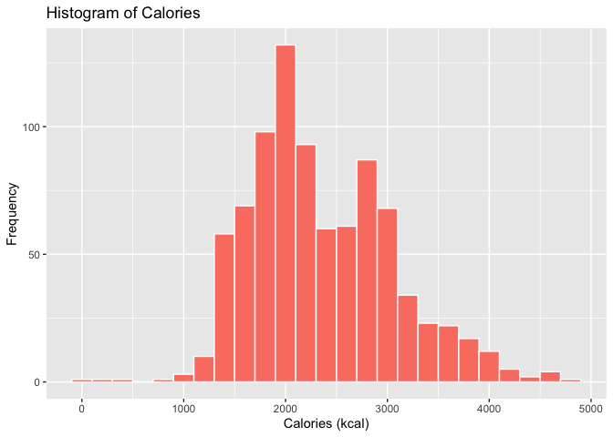
The data shows a peak calorie distribution around 2000 kcal, which is at
the lower end of the 2,000–3,000+ Daily Calorie Intake Guidelines for
Active Individuals maintaining their weight. This suggests that many
participants are not highly active, indicating a potential target
audience for Bellabeat.

**Average Daily Calories Burned Trend**

We will now examine the time-based trend of the average daily calories
burned.

``` r
daily_activity_sleep %>% group_by(RecordedDate,DayType) %>% 
  summarise(daily_avg= mean(Calories), .groups = 'drop') %>% # Calculate mean per day
  ggplot(aes(x=format(as.Date(RecordedDate), format = "%m-%d"), # Remove Year 
             y=daily_avg, group = 1, color=DayType)) + 
  geom_point(shape=18, size=2.5) +
  geom_smooth(color = "navyblue") +
  theme(axis.text.x = element_text(angle = 45, hjust = 1, vjust = 1)) +
  labs(
    x = "Date", # New x-axis title
    y = "Average Calories (kcal)", # New y-axis title
    title = "Average Calories Per Day", # New title
    color="Day Type", # New legend title
    caption = "Total Respondents: 33, Year: 2016"
  )
```

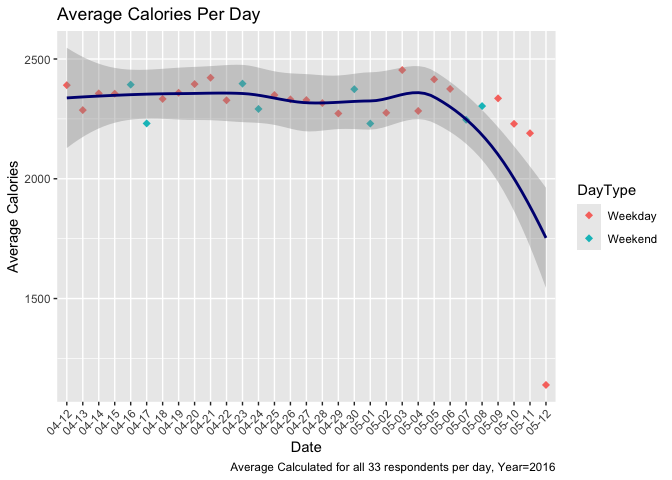

The average calories burned level remains relatively stable throughout
April but shows a decline in May.There is also no observed variation
based on day type (weekends compared to weekdays).

The drop in calories burned could be attributed to two main factors:

1.  **Rising Summer Temperatures**: As summer progresses, people may be
    less inclined to participate in outdoor activities due to increased
    heat. Bellabeat could address this by promoting and recommending
    indoor workouts and activity options during the summer months.
2.  **Possible Attrition of High Performers**: The decrease in average
    could also result from the attrition of users who were previously
    high performers in the final days of the period, thereby lowering
    the overall average.

We can check whether general attrition took place through the code
below:

``` r
# Group by Recorded Date and count observations
# Arrange with lowest values of observations at the top
daily_activity_sleep %>% 
  group_by(RecordedDate, DayType) %>% 
  summarize(Observations = n(), .groups = 'drop') %>% arrange(Observations) %>% 
  head(5) %>% kable(booktabs = TRUE) %>% kable_styling("striped")
```

<table class="table table-striped" style="margin-left: auto; margin-right: auto;">

<thead>

<tr>

<th style="text-align:left;">

RecordedDate
</th>

<th style="text-align:left;">

DayType
</th>

<th style="text-align:right;">

Observations
</th>

</tr>

</thead>

<tbody>

<tr>

<td style="text-align:left;">

2016-05-12
</td>

<td style="text-align:left;">

Weekday
</td>

<td style="text-align:right;">

21
</td>

</tr>

<tr>

<td style="text-align:left;">

2016-05-11
</td>

<td style="text-align:left;">

Weekday
</td>

<td style="text-align:right;">

24
</td>

</tr>

<tr>

<td style="text-align:left;">

2016-05-10
</td>

<td style="text-align:left;">

Weekday
</td>

<td style="text-align:right;">

26
</td>

</tr>

<tr>

<td style="text-align:left;">

2016-05-08
</td>

<td style="text-align:left;">

Weekend
</td>

<td style="text-align:right;">

27
</td>

</tr>

<tr>

<td style="text-align:left;">

2016-05-09
</td>

<td style="text-align:left;">

Weekday
</td>

<td style="text-align:right;">

27
</td>

</tr>

</tbody>

</table>

The code analysis above does confirm the decline, as the lowest
observations are from the last 5 days in May. However, it does not
confirm that the missing data is exclusively from high performers, which
would verify this as the reason for the lower overall average.

#### Analyzing Steps

Lets next analyze Total Steps beginning with a histogram to visualize
the distribution.

**Distribution of Total Steps**

``` r
ggplot(daily_activity_sleep, aes(Steps)) +
 geom_histogram(fill = 'darkgreen', color = 'white', binwidth=1250) +
  labs(title ="Histogram of Total Steps", 
  x = 'Total Steps', 
  y = "Frequency") 
```

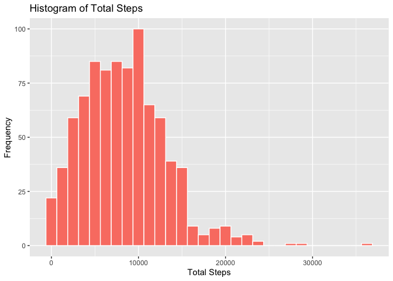

The Total Steps data exhibits a right-skewed (positively skewed)
distribution, meaning most data points are concentrated on the left side
of the graph. A few extremely high values (outliers) influence the mean,
pulling it above the median, as evidenced by the summary statistics.

Additionally the distribution for Total Steps is also bimodal or has two
peaks/bumps. The data suggests that the participant group includes
individuals who are both significantly high and significantly low
performers as:

1.  Low Performers (Low Outliers): A significant observation is the peak
    of observations with daily steps less than 1250. In fact, a good
    portion of the distribution is concentrated on the left of 10,000.
    This suggests a substantial number of users are not meeting the
    recommended daily goal of 5,000–7,000 steps. Bellabeat could
    consider targeting these users with daily reminders.

2.  High Performers (Enthusiasts): Conversely, there is a notable number
    of observations recording well over 10,000 steps. These high-value
    observations raise the average step count to approximately 7,600
    (refer to summary statistics), placing it within the 5,000–7,000
    range. Bellabeat can target these enthusiasts by recommending
    workout plans and fitness goals.

It would be beneficial to determine the percentage of all individuals
whose average daily steps fall below 6,000 (the midpoint of 5000-7000).

This code calculates the percentage of the 33 respondents whose Average
Daily Step count is below 6000

``` r
daily_activity_sleep %>% group_by(Id) %>% ##
  summarize(meanStep=mean(Steps)) %>% ## Caclulate avg steps for each Id
  filter(meanStep < 6000) %>%  ## Filter for less than 500
  nrow() * 100 / 33 ## Calculate %age
```

    ## [1] 33.33333

Approximately 33.3% or **one third** of participants have a daily
average step count of **less than 6000**. This is a very high percentage
and Bellabeat should work towards targeting this

**Average Daily Steps Trend**

We will now examine the time-based trend of the average total steps
covered.

``` r
daily_activity_sleep %>% group_by(RecordedDate,DayType) %>% 
  summarise(daily_avg= mean(Steps), .groups = 'drop') %>% # Calculate mean per day
  ggplot(aes(x=format(as.Date(RecordedDate), format = "%m-%d"), # Remove Year
             y=daily_avg, group = 1, color=DayType)) + 
  geom_point(shape=18, size=2.5) +
  geom_smooth(color = "navyblue") +
  theme(axis.text.x = element_text(angle = 45, hjust = 1, vjust = 1)) +
  labs(
    x = "Date", # New x-axis title
    y = "Average Steps", # New y-axis title
    title = "Average Steps Per Day", # New title
    color="Day Type", # New legend title
    caption = "Total Respondents: 33, Year: 2016"
  )
```

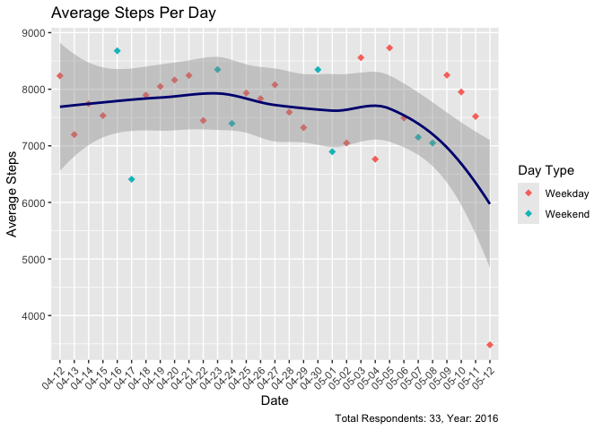

Similar to Calories, the average of daily steps remains relatively
stable throughout April but shows a decline in May. There is also no
observed variation based on day type (weekends compared to weekdays).

The drop in daily steps could be attributed to the same two factors
discussed earlier (Rising Summer Temperatures or Possible Attrition of
High Performers)

#### Analyzing Total Active Minutes and Sedantary Minutes

Lets next analyze the Minutes variables

Recall that in the Join statement Total Active Minutes was created as
the sum of Fairly Active Minutes, Lightly Active Minutes and Very Active
Minutes

**Composition of Total Active Min**

Lets first review the composition of Total Active Minutes.

The code below calculates the sum of Fairly Active Minutes, Lightly
Active Minutes and Very Acive Minutes and then creates a column for
percentages as a portion of the whole. A pie-chart is then created to
visualize the proportions. Means for respective categories are also
shown.

``` r
# Identify data for the plot

# Select FairlyActMin, LightlyActMin, VeryActMin
# Use the apply function to sum all rows in each of the columns
# Calculate percentage by dividing each sum value with the sum of TotalActiveMinutes
# Update Category to include means by dividing each sum values with total rows
# in the joined data set

plot_data <- daily_activity_sleep[,c("FairlyActMin","LightlyActMin","VeryActMin")] %>% 
  apply(2,sum) %>% as.data.frame() %>% setNames("value") %>%  
  rownames_to_column("category") %>% 
  mutate(percentage = value / sum(daily_activity_sleep$TotalActMin) * 100, 
         means=value/nrow(daily_activity_sleep), 
         category = paste0(category, " (", round(means, 0)," min)")) %>% 
  arrange(value)

#Plot the data using geom_bar
ggplot(plot_data, aes(x = "", y = value, fill = category)) +
  geom_bar(stat = "identity", width = 1) + #stacked bar chart
  coord_polar(theta = "y") + #To convert the chart into a pie-chart
  theme_void() + # Removes background grid and axes
  labs(title = "Composition of Total Active Minutes", 
       fill='Category (Mean value)') + #Add title and legend
  geom_text(aes(label = paste0(round(percentage, 1), "%")), 
            position = position_stack(vjust = 0.5)) + #Add labels for %age
  scale_fill_brewer(palette = "Pastel2")
```

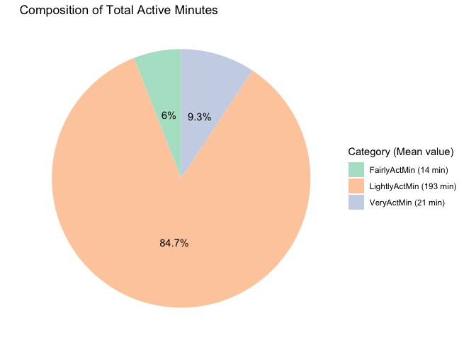

Lightly Active Minutes account for approximately 85% of the total
activity. This significant proportion explains why the average for
Lightly Active Minutes (193 minutes or 3.2 hours) is notably higher than
the averages for Fairly Active Minutes (14 minutes) and Very Active
Minutes (21 minutes). Overall, the data indicates that most respondents
are only lightly active.

**Composition of Total Minutes**

Lets next review the composition of Total Minutes as a sum of Total
Active Minutes and Sedentary Minutes.

The code below calculates the sum of Total Active Minutes and Sedentary
Minutes and then creates a column for percentages as a portion of the
whole. A pie-chart is then created to visualize the proportions. Means
for respective categories are also shown. Means for respective
categories are also shown.

``` r
# Identify data for the plot

# Select TotalActiveMinutes and SedentaryMinutes
# Use the apply function to sum all rows in each of the columns
# Calculate  percentage by dividing each sum value with the sum of TotalMinutes
# Update Category to include means by dividing each sum values with total rows
# in the joined data set

plot_data <- daily_activity_sleep[,c("TotalActMin","SedMin")] %>% 
  apply(2,sum) %>% as.data.frame() %>% setNames("value") %>%  
  rownames_to_column("category") %>% 
  mutate(percentage = value / sum(value) * 100, 
         means=value/nrow(daily_activity_sleep), 
         category = paste0(category, " (", round(means, 0)," min)")) %>% 
  arrange(value)

#Plot the data using geom_bar
ggplot(plot_data, aes(x = "", y = value, fill = category)) +
  geom_bar(stat = "identity", width = 1) + #stacked bar chart
  coord_polar(theta = "y") + #To convert the chart into a pie-chart
  theme_void() + # Removes background grid and axes
  labs(title = "Composition of Total Minutes", 
       fill='Category (Mean value)') + #Add title and legend
  geom_text(aes(label = paste0(round(percentage, 1), "%")), 
            position = position_stack(vjust = 0.5)) + #Add labels for %age
  scale_fill_brewer(palette = "Pastel2")
```

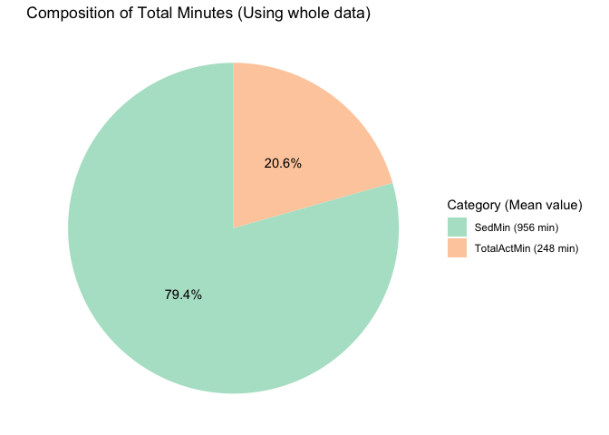
Sedentary Minutes constitute a striking 82% of the total time. This high
proportion directly leads to a very high average of 991 minutes (or 16.5
hours) for Sedentary Minutes, significantly overshadowing the average of
228 minutes (or 3.8 hours) for Total Active Minutes. This data strongly
suggests a considerably sedentary lifestyle among the users, which is a
key area Bellabeat should target for intervention to promote lower
sedentary behavior.

**Distribition of Total Active Hours**

Next, lets use a histogram to visualize the distribution of Total Active
Hours. Minutes are converted to hours for easier readability

``` r
ggplot(daily_activity_sleep, aes(TotalActMin/60)) +
 geom_histogram(fill = 'salmon', color = 'white', binwidth = 0.5) +
  labs(title ="Histogram of Total Active Hours", 
  x = "Total Activity (Hours)", 
  y = "Frequency") 
```

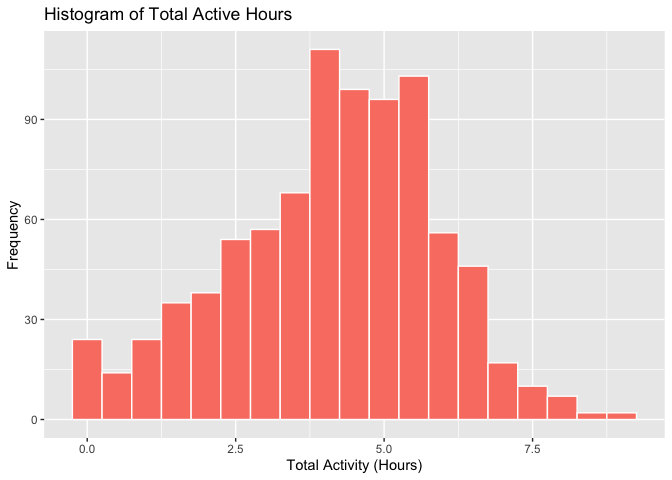
Similar to Calories and Steps, the distribution for active hours
exhibits a bimodal nature, indicating two distinct peaks. The data
suggests that the participant group includes individuals who are both
significantly high and significantly low performers as:

1.  Low Performers (Low Outliers): A notable peak exists at observations
    with Total Activity less than 30 minutes, which is below the
    recommended daily activity time\*. Bellabeat can address this group
    by sending reminders to users on days when their daily activity
    falls below 30 minutes.

<https://www.cdc.gov/physical-activity-basics/guidelines/adults.html>

2.  High Performers (Enthusiasts): The remaining distribution peaks
    around 3.75 hours, suggesting the presence of users with high
    activity levels. Bellabeat can engage these enthusiasts by
    recommending workout plans and fitness goals.

**Average of Daily Activity Trend**

We will now examine the time-based trend of the average daily activity.

``` r
daily_activity_sleep %>% group_by(RecordedDate,DayType) %>% 
  summarise(daily_avg= mean(TotalActMin/60), .groups = 'drop') %>% # Calculate mean per day
  ggplot(aes(x=format(as.Date(RecordedDate), format = "%m-%d"), # Remove Year
             y=daily_avg, group = 1, color=DayType)) + 
  geom_point(shape=18, size=2.5) +
  geom_smooth(color = "navyblue") +
  theme(axis.text.x = element_text(angle = 45, hjust = 1, vjust = 1)) +
  labs(
    x = "Date", # New x-axis title
    y = "Average Activity (hours)", # New y-axis title
    title = "Average Activity Per Day", # New title
    color="Day Type", # New legend title
    caption = "Total Respondents: 33, Year: 2016"
  )
```

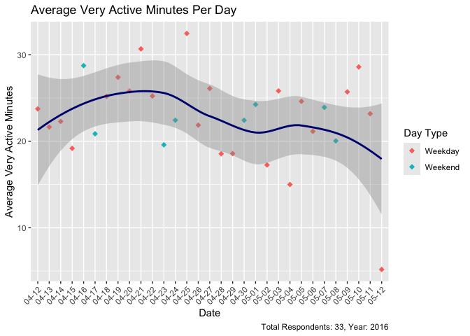
Similar to Calories and Steps, the average of activity level remains
relatively stable throughout April but shows a decline in May. There is
also no observed variation based on day type (weekends compared to
weekdays).

The drop in activity level could be attributed to the same two factors
discussed earlier (Rising Summer Temperatures or Possible Attrition of
High Performers)

**Distribition of Sedentary Hours**

Next, lets use a histogram to visualize the distribution of Sedantary
hours. Minutes are converted to hours for easier readability

``` r
ggplot(daily_activity_sleep, aes(SedMin/60)) +
 geom_histogram(fill = 'midnightblue', color = 'white', binwidth = 1) +
  labs(title ="Histogram of Sedentary Hours", 
  x = "Sedentary Hours", 
  y = "Frequency")
```

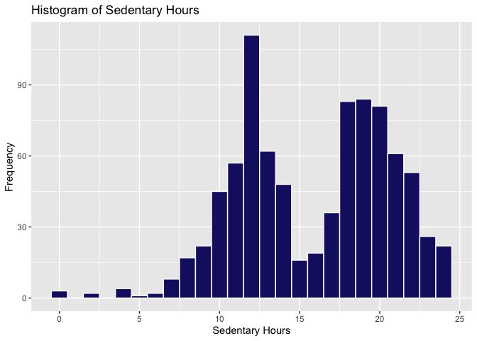
The distribution of Sedentary Hours, similar to the Activity data,
exhibits a multi-modal nature, suggesting the presence of three distinct
peaks. This indicates that the participant group consists of individuals
with varying performance levels:

1.  Low Performers: A notable peak is observed for observations with
    Total Sedentary Hours exceeding 17.5 hours, which represents a very
    high level. Accounting for 8 hours of sleep, this leaves 9.5 hours,
    equating to approximately 60% of the time awake (60% of 16 hours).
    This signifies that a portion of users spend more than half of their
    day in a sedentary lifestyle. Bellabeat should again target this
    group with reminders to engage in activity when sedentary hours
    surpass a specific threshold. Suggestions such as “Time to take a
    walk” or “Time for some stretches” could be beneficial.

2.  High Performers (Enthusiasts): A peak is also evident at
    approximately 12 hours, which is commendable, considering the
    allocation of 8 hours for sleep. Bellabeat can engage these
    enthusiasts by recommending tailored workout plans and fitness
    goals, while also incorporating the recommended amount of breaks.

#### Analyzing Distance

Lets next analyze the Distance Variables.

Recall that, in the Join statement, Total Distance was created as the
sum of Light Active Distance, Moderately Active Distance and Very Active
Distance

**Composition of Total Distance**

Lets first review the composition of Total Distance.

The code below calculates the sum of Light Active Distance, Moderately
Active Distance and Very Active Distance and then divides each sum by
the sum of Total Distance. A pie-chart is then created to visualize the
proportions.

``` r
# Identify data for the plot

# Select LightActDist, ModActDist, VeryActDist
# Use the apply function to sum all rows in each of the columns
# Calculate  percentage by dividing each sum value with the sum of TotalDistance
# Update Category to include means by dividing each sum values with total rows
# in the joined data set

plot_data <- daily_activity_sleep[,c("LightActDist","ModActDist","VeryActDist")] %>% 
  apply(2,sum) %>% as.data.frame() %>% setNames("value") %>%  
  rownames_to_column("category") %>% 
  mutate(percentage = value / sum(daily_activity_sleep$TotalDist) * 100, 
         means=value/nrow(daily_activity_sleep), 
         category = paste0(category, " (", round(means, 1)," km)")) %>% 
  arrange(value)

#Plot the data using geom_bar
ggplot(plot_data, aes(x = "", y = value, fill = category)) +
  geom_bar(stat = "identity", width = 1) + #stacked bar chart
  coord_polar(theta = "y") + #To convert the chart into a pie-chart
  theme_void() + # Removes background grid and axes
  labs(title = "Composition of Total Distance", 
       fill='Category (Mean value)') + #Add title and legend
  geom_text(aes(label = paste0(round(percentage, 1), "%")), 
            position = position_stack(vjust = 0.5)) + #Add labels for %age
  scale_fill_brewer(palette = "Pastel2")
```

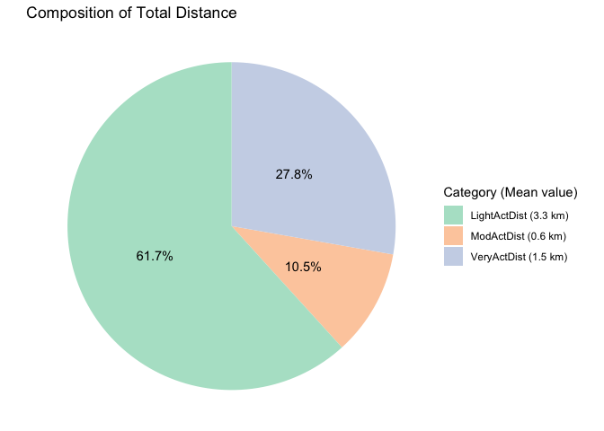
The analysis of activity distance reveals a significant variation in
participant performance levels, underscoring the necessity for
personalized recommendations. Specifically, LightlyActiveDistance
accounts for the largest proportion of the data, comprising about 62%
with an average of 3.3 km. This is followed by VeryActiveDistance at
approximately 28% (mean of 1.5 km) and ModeratelyActiveDistance at 10%
(mean of 0.6 km). These disparate distribution patterns strongly
indicate that a one-size-fits-all approach is ineffective, necessitating
the development of user-targeted plans.

**Distribition of Total Distance**

Next, lets use a histogram to visualize the distribution of
TotalDistance

``` r
ggplot(daily_activity_sleep, aes(TotalDist)) +
 geom_histogram(fill = 'darkgreen', color = 'white', binwidth = 1) +
  labs(title ="Histogram of Total Active Distance", 
  x = "Total Active Distance (km)", 
  y = "Frequency") 
```

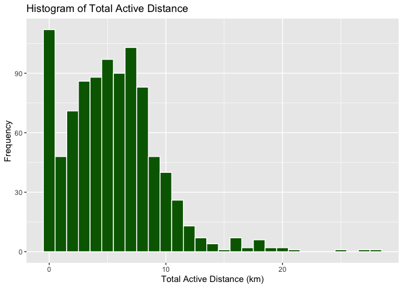
The distribution of Total Active Distance data, similar to Total Steps,
is right-skewed (positively skewed), indicating a concentration of data
points on the left side of the graph. A small number of extremely high
values (outliers) skew the mean, resulting in a value greater than the
median, as demonstrated by the summary statistics.

Furthermore, the distribution for Total Active Distance is bimodal,
which suggests the participant cohort comprises individuals who are both
significantly high and significantly low performers:

1.  Low Performers (Low Outliers): A notable peak occurs for
    observations with a daily active distance less than 1 km. A
    substantial portion of the distribution is concentrated below 4 km
    (2.5 miles), which is the recommended threshold for classifying an
    individual as “active”\*. Bellabeat may consider engaging these
    users with daily reminders.

\*<https://www.health.com/how-many-miles-should-you-walk-a-day-8736501>

2.  High Performers (Enthusiasts): Conversely, the data exhibits a
    second peak around 5–7 km (3–4 miles). These relatively high
    observations elevate the average daily distance to approximately 5.5
    km (as indicated in the summary statistics). Bellabeat has the
    opportunity to target these enthusiasts by recommending personalized
    workout plans and fitness goals to facilitate further improvement.

It would be beneficial to ascertain the percentage of all 33
participants whose average daily active distance is less than 4 km (2.5
miles). The code below calculates this

``` r
daily_activity_sleep %>% group_by(Id) %>% ##
  summarize(meanStep=mean(TotalDist)) %>% ## Caclulate avg steps for each Id
  filter(meanStep < 4) %>%  ## Filter for less than 500
  nrow() * 100 / 33 ## Calculate %age
```

    ## [1] 30.30303

Approximately **30%** of participants exhibit a daily Active Distance of
**less than 4 km**. This constitutes a substantial percentage that
Bellabeat should prioritize in its targeting strategy.

**Average of Daily Total Distance Trend**

We will now examine the time-based trend of the average total distance
covered.

``` r
daily_activity_sleep %>% group_by(RecordedDate,DayType) %>% 
  summarise(daily_avg= mean(TotalDist), .groups = 'drop') %>% #Calculate mean per day
  ggplot(aes(x=format(as.Date(RecordedDate), format = "%m-%d"), #Remove Year
             y=daily_avg, group = 1, color=DayType)) + 
  geom_point(shape=18, size=2.5) +
  geom_smooth(color = "navyblue") +
  theme(axis.text.x = element_text(angle = 45, hjust = 1, vjust = 1)) +
  labs(
    x = "Date", # New x-axis title
    y = "Average Active Distance (km)", # New y-axis title
    title = "Average Active Distance covered", # New title
    color="Day Type", # New legend title
    caption = "Total Respondents: 33, Year: 2016"
  )
```

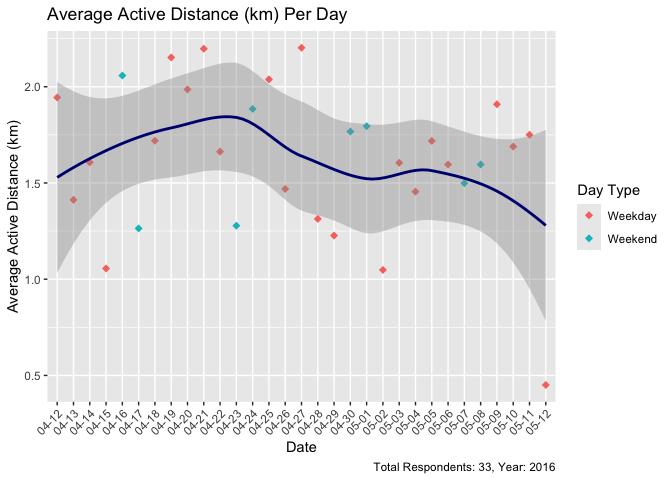
Similar to Calories, Steps and Activities, the average of Total Active
Distance remains relatively stable throughout April but shows a slight
decline in May. There is also no observed variation based on day type
(weekends compared to weekdays).

The drop in activity level could be attributed to the same two factors
discussed earlier (Rising Summer Temperatures or Possible Attrition of
High Performers)

#### Analyzing Hours Asleep

**Composition of Total Hours Asleep**

Next, lets use a histogram to visualize the distribution of Total Hours
Asleep. Minutes are converted to hours for easier readability

``` r
ggplot(daily_activity_sleep, aes(AsleepMin/60)) +
 geom_histogram(fill = 'slategray', color = 'white', binwidth = 1) +
  labs(title ="Histogram of Total Hours Alseep", 
  x = 'Time Sleeping (hours)', 
  y = "Frequency") 
```

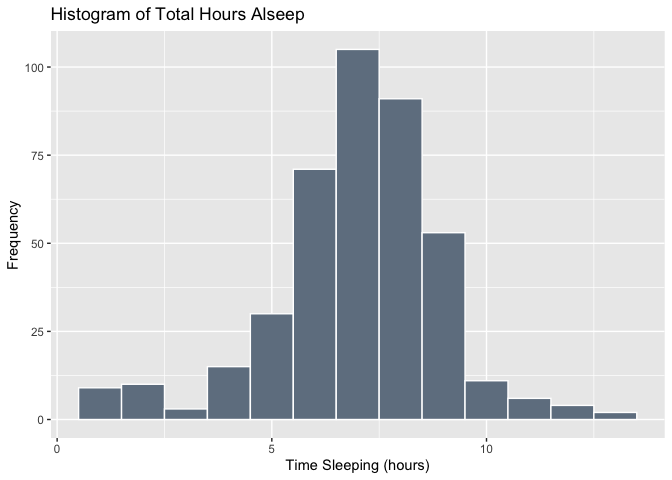
The majority of users report approximately 7–8 hours of sleep per day,
which aligns with general recommendations for adults\*. As noted in the
Data Processing and Cleaning section, most individuals sleep only once
per day, with the TotalSleepRecords variable indicating a value of 1 for
88% of observations.

\*<https://www.sleepfoundation.org/how-sleep-works/how-much-sleep-do-we-really-need>

For users at the extremes of the distribution (those sleeping less than
4 hours or more than 6 hours), Bellabeat may implement reminders or
alarms to promote adherence to the recommended guidelines. Bellabeat can
also help users set up sleep schedules.

### Identifying Relationships

#### Correlation Matrix Heat Map

Exclude indvidual components Exclude TotalDistance as it is likely to be
almost linearly correlated with Steps Exclude TimeInBed as it is likely
to be almost linearly correlated with MinutesAsleep

``` r
cat(paste0("Correlation between Total Distand and Total Steps: ",
           cor(daily_activity_sleep[,c("TotalDist", "Steps")], 
               use="pairwise.complete.obs")[1,2] %>% round(2),
           "\nCorrelation between Time In Bed and Minutes Asleep: ",
           cor(daily_activity_sleep[,c("TimeInBed", "AsleepMin")], 
               use="pairwise.complete.obs")[1,2] %>% round(2)))
```

    ## Correlation between Total Distand and Total Steps: 0.97
    ## Correlation between Time In Bed and Minutes Asleep: 0.93

``` r
hmap_cols <- c("TotalActMin", "Steps","Calories","SedMin","AsleepMin")

# Create correlation matrix 
corr_matrix <- cor(daily_activity_sleep[,hmap_cols], #Only select numeric data
                   use="pairwise.complete.obs") %>% 
  round(2) #round correlation matrix

ggcorrplot(corr_matrix, 
           method='square',
           hc.order = TRUE,   # Automatic hierarchical clustering
           colors = c("midnightblue", "white", "darkorange"),
           lab = TRUE,        # Add correlation coefficients
           outline.color='white', #Add outline color
           lab_size = 3.2,     # Adjust label size
           tl.cex = 10,  # Adjust text label size
           legend.title='Correlation', #Add legend title
           ggtheme = ggplot2::theme_bw, # Set theme
           title= 'Heatmap') +
           theme(legend.key.size = unit(1.2, "cm")) #Set legend size
```

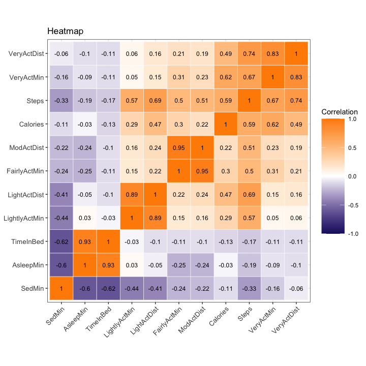
sed min all very strong -ve correlations asleep min relatively weaker
correlations (with variables other than sed min) but all negative

calories, total actmin and steps, strong positive correlations

**Weekdays Vs Weekend**

``` r
# correlation matrix with data filtered for weekday
corr_mat_wd <- cor(daily_activity_sleep %>% filter(DayType == 'Weekday')  %>% .[,hmap_cols], 
                   use="pairwise.complete.obs")  %>% round(2)
 
#correlation matrix with data filtered for weekend
corr_mat_wend <- cor(daily_activity_sleep %>% filter(DayType == 'Weekend') %>% .[,hmap_cols],
                     use="pairwise.complete.obs") %>% round(2)

p1 <- ggcorrplot(corr_mat_wd, 
           method='square',
           type='upper',
           hc.order = TRUE,   
           colors = c("midnightblue", "white", "darkorange"),
           lab = TRUE,        
           outline.color='white',
           lab_size = 3.2,     
           tl.cex = 10,  
           ggtheme = ggplot2::theme_bw,
           show.legend=FALSE) 

p2 <- ggcorrplot(corr_mat_wend, 
           method='square',
           type='lower',
           hc.order = TRUE,   
           colors = c("midnightblue", "white", "darkorange"),
           lab = TRUE,       
           outline.color='white',
           lab_size = 3.2,     
           tl.cex = 10,  
           ggtheme = ggplot2::theme_bw,
           show.legend = FALSE) 

plot_grid(p1, p2, ncol = 2, labels = c('Weekday', 'Weekend'), label_size = 12)
```

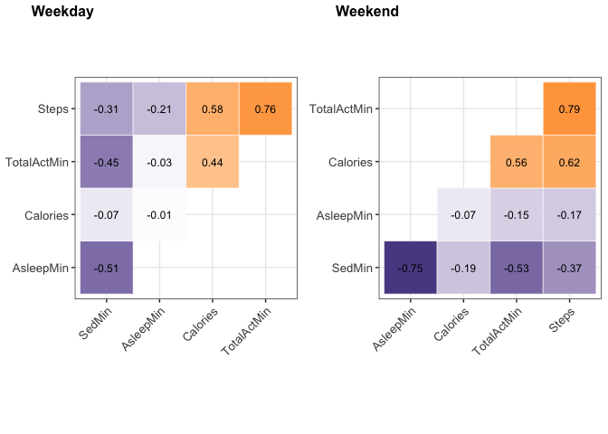
switches: sed min and asleep min, sed min and calories total act min and
asleeo min,

Calories and sed minutes; relationship stronger on weekends rec:
relationships stronger on weekend,

#### Sedentary Minutes and Total Minutes Asleep

``` r
ggplot(data=daily_activity_sleep) + 
geom_jitter(aes(x=SedMin,y=AsleepMin),color='slategray') + 
geom_smooth(aes(x=SedMin,y=AsleepMin,color=DayType)) +
labs(
    x = "Sedentary Minutes", # New x-axis title
    y = "Total Minutes while Sleeping", # New y-axis title
    color = "Day Type", # New legend title 
    title = "Sedentary Minutes Vs Total Minutes while Sleeping" # New title
  )
```

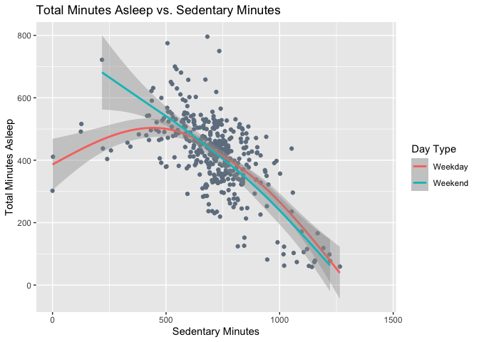

very strong for weekends as compared to weekday. sharp fall for both for
those days when an individual had high amount of sdeneatrt minutes.
weekends: relaxing, watching movies, reading books, scrolling social
media

#### Sedentary Minutes and Calories

corr changed

``` r
ggplot(data=daily_activity_sleep) + 
geom_jitter(aes(x=SedMin,y=Calories), color='slategray') + 
geom_smooth(aes(x=SedMin,y=Calories, color=DayType)) + 
  labs(
    x = "Sedentary Minutes", # New x-axis title
    y = "Calories", # New y-axis title
    color = "Day Type", # New legend title 
    title = "Sedentary Minutes Vs Calories Burned" # New title
  )
```

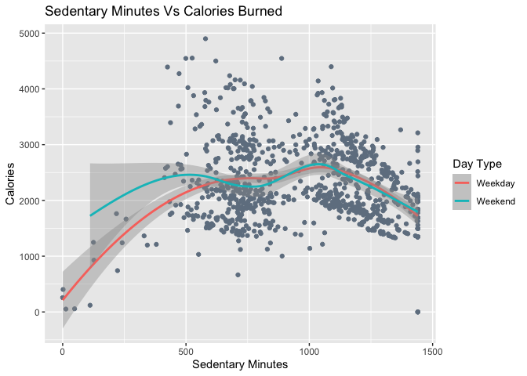
high performer, weekend stronger, +ve relationship, can have both inc
activity and low levels of sed to relax. relaxing more and burning
calories more

low perfomer, neg relationship

#### Sedentary Minutes and Total Active Minutes

corr stronger

``` r
ggplot(data=daily_activity_sleep) + 
geom_jitter(aes(x=SedMin,y=TotalActMin), color='slategray') + 
geom_smooth(aes(x=SedMin,y=TotalActMin),color='salmon') + 
  labs(
    x = "Sedentary Minutes", # New x-axis title
    y = "Total Active Minutes", # New y-axis title
    title = "Sedentary Minutes Vs Total Active Minutes" # New title
  )
```

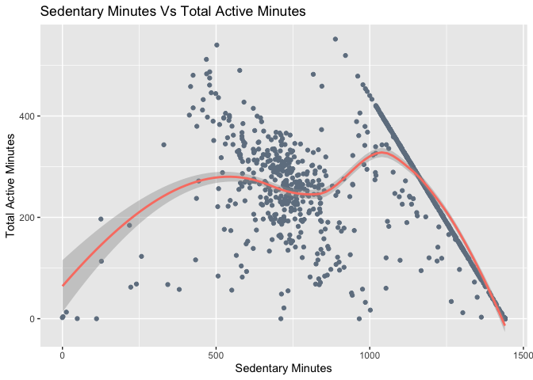
high performer, weekend stronger we have extreme groups so two
downfalss, sec 500 and 800, sed \>900

#### Sedentary Minutes and Steps

``` r
ggplot(data=daily_activity_sleep) + 
geom_jitter(aes(x=SedMin,y=Steps), color='slategray') + 
geom_smooth(aes(x=SedMin,y=Steps), color='salmon') + 
labs(
    x = "Sedentary Minutes", # New x-axis title
    y = "Steps", # New y-axis title
    title = "Sedentary Minutes Vs Steps" # New title
  )
```

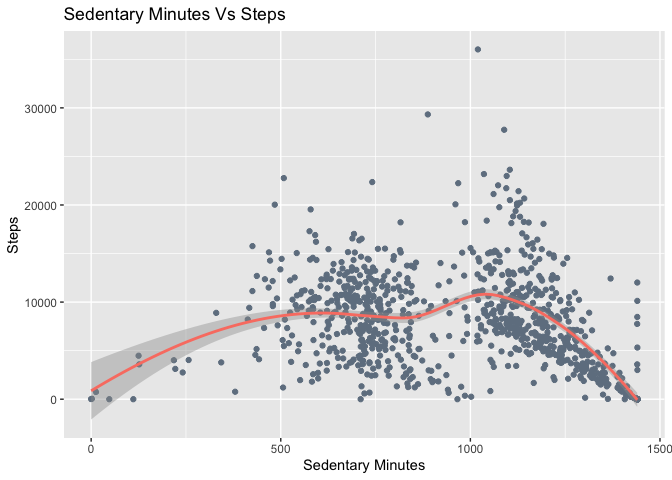

• Days when sedenatry minutes are upto 500, total steps also increase
and total time asleep also increases • Days when sedenatry minutes are
more 1000, total steps also decrease and total time asleep also
increases

we have extreme groups so two downfalss, sec 500 and 800, sed \>900

#### Total Active Minutes and Total Minutes Asleep

``` r
ggplot(data=daily_activity_sleep,) + 
geom_jitter(aes(x=TotalActMin,y=AsleepMin), color='lightslategray') + 
geom_smooth(aes(x=TotalActMin,y=AsleepMin, color=DayType)) +
  labs(
    x = "Total Active Minutes", # New x-axis title
    y = "Minutes Asleep", # New y-axis title
    color = "Day Type", # New legend title 
    title = "Total Active Minutes vs. Minutes Aleep", 
      )
```

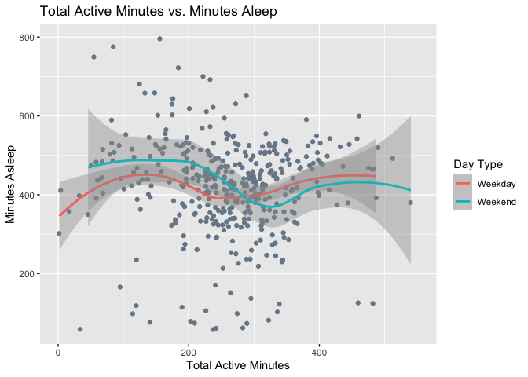

#### Total Active Minutes and Calories

``` r
ggplot(data=daily_activity_sleep) + 
geom_jitter(aes(x=TotalActMin,y=Calories), color='lightslategray') + 
geom_smooth(aes(x=TotalActMin,y=Calories, color=DayType)) + 
  labs(
    x = "Total Active Minutes", # New x-axis title
    y = "Calories", # New y-axis title
    color = "Day Type", # New legend title 
    title = "Total Active Minutes Vs Calories Burned" # New title
  )
```


steep rise on weekends

#### Total Active Minutes and Total Steps

``` r
ggplot(data=daily_activity_sleep) + 
geom_jitter(aes(x=TotalActMin, y=Steps), color='slategray') + 
geom_smooth(aes(x=TotalActMin, y=Steps), color='salmon') + 
labs(
    x = "Total Active Minutes", # New x-axis title
    y = "Total Steps", # New y-axis title
    title = "Total Steps Vs Total Active Minutes"
  )
```

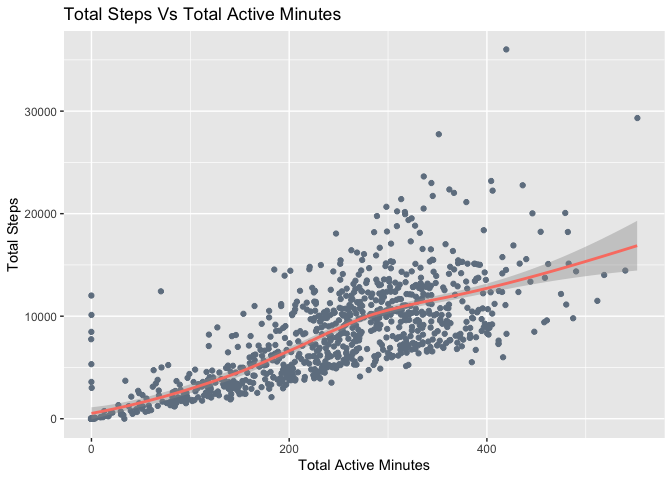
steep rise

#### Total Steps and Calories

``` r
ggplot(data=daily_activity_sleep,) + 
geom_jitter(aes(x=Steps,y=Calories), color='lightslategray') + 
geom_smooth(aes(x=Steps,y=Calories), color='salmon') +
  labs(title = "Total Steps vs. Calories Burned")
```

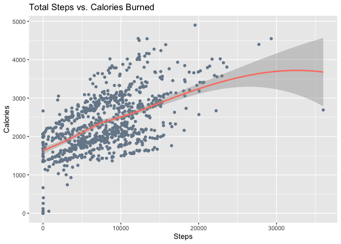
very sharp trend

# Part 2: Hourly Level Analysis

Moving forward, we will now extende our analysis to a higher level of
granularity. The subsequent analysis will focus on the hourly level data
for some of the same indicators as above. Since a thorough analysis has
already been conducted at the daily level, we will bypass repeating this
process for the hourly analysis. Our primary goal for the hourly data
will be to review how the distributions of these indicators change
throughout the hours of the day.

## Data Processing and Cleaning

This section details the process for data processing and cleaning in
preparation for the hourly analysis

### Shortlisting Tables and Columns

We have identified a total of three relevant hourly data indicators. We
will assess which ones require joining.

- Intensities
- Steps
- Calories

#### Unique ID’s in each table

Just like before, let’s first check the number of Unique ID’s in each of
the hourly tables. This will help determine any tablet that do not
contain information for all tables

The following SQL query checks the number of unique ID’s in all 3
tables.

``` sql
SELECT        -- Intensities Table
  'HourlyIntensities' AS DataIndicator, -- Data indicators representing each table
    COUNT(DISTINCT Id) AS UniqueIds  -- Count of Unique IDs
FROM
    hourlyintensities_merged
UNION
SELECT      -- Process Repeated for Steps
    'HourlySteps' AS DataIndicator,
    COUNT(DISTINCT Id) AS UniqueIds
FROM
        hourlysteps_merged
UNION
SELECT             -- Process Repeated for Calories
    'Calories' AS DataIndicator,
    COUNT(DISTINCT Id) AS UniqueIds
FROM
    hourlycalories_merged
ORDER BY        -- Sort by Unique ID's
  UniqueIds    
```

<div class="knitsql-table">

| DataIndicator     | UniqueIds |
|:------------------|----------:|
| Calories          |        33 |
| HourlyIntensities |        33 |
| HourlySteps       |        33 |

3 records

</div>

All 3 tables contain information on all 33 respondents, therefore none
need to be dropped

#### Finalize and Validate Remaining Columns

Next, we will assess if any columns in the three tables require dropping
or transformation. To begin, let’s obtain a brief description of the
columns within all tables.

``` sql
PRAGMA table_info(hourlyintensities_merged)
```

<div class="knitsql-table">

| cid | name             | type    | notnull | dflt_value |  pk |
|:----|:-----------------|:--------|--------:|:-----------|----:|
| 0   | Id               | REAL    |       0 | NA         |   0 |
| 1   | ActivityHour     | TEXT    |       0 | NA         |   0 |
| 2   | TotalIntensity   | INTEGER |       0 | NA         |   0 |
| 3   | AverageIntensity | REAL    |       0 | NA         |   0 |

4 records

</div>

``` sql
PRAGMA table_info(hourlysteps_merged)
```

<div class="knitsql-table">

| cid | name         | type    | notnull | dflt_value |  pk |
|:----|:-------------|:--------|--------:|:-----------|----:|
| 0   | Id           | REAL    |       0 | NA         |   0 |
| 1   | ActivityHour | TEXT    |       0 | NA         |   0 |
| 2   | StepTotal    | INTEGER |       0 | NA         |   0 |

3 records

</div>

``` sql
PRAGMA table_info(hourlycalories_merged)
```

<div class="knitsql-table">

| cid | name         | type    | notnull | dflt_value |  pk |
|:----|:-------------|:--------|--------:|:-----------|----:|
| 0   | Id           | REAL    |       0 | NA         |   0 |
| 1   | ActivityHour | TEXT    |       0 | NA         |   0 |
| 2   | Calories     | INTEGER |       0 | NA         |   0 |

3 records

</div>

**We can see that Id and ActivityHour are in all 3 tables which can be
used to join the tables**

All 3 of the remaining columns, TotalIntensity,
AverageIntensity,Calories and Steps only exist on one of the tables
each. Let’s also review their descriptions to see if we should exclude
any amongst them. The table below lists descriptions for the relevant
columns from the Fitabase data dictionary avaialble at this link:

<https://www.fitabase.com/media/2126/fitabase-fitbit-data-dictionary-as-of-05162025.pdf>

``` r
datadescription <- read_excel("datadescription.xlsx", sheet='Hourly')
kable(datadescription) %>% 
  kable_styling("striped") %>% column_spec(2, width = "12cm")
```

<table class="table table-striped" style="margin-left: auto; margin-right: auto;">

<thead>

<tr>

<th style="text-align:left;">

Data Header
</th>

<th style="text-align:left;">

Data Description
</th>

</tr>

</thead>

<tbody>

<tr>

<td style="text-align:left;">

ActivityHour
</td>

<td style="text-align:left;width: 12cm; ">

Date and hour value in mm/dd/yyyy hh:mm:ss format.
</td>

</tr>

<tr>

<td style="text-align:left;">

TotalIntensity
</td>

<td style="text-align:left;width: 12cm; ">

Value calculated by adding all the minute-level intensity values that
occurred within the hour
</td>

</tr>

<tr>

<td style="text-align:left;">

AverageIntensity
</td>

<td style="text-align:left;width: 12cm; ">

Average intensity state exhibited during that hour (TotalIntensity for
that ActivityHour divided by 60).
</td>

</tr>

<tr>

<td style="text-align:left;">

StepTotal
</td>

<td style="text-align:left;width: 12cm; ">

Total number of steps taken.
</td>

</tr>

<tr>

<td style="text-align:left;">

Calories
</td>

<td style="text-align:left;width: 12cm; ">

Total number of estimated calories burned.
</td>

</tr>

</tbody>

</table>

Since AverageIntensity is just a transformation of TotalIntensity, we
will drop it from our analysis

#### Checking for Duplicates and Missing Values

Next we will check for any duplicates and missing values that exist for
our finalized column lists for all 3 tables

``` sql
WITH dup_inten as (     -- Create a temporary table to calculate Duplicates  
SELECT                
  1 as UniId,    -- Define UniId in each temporary table to facilitate the join
  COUNT(*) -     -- Calculate the difference between the count of total rows 
(SELECT          -- and distinct rows. This difference will be the # of duplicates
  count(*) 
FROM
(SELECT DISTINCT      -- This inner query counts distinct rows 
  Id,   
  ActivityHour,     
  TotalIntensity
FROM
  hourlyintensities_merged) as t1) as DuplicatesIntensities
FROM
  hourlyintensities_merged
),
miss_inten as ( -- Create a temporary table to calculate Missing Values
SELECT       
    COUNT(*) AS MissingIntensities,  -- Count values when any one of the columns  
    1 as UniId                          -- specified is null.
FROM
    hourlyintensities_merged
WHERE
    Id IS NULL OR   
  ActivityHour IS NULL OR       
  TotalIntensity IS NULL 
),
dup_steps as (     -- Repeat the process for the steps table 
SELECT
  1 as UniId,
  COUNT(*) -
(SELECT
  count(*)
FROM
(SELECT DISTINCT
  Id,   
  ActivityHour,     
  StepTotal
FROM
  hourlysteps_merged) as t2) as DuplicatesSteps
FROM
  hourlysteps_merged
),
miss_steps as (
SELECT
    COUNT(*) AS MissingSteps,
    1 as UniId
FROM
  hourlysteps_merged
WHERE
    Id IS NULL OR   
  ActivityHour IS NULL OR       
  StepTotal IS NULL
),
dup_cals as (     -- Repeat the process for the calories table 
SELECT
  1 as UniId,
  COUNT(*) -
(SELECT
  count(*)
FROM
(SELECT DISTINCT
  Id,   
  ActivityHour,     
  Calories
FROM
  hourlycalories_merged) as t2) as DuplicatesCals
FROM
  hourlycalories_merged
),
miss_cals as (
SELECT
    COUNT(*) AS MissingCals,
    1 as UniId
FROM
  hourlycalories_merged
WHERE
    Id IS NULL OR   
  ActivityHour IS NULL OR       
  Calories IS NULL
)
SELECT               -- Join results from all tables into one
  A.DuplicatesIntensities,
  B.MissingIntensities,
  C.DuplicatesSteps,
  D.MissingSteps,
  E.DuplicatesCals,
  F.MissingCals
FROM
  dup_inten as A
JOIN
  miss_inten as B on A.UniId=B.UniId
JOIN
  dup_steps as C on A.UniId=C.UniId
JOIN
  miss_steps as D on A.UniId=D.UniId
JOIN
  dup_cals as E on A.UniId=E.UniId
JOIN
  miss_cals as F on A.UniId=F.UniId
```

<div class="knitsql-table">

| DuplicatesIntensities | MissingIntensities | DuplicatesSteps | MissingSteps | DuplicatesCals | MissingCals |
|---:|---:|---:|---:|---:|---:|
| 0 | 0 | 0 | 0 | 0 | 0 |

1 records

</div>

All three tables are clean, with zero missing values and duplicates.

### Joining the Daily tables

Next we will join all 3 of the tables on the Id and ActivityHour
columns. As discussed earlier, AverageIntensity is not included

``` sql
SELECT 
  I.Id, 
  I.ActivityHour,       
  I.TotalIntensity,
  S.StepTotal,         
  C.Calories           
FROM hourlyintensities_merged as I
JOIN
    hourlysteps_merged as S 
ON 
    I.Id = S.Id      -- Join on Id and Activity Hour
AND
    I.ActivityHour = S.ActivityHour
JOIN    
    hourlycalories_merged as C
ON 
    I.Id = C.Id
AND
    I.ActivityHour = C.ActivityHour
```

#### Review Joined data

Lets now the first few rows of the joined dataframe for some quick
validation

``` r
kable(head(hourly_activity,5)) %>% 
  kable_styling("striped")
```

<table class="table table-striped" style="margin-left: auto; margin-right: auto;">

<thead>

<tr>

<th style="text-align:right;">

Id
</th>

<th style="text-align:left;">

ActivityHour
</th>

<th style="text-align:right;">

TotalIntensity
</th>

<th style="text-align:right;">

StepTotal
</th>

<th style="text-align:right;">

Calories
</th>

</tr>

</thead>

<tbody>

<tr>

<td style="text-align:right;">

1503960366
</td>

<td style="text-align:left;">

4/12/2016 12:00:00 AM
</td>

<td style="text-align:right;">

20
</td>

<td style="text-align:right;">

373
</td>

<td style="text-align:right;">

81
</td>

</tr>

<tr>

<td style="text-align:right;">

1503960366
</td>

<td style="text-align:left;">

4/12/2016 1:00:00 AM
</td>

<td style="text-align:right;">

8
</td>

<td style="text-align:right;">

160
</td>

<td style="text-align:right;">

61
</td>

</tr>

<tr>

<td style="text-align:right;">

1503960366
</td>

<td style="text-align:left;">

4/12/2016 2:00:00 AM
</td>

<td style="text-align:right;">

7
</td>

<td style="text-align:right;">

151
</td>

<td style="text-align:right;">

59
</td>

</tr>

<tr>

<td style="text-align:right;">

1503960366
</td>

<td style="text-align:left;">

4/12/2016 3:00:00 AM
</td>

<td style="text-align:right;">

0
</td>

<td style="text-align:right;">

0
</td>

<td style="text-align:right;">

47
</td>

</tr>

<tr>

<td style="text-align:right;">

1503960366
</td>

<td style="text-align:left;">

4/12/2016 4:00:00 AM
</td>

<td style="text-align:right;">

0
</td>

<td style="text-align:right;">

0
</td>

<td style="text-align:right;">

48
</td>

</tr>

</tbody>

</table>

The data has been successfully and correctly joined. We will now proceed
to the Data Visualization phase.

## Data Visualization and Plots

Now that we have our data we can move forward with the Data
Visualization phase. As previously stated, the analysis will remain
concise, focusing solely on summary statistics and an examination of how
the distributions of the three indicators fluctuate throughout the hours
of the day.

### Summary Statistics

The initial step involves generating summary statistics to facilitate a
more comprehensive understanding of the dataset.

``` r
kable(hourly_activity %>% summary(digits=2)) %>% 
  kable_styling("striped")
```

<table class="table table-striped" style="margin-left: auto; margin-right: auto;">

<thead>

<tr>

<th style="text-align:left;">

</th>

<th style="text-align:left;">

Id
</th>

<th style="text-align:left;">

ActivityHour
</th>

<th style="text-align:left;">

TotalIntensity
</th>

<th style="text-align:left;">

StepTotal
</th>

<th style="text-align:left;">

Calories
</th>

</tr>

</thead>

<tbody>

<tr>

<td style="text-align:left;">

</td>

<td style="text-align:left;">

Min. :1.5e+09
</td>

<td style="text-align:left;">

Length:22099
</td>

<td style="text-align:left;">

Min. : 0
</td>

<td style="text-align:left;">

Min. : 0
</td>

<td style="text-align:left;">

Min. : 42
</td>

</tr>

<tr>

<td style="text-align:left;">

</td>

<td style="text-align:left;">

1st Qu.:2.3e+09
</td>

<td style="text-align:left;">

Class :character
</td>

<td style="text-align:left;">

1st Qu.: 0
</td>

<td style="text-align:left;">

1st Qu.: 0
</td>

<td style="text-align:left;">

1st Qu.: 63
</td>

</tr>

<tr>

<td style="text-align:left;">

</td>

<td style="text-align:left;">

Median :4.4e+09
</td>

<td style="text-align:left;">

Mode :character
</td>

<td style="text-align:left;">

Median : 3
</td>

<td style="text-align:left;">

Median : 40
</td>

<td style="text-align:left;">

Median : 83
</td>

</tr>

<tr>

<td style="text-align:left;">

</td>

<td style="text-align:left;">

Mean :4.8e+09
</td>

<td style="text-align:left;">

NA
</td>

<td style="text-align:left;">

Mean : 12
</td>

<td style="text-align:left;">

Mean : 320
</td>

<td style="text-align:left;">

Mean : 97
</td>

</tr>

<tr>

<td style="text-align:left;">

</td>

<td style="text-align:left;">

3rd Qu.:7.0e+09
</td>

<td style="text-align:left;">

NA
</td>

<td style="text-align:left;">

3rd Qu.: 16
</td>

<td style="text-align:left;">

3rd Qu.: 357
</td>

<td style="text-align:left;">

3rd Qu.:108
</td>

</tr>

<tr>

<td style="text-align:left;">

</td>

<td style="text-align:left;">

Max. :8.9e+09
</td>

<td style="text-align:left;">

NA
</td>

<td style="text-align:left;">

Max. :180
</td>

<td style="text-align:left;">

Max. :10554
</td>

<td style="text-align:left;">

Max. :948
</td>

</tr>

</tbody>

</table>

Some quick insights:

- The mean for Total Intensity is 12 minutes. This means that on
  average, in a given hour, respondents engage in 12 minutes of
  activity.
- The mean of StepTotal is 320. This means that on average, in a given
  hour, respondents walk 320 steps.
- The mean of Calories burned is 97. This means that on average, in a
  given hour, respondents burn 320 97 calories

### Variation in Averages at each Hour of the Day

We will now proceed to delve deeper into these statistics by identifying
how the average values vary across each hour of the day.

To prepare for this, we must first add two new columns: one representing
the hour of the day (in 24-hour format) and another specifying the Day
Type (differentiating between Weekend and Weekday)

``` r
hourly_activity <- hourly_activity %>%  
  mutate(activity_time = mdy_hms(ActivityHour), ##Cleaned ActivityHour
         hour_of_day = hour(activity_time),      ## Calculate Hour of the day
         daytype= ifelse(weekdays(activity_time) == "Saturday" | 
                           weekdays(activity_time) == "Sunday", 
                         "Weekend", "Weekday")) ##Calculate DayType
```

#### Average Total Intensities at each Hour of the Day

This code computes the average total intensity for each hour of the day
and then plots the results against time. Distinct plots are generated to
compare weekday and weekend averages. A gray line is drawn at peak hours

``` r
line_data <- data.frame(        #Data to draw vertical lines at peak times 
  daytype = c("Weekday", "Weekend"),   #6 pm on weekedays and 1 pm on weekend
  x_pos = c(18, 13), # Unique positions for each facet
  label = c("6 PM", "1 PM") # The text for each facet
)
 
hourly_activity %>% group_by(hour_of_day, daytype) %>% #For each hour
  summarise(hourly_avg = mean(TotalIntensity), .groups="drop") %>% #Calculate Avg 
  ggplot(aes(x=hour_of_day, y=hourly_avg, fill = daytype)) + geom_col() + 
  facet_wrap(~daytype) + #Separate plots for Weekday and Weekend
  geom_vline(data = line_data, aes(xintercept = x_pos), # Draw lines
             linetype = "dashed", color = "darkslategray", size = 0.5) +   
  geom_text(data = line_data, aes(x = x_pos, y = Inf, label = label), #Add text
        vjust = 2, hjust = -0.3, inherit.aes = FALSE, size=3.5,color='blue') + 
  labs(title="Average Total Intensity over Time", # New Title
                              x='Hour of the Day (24-hr)', # New x and y labels
                              y='Average Total Intensity', fill="Day Type")
```

    ## Warning: Using `size` aesthetic for lines was deprecated in ggplot2 3.4.0.
    ## ℹ Please use `linewidth` instead.
    ## This warning is displayed once per session.
    ## Call `lifecycle::last_lifecycle_warnings()` to see where this warning was
    ## generated.

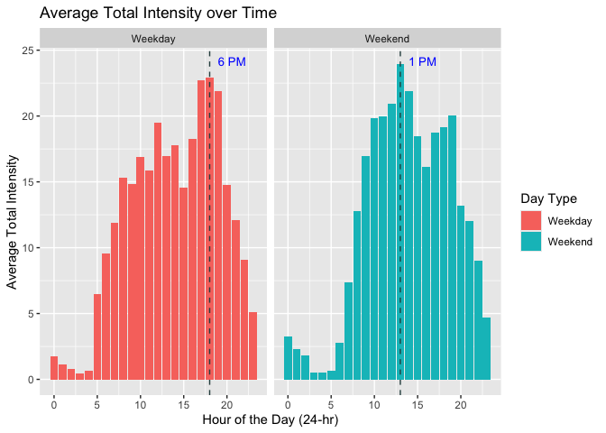
Activity levels are observed to increase as the day progresses in both
charts before declining later. Distinct variations are evident in the
activity distributions for weekends and weekdays. On weekdays, peak
activity occurs between 5-7 p.m., while on weekends, the peak is notably
at 1 p.m.

This pattern is logical, as individuals on weekdays may engage in
exercise following the conclusion of typical office hours at 5 p.m.
Conversely, on weekends, they have the flexibility to schedule these
workouts earlier, such as at 1 p.m., a time that still permits a later
start to the day.

This provides an important insight for Bellabeat: reminders prompting
users to engage in activity could be strategically timed differently for
weekdays and weekends. On weekdays, reminders such as, “Time to take a
walk,” or “Time to visit the gym,” could be dispatched at 5 p.m. On
weekends, these prompts could be sent at around 12:45 p.m.

#### Average Calories at each Hour of the Day

This code computes the average calories burned for each hour of the day
and then plots the results against time. Distinct plots are generated to
compare weekday and weekend averages.

``` r
hourly_activity %>% group_by(hour_of_day, daytype) %>% #For each hour
  summarise(hourly_avg = mean(Calories), .groups="drop") %>% #Calculate Avg 
  ggplot(aes(x=hour_of_day, y=hourly_avg, fill = daytype)) + geom_col() + 
  facet_wrap(~daytype) + #Separate plots for Weekday and Weekend
  geom_vline(data = line_data, aes(xintercept = x_pos), # Draw lines
             linetype = "dashed", color = "darkslategray", size = 0.5) +   
  geom_text(data = line_data, aes(x = x_pos, y = Inf, label = label), #Add text
        vjust = 2, hjust = -0.3, inherit.aes = FALSE, size=3.5,color='blue') + 
  labs(title="Average Calories Burned over Time", # New Title
                              x='Hour of the Day (24-hr)', # New x and y labels
                              y='Average Calories Burned', fill="Day Type") 
```

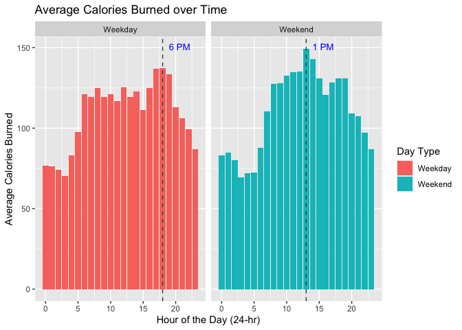
A similar variation is observed for Calories burned; the values increase
before declining. During weekdays, the peak is observed at 5-7 pm, while
on weekends, it occurs at 6 pm. This further reinforces the
recommendation to send reminders at 5 pm on weekdays and 1 pm on
weekends.

#### Average Total Steps at each Hour of the Day

This code computes the average total steps for each hour of the day and
then plots the results against time. Distinct plots are generated to
compare weekday and weekend averages.

``` r
hourly_activity %>% group_by(hour_of_day, daytype) %>% #For each hour
  summarise(hourly_avg = mean(StepTotal), .groups="drop") %>%  #Calculate Avg 
  ggplot(aes(x=hour_of_day, y=hourly_avg, fill = daytype)) + geom_col() + 
  facet_wrap(~daytype) + #Separate plots for Weekday and Weekend
  geom_vline(data = line_data, aes(xintercept = x_pos), # Draw lines
            linetype = "dashed", color = "darkslategray", size = 0.5) +   
  geom_text(data = line_data, aes(x = x_pos, y = Inf, label = label), #Add text
      vjust = 2, hjust = -0.3, inherit.aes = FALSE, size=3.5, color='blue') + 
  labs(title="Average Total Steps over Time", # New Title
                              x='Hour of the Day (24-hr)', # New x and y labels
                              y='Average Total Steps', fill="Day Type")
```

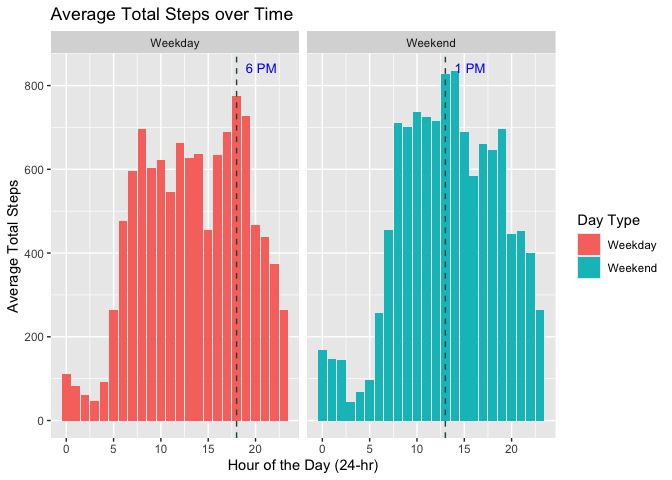
The expected trend of a rise followed by a decline is also observed for
step counts. Step activity reaches its maximum at 6:00 PM on weekdays
and between 1:00 PM and 2:00 PM on weekends. Reminders such as “Time to
talk a walk” and “Ready for a Run” are optimally timed for these periods
on the respective days of the week.

# Conclusion and Recommendations

daily- dist and comp: the data suggests that most people only sleep once
in a day (presumably at night) calorie burned dist peak is on lower end
of recommended range one third have steps below 6000 lightly activ pop
very sed lifestyle 16 hours activity potentially drops in summers we
have high performers and low performers, mkr strategy should be targeted
, varying performance levels. h These disparate distribution patterns
strongly indicate that a one-size-fits-all approach is ineffective,
necessitating the development of user-targeted plans. 30% walk less than
4 km sleep is fine but bellabeat can help set up sleep schedule

daily: relationships

hourly: times for remoinder 5-7 on weekend, 1-2 on weekdays

``` r
# Code to close database connection
DBI::dbDisconnect(con)
```
